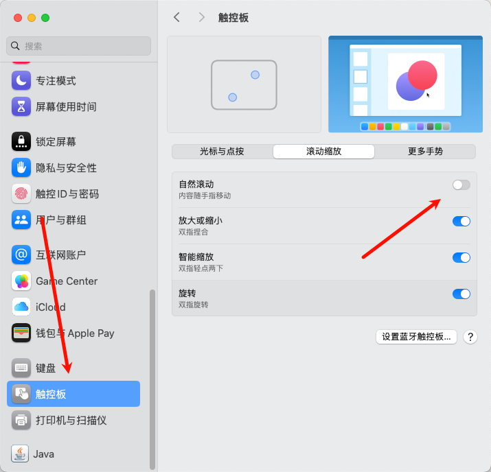

# Mac快速上手

对于从Windows第一次转入Mac的用户来说，多多少少也有一些不适应，也有一些反人类设计，需要去设置更改。


本项目是[强迫症的 Mac 设置指南](https://github.com/macdao/ocds-guide-to-setting-up-mac)学习而来，此项目仅做简单配置，部分内容是直接复制粘贴的，感谢作者。如果还需要更多更深入设置，请移步[强迫症的 Mac 设置指南](https://github.com/macdao/ocds-guide-to-setting-up-mac)。


**Windows的任务管理器 => Mac的活动监视器**

## 鼠标触控板

首先是鼠标触控板设置，当你第一次上手触控板的时候你应该也感受到了，它是跟随你滑动方向来，这玩意儿鼠标和触控板不能单独调整，特别反人类。如果你是Windows的用户，而且可能会两个平台频繁切换，建议关掉自然滚动。



你也可以使用`Scroll Reverser`

> unverified

当你在浏览一个很长的网页时，你看完了当前显示的内容，想要看后续的内容，你可以在 Trackpad 上双指上滑，或者鼠标滚轮向上滚动。这是被称作“自然”的滚动方向。

然而在 Windows 里鼠标滚动的行为是相反的：鼠标滚轮向下滚动才会让浏览器显示后续的内容，向上滚动会达到页面的顶部。你可以在 macOS 的系统偏好设置里修改（选择 [System Settings] > [Trackpad]，在 [Scroll & Zoom] 标签页中取消 [Natural scrolling]），但是这样会同时改变 Trackpad 的方向。

要想只改变鼠标滚轮的方向，而保持 Trackpad 依旧是“自然”的，我们需要 Scroll Reverser：

```sh
brew install --cask scroll-reverser
```

PS：这货会让三指点击失效。

### 高效的光标

默认情况下，光标的闪烁速度和移动速度是相当慢的。当你需要用退格键删除大段文字的时候，会觉得痛不欲生，因为即使长按退格键，光标也移动的很缓慢。

调节光标移动速度：选择 [System Settings] > [Keyboard]，把 [Key repeat rate] 以及 [Delay until repeat] 的滑块拉到最右端，分别把持续连续输入和首次连续输入加快，从此享受飞一般的速度。

## 键盘快捷键

- [Mac键盘快捷键](https://support.apple.com/zh-cn/102650)
- [Mac终端中键盘快捷键](https://support.apple.com/zh-cn/guide/terminal/trmlshtcts/mac)


Mac上关闭窗口的快捷键是⌘ + W（只关闭窗口不关闭应用），关闭应用的快捷键为⌘ + Q（很容易误触导致退出应用，而且大部分应用不会有提醒！！如果你需要修改的话另行搜索）

有一个解决方法是[SlowQuitApp](https://github.com/dteoh/SlowQuitApps)，通过延时来解决。但是在我的Mac上没用，自行测试（爱折腾也可以用AppleScript)


此处重点说一下比较好用的快捷键

### 语音

> ⌥ + Esc

macOS 自带了语音功能，可以用`say`命令让 Mac 开口说话：

```sh
say hello
```

可以和`&&`或者`;`配合使用来提示你某任务已经完成：

```sh
brew update && brew upgrade && brew cleanup ; say mission complete
```

通过命令行来听取发音还是有点麻烦。其实我们几乎可以在任何地方选中单词，然后使用快捷键`Option-Esc`发音。

仅仅需要这样设置一下：选择 [System Settings] > [Accessibility] > [Spoken Content]，选中 [Speak selection]。(可以选音色哦～)


### 中/英输入法切换

大写锁定键改为中/英切换很方便。但是当你手速过快或者某些时候，容易导致中英切换失效，按了很多次切换都无法切换输入法。目前似乎没有什么好解决的方法，也许你可以试一下将切换输入法的快捷键改为⌘ + 空格，但是会和其他应用冲突（我没怎么用所以不太清楚）


## Dock Position

默认 Dock 在屏幕下方。我们的屏幕一般都是 16:10，Dock 在屏幕下方的话会占据本来就不大的垂直空间。建议把 Dock 放到右边或者左边。

选择 [System Settings] > [Desktop & Dock]，在 [Position on screen] 中选择不同的位置。


## Homebrew

对于Mac来说，这就是第二个“App Store”

Homebrew Cask和Homebrew深度集成，一般不需要单独安装

几乎所有的常用应用都可以在Homebrew Cask安装


## 强迫症适用

> ### Remove all Dock icons [OCD]
>
> 本条目对于强迫症适用。
>
> 默认情况下 Dock 被一堆系统自带的应用占据着，而其中大部分我都很少使用，当我打开几个常用应用后，Dock 上会有很多图标，每个图标都会被挤得很小。所以我会把所有 Dock 上固定的图标都删掉，这样一来 Dock 上只有我打开的应用。
>
> PS：Finder 图标是删不掉的。
>
> 除了一个一个删除图标，也可以通过这个命令来删除所有的固定图标：
>
> ```sh
> defaults write com.apple.dock static-only -bool true; killall Dock
> ```
>
> PS：Dock 上的`Downloads`也会被隐藏掉。
>
> 如何恢复（之前只改变`static-only`的方法已经不生效了）：
>
> ```sh
> defaults delete com.apple.dock; killall Dock
> ```
>
> PS：使用这个方法会让所有的 Dock 配置重置，包括 Dock Position。
>
> ### 重置 Launchpad 上图标位置 [OCD]
>
> 本条目对于强迫症适用。
>
> 新的应用被安装后，经常会跑到 Launchpad 的第一屏，所以它们的位置跟安装的顺序有关系，而我更希望它们可以按照某种更加稳定的顺序排列，比如按照系统默认的顺序：
>
> ```sh
> defaults write com.apple.dock ResetLaunchPad -bool true; killall Dock
> ```
>
> 在默认顺序中，Launchpad 第一屏只有 Apple 自家应用。
>
> 在我更新到 macOS 15.2 以后，上面命令就失效了，我[找到](https://forums.macrumors.com/threads/macos-15-2-launchpad-default-layout.2445232/)了下面这个命令：
>
> ```sh
> find 2>/dev/null /private/var/folders/ -type d -name com.apple.dock.launchpad -exec rm -rf {} +; killall Dock
> ```
>
> 这个命令查找目录`/private/var/folders/`下名为`com.apple.dock.launchpad`的文件夹，然后删除。


## Microsoft-Office-For-MacOS

Mac也有Microsoft-Office，去官网下载本体，破解在此处[Microsoft-Office-For-MacOS](https://github.com/alsyundawy/Microsoft-Office-For-MacOS)