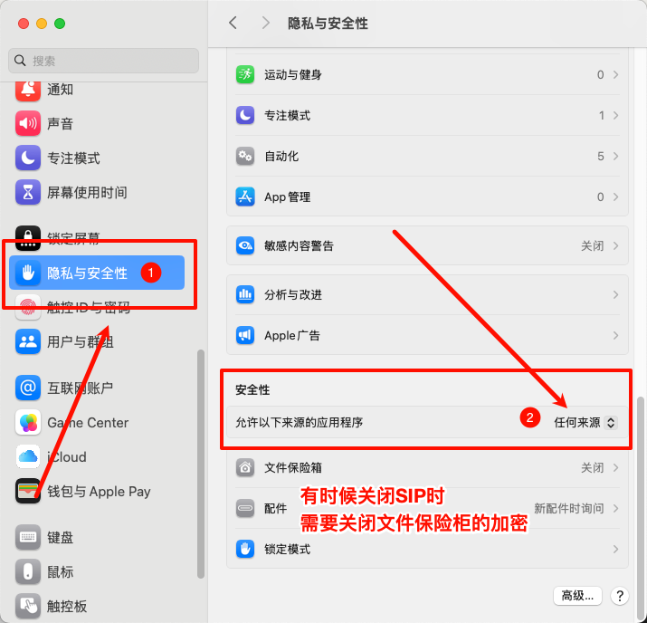

# MacOS快速部署

目标是致力于让第一次使用Mac的Java程序员快速上手

## 目录

[toc]


## 写在最前

- 不要装360
- 不要装杀毒软件

> 大部分情况下这些杀毒软件对你的开发会存在影响，特别是你需要“特殊版”的软件

下载前请确认你的架构和芯片再下载

```sh
# 查看Mac架构是amd还是arm，否则无法安装
uname -m
```

兼容性查询：[Is Apple Silicon Ready](https://isapplesiliconready.com/zh)、[DoesitARM](https://doesitarm.com/)、[Silicon](https://imazing.com/downloads)

## 应用准备

Homebrew友好界面：[Mac可视化Homebrew界面应用](https://github.com/milanvarady/Applite)(说实话没多少东西可以下载，也不稳定，但是)

> [!NOTE]
>
> 非常建议先下载剪切板还有Path Finder！！！！
>
> 剪切板：[EcoPaste](https://github.com/EcoPasteHub/EcoPaste)、[SyncClipboard](https://github.com/Jeric-X/SyncClipboard)
>
> 个人在使用`EcoPaste`这款，快捷键为 ⌥  + C。（支持中文）
>
> **Path Finder**执行找“特殊版”，自带的访达可以用，但是使用起来比较麻烦，也不够便捷，这个是我强烈推荐的软件，必装。

终端工具（此处不提供连接）：WindTerm、 Tabby、Putty、xterm、Windows Terminal + ssh.exe、iterm2、rxvt、Gnome

应用快速下载，相对重要(部分应用的专业旗舰版需要付费登陆使用)：

- [BetterZip](https://macitbetter.com/downloads/)：解压缩软件（不唯一）
- [Intellij IDEA](https://www.jetbrains.com/zh-cn/idea/download/#section=mac)
- [Visual Studio Code](https://code.visualstudio.com/)
- [Cursor](https://cursor.com/home)
- [Trae海外版](https://www.trae.ai/)、[Trae CN](https://www.trae.cn/)
- [Warp](https://www.warp.dev/)(一款AI terminal。需要付费使用)
- [Github Desktop]()
- [Apifox]()、[Postman]()、[Apipost]()
- [Docker Desktop](https://www.docker.com/)([镜像](https://docker.fxxk.dedyn.io/)、[汉化](https://github.com/asxez/DockerDesktop-CN))
- [Notepad--](https://github.com/cxasm/notepad--)（Mac不支持Notepad++）
- [PixPin](https://pixpin.cn/)：截图软件，你也可以使用[Snipaste](https://www.snipaste.com/)，个人觉得PixPin功能更强大一些

可选：

- [Python](https://www.python.org/downloads/macos/)、[Pycharm](https://www.jetbrains.com/pycharm/)(如果你需要的话)
- [VMware Fusion](https://support.broadcom.com/group/ecx/productdownloads?subfamily=VMware%20Fusion&freeDownloads=true)、[Free Downloads](https://support.broadcom.com/group/ecx/free-downloads)登陆后使用(第一次下载需要砍协议还有填地址)（Mac没有VMware workstation，而且注意镜像的架构是否和Mac一致，否则可能无法运行从Windows带过来的虚拟机镜像)
- 特殊系列可以在[此处](https://blog.idejihuo.com/jetbrains/intellij-idea-2025-1-3-the-latest-cracking-tool-for-permanent-activation-codes.html)获取特殊工具
- 如果你需要Microsoft-Office，请移步： [Mac快速使用.md](./Mac快速使用.md) 
- HbuilderX
- Another Redis Desktop Manager
- 微信开发者工具


不重要，但是可以改善你的体验的软件

- [keycastr](https://github.com/keycastr/keycastr)：an open source keystroke visualizer.（无中文）映射你当前键盘鼠标操作
- [OBS](https://obsproject.com/)：强大的屏幕录制软件
- DeepL：翻译软件，你也可以使用有道翻译
- [IINA](https://iina.io/)：视频播放器（没有PotPlayer,不用找了)
- [vanilla](https://matthewpalmer.net/vanilla/)(自动隐藏功能收费):Hide menu bar icons on your Mac.Windows上面的隐藏应用图标
- [Ice](https://github.com/jordanbaird/Ice)：开源免费，自动隐藏，个人觉得比上面的好


> 如果你想在Mac允许Windows或者Linux的软件，你需要安装虚拟机或者其他工具。

## 环境搭建

### 安装[Homebrew](https://brew.sh/zh-cn/)

```sh
/bin/bash -c "$(curl -fsSL https://raw.githubusercontent.com/Homebrew/install/HEAD/install.sh)"
```


### jenv管理jdk

先安装[Jenv](https://www.jenv.be/)（管理JAVA_HOME工具）再下载jdk，方便进行项目管理

jdk下载地址：[jdk21-mac](https://www.oracle.com/java/technologies/downloads/#jdk21-mac)、[jdk17-mac](https://www.oracle.com/java/technologies/downloads/#java17-mac)、[jdk11-mac](https://www.oracle.com/java/technologies/downloads/#java11-mac)、[jdk8-mac](https://www.oracle.com/java/technologies/downloads/#java8-mac)

```sh
# 查看brew版本
brew -v

# 下载jdk（最新版）
brew install java

#  可以安装最 JDK 8。
brew install adoptopenjdk/openjdk/adoptopenjdk8 --cask

# 查看本机所有安装过的 JDK 包
ls /Library/Java/JavaVirtualMachines/

# 将安装过的 JDK 加入到 jenv 版本库中
cd /Library/Java/JavaVirtualMachines/
jenv add adoptopenjdk-8.jdk/Contents/Home/

# 可以指定当前的 JDK 版本
jenv global openjdk64-1.8.0.292

# 查看默认使用的 JDK 版本（带*的 ）
jenv versions

# 查看当前使用的jdk版本
Java -version
```

### Maven

```sh
# 安装Maven(如果需要指定版本的话自己找)
brew install maven

# 查看版本
mvn -v
```

### Git

```sh
brew install git

# 查看版本号
git --version
```

### Redis

```sh

```


### Mysql

```sh

```


### MongoDB

```sh

```

### Note


# 常见问题解决

## 无法打开下载的应用

> mac提示“打不开xxx,因为Apple无法检查其是否包含恶意软件...”

在设置内允许**任何来源**的应用程序



> [!NOTE]
>
> 如果没有的话，终端执行下面这条语句
>
> ```sh
> sudo spctl --master-disable
> ```
>
> 再回到设置继续找到对应位置允许任何来源即可，安装完成后(建议)关闭（看个人，认准官方软件的话，不关也可以）
>
> ```sh
> sudo spctl --master-enable
> ```


## SIP

> [!caution]
>
> 请确保你清楚你在做什么
>
> SIP机制能有效保护系统安全,建议仅在必要时临时禁用。操作完成后,及时重新启用SIP,保证Mac系统的安全性。

SIP 是 System Integrity Protection 的简写，译为系统完整性保护。 SIP 是 OS X El Capitan 时开始采用的一项安全技术，目的是为了限制 root 账户对系统的完全控制权，也叫 Rootless 保护机制。

Mac 系统中 SIP 状态默认是开启的。近期更新了系统版本导致该状态重新被打开，在终端运行一些命令时提示 "Operation not permitted" 。

它会保护以下系统路径

```tex
/System
/usr
/bin 
/sbin
```

### 查看 SIP 状态

终端输入 `csrutil status` 即可看到 SIP 的状态是 disable 还是 enable 。

### 关闭或开启 SIP

1. 重启 Mac 
   1. Intel处理器：按住 ⌘  + R 直到屏幕上出现苹果的标志和进度条 ，进入 Recovery 模式 ；
   2. M1/M2处理器：按住电源开机键不要松开，等出现选项之后再松开，点击选项进入Recovery模式；

2. 在屏幕上方的工具栏找到并打开终端，输入命令 `csrutil disable` ；
3. 关掉终端，重启 Mac ；
4. 重启以后可以在终端中查看状态确认 。

开启 SIP 只需在上面第 2 步命令改为 `csrutil enable` 即可。


# 最后

如果你有更好的替代，或者好玩的项目软件，欢迎提PR或者ISSUES，给出建议以及提出错误～
