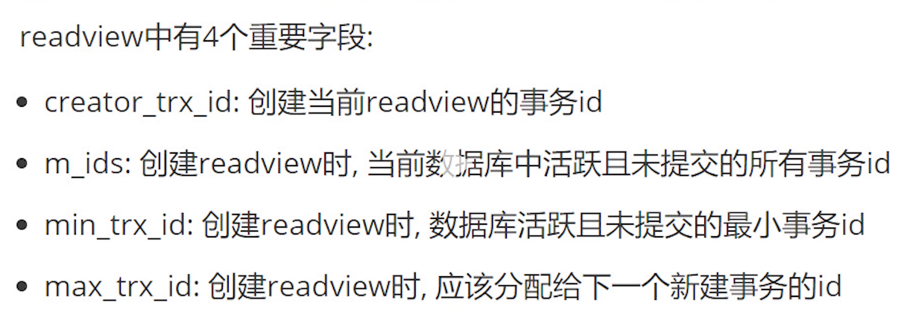
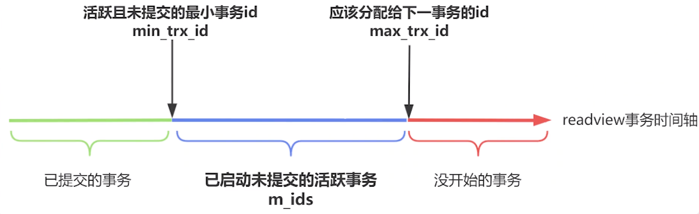
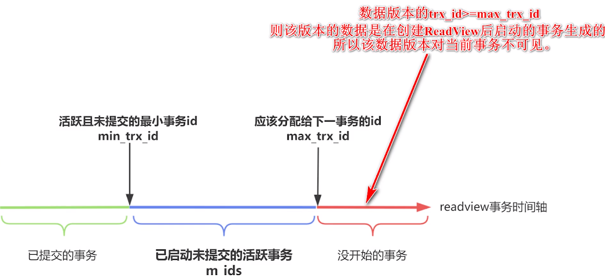
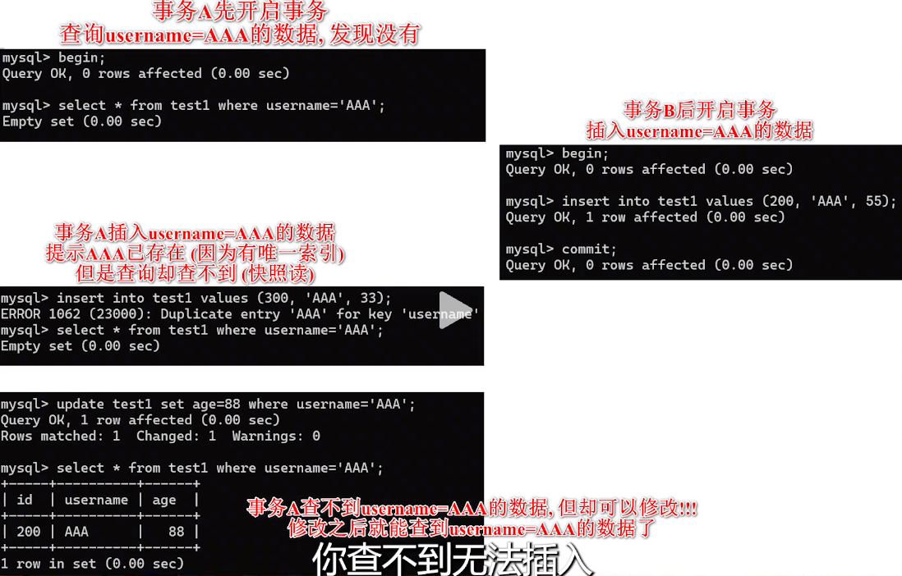
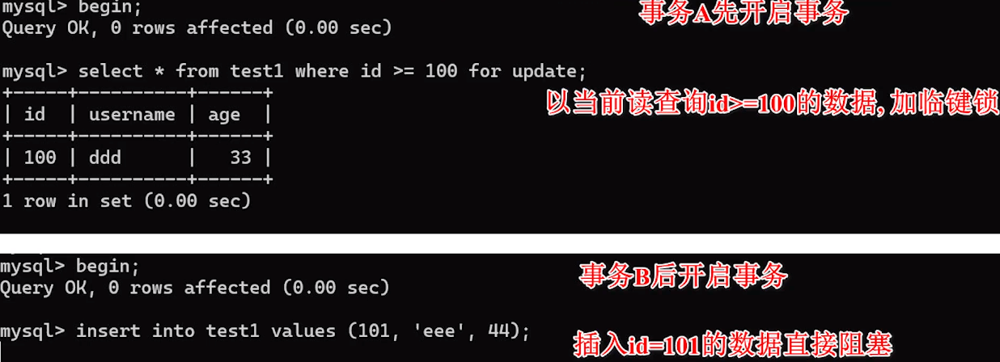
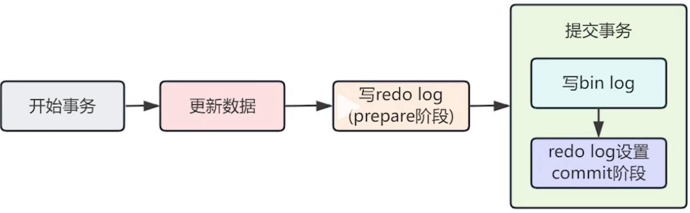

# 数据库事务并发控制与存储引擎笔记

## 一、事务并发问题

### 1.1 并发带来的问题
- **脏读**：读取到其他事务未提交的数据
- **不可重复读**：同一事务中多次读取同一数据结果不同
- **幻读**：同一事务中多次查询，结果集中的记录数量发生变化，一个事务按照条件查询数据时，没有对应的数据行,但是在插入数据时，又发现这行数据已经存在，好像出现了“幻影”

## 二、数据库四种隔离级别

### 2.1 隔离级别分类
1. **读未提交（READ UNCOMMITTED）** - 最低级别
   - 可能出现脏读、不可重复读、幻读
   
2. **读已提交（READ COMMITTED）**- **Oracle**、SQL Server等大多数数据库的默认隔离级别
   - 避免脏读，但可能出现不可重复读、幻读
   
3. **可重复读（REPEATABLE READ）** - MySQL默认级别
   - 避免脏读、不可重复读，但可能出现幻读
   
4. **串行化（SERIALIZABLE）** - 最高级别
   - 通过加锁实现，避免所有并发问题
   - 缺点：大量并发时导致锁竞争和超时，性能很差


事务隔离级别越高,娄数据越安全,但是性能越低。

### 2.2 如何设置隔离级别

```mysql
-- 查看事务隔离级别
SELECT @@TRANSACTION_ISOLATION;

-- 设置事务隔离级别
SET[SESSION|GLOBAL]TRANSACTION ISOLATION LEVEL{READ UNCOMMITTED|READ COMMITTED|REPEATABLE READ|SERIALIZABLE}

-- session：当前对话
-- global；全局
```


## 三、MVCC（多版本并发控制）

### 3.1 核心概念
- **Read View（读视图）**：用于判断数据版本对当前事务的可见性
- **Undo Log**：记录数据的历史版本
- **隐藏字段**：
  - `trx_id`：记录修改该行数据的事务ID
  - `roll_pointer`：回滚指针，指向undo log中的历史版本



分下面几种情况分析







### 3.2 不同隔离级别的实现

- **可重复读**：复用第一次生成的read view，保证事务期间读取一致
- **读已提交**：每次读取都生成新的read view

### 3.3 版本选择机制
- 通过自增的事务ID判断事务创建时间
- Read view判断哪个数据版本对当前事务可见
- Undo log将历史版本串联成链表结构

## 四、幻读问题的解决方案

### 4.1 问题描述
可重复读能解决脏读和不可重复读，但无法完全解决幻读

下面这两种情况就是例子：

- 事务A快照插id=1的数据，事务B开启后插入id=1的数据，此时事务A再使用快照读，还是查不到，但是使用当前读(select for update)就可以查到id=1的数据了，此时就发生了幻读。


- 这是插入username=AAA的操作，事务A先快照读，发现没有，此时事务B插入了username=AAA，事务A插入报错，提示username=AAA已存在（但是如果用修改的话没问题）




### 4.2 解决方案

#### 方案一：快照读 + 当前读
- **快照读**：使用MVCC读取同一版本数据，避免加锁
  ```sql
  SELECT * FROM table WHERE condition;
  ```

- **当前读**：读取最新数据，需要加锁
  ```sql
  SELECT * FROM table WHERE condition FOR UPDATE;
  SELECT * FROM table WHERE condition IN SHARE MODE;
  -- 或执行 INSERT、UPDATE、DELETE 操作
  ```

#### 方案二：临键锁（Next-Key Lock）
- MySQL在当前读时使用临键锁锁住数据间的空隙
- 防止其他事务在范围内插入新数据



#### 方案三：表锁和行锁

- **表锁**：`SELECT FOR UPDATE` 不带WHERE条件
- **行锁/临键锁**：`SELECT FOR UPDATE` 带WHERE条件，锁定范围内的行和间隙

### 4.3 局限性
先使用快照读，再使用当前读时，仍可能出现幻读现象

## 五、MySQL存储引擎优化

### 5.1 Buffer Pool（缓冲池）
- **空间局部性原理**：将相关数据页缓存在内存中
- 提高数据访问效率，减少磁盘I/O

### 5.2 Redo Log（重做日志）
- **作用**：记录每次对磁盘的操作，保证数据持久性
- **特点**：
  - 顺序IO，性能优异
  - 循环写入，空间利用率高
  - 记录物理修改而非数据修改
- **Redo Log Buffer**：防止MySQL崩溃时数据丢失
- **配置参数**：`innodb_flush_log_at_trx_commit`

### 5.3 Binary Log（二进制日志）
- **作用**：实现数据全量备份和恢复
- **特点**：追加写入
- **Binary Log Cache**：提高写入性能

### 5.4 数据一致性保证

由于Redo Log在InnoDB层，Binlog在Server层，一个事务提交时，需要同时保证这两个日志的数据一致性。如果一个写入成功而另一个失败，就会导致主库和从库（或备份）数据不一致。

**两阶段提交（2PC）**：
1. **Prepare阶段**：InnoDB将Redo Log写入磁盘，并将其状态标记为“prepare”。
2. **Commit阶段**：执行器将Binlog写入磁盘，随后InnoDB将Redo Log的状态从“prepare”修改为“commit”。

通过这种方式，保证了只有当Binlog成功写入后，事务才最终被认为是成功提交。如果在任何一步发生崩溃，MySQL在重启恢复时，会检查Redo Log的prepare状态和对应的Binlog是否完整，从而决定是提交还是回滚事务，最终确保了两个日志的一致性。




### 5.5 提问

在读未提交的事务隔离级别下未提交的事务为什么会修改数据库？没有执行commit前都会写入数据库持久化吗？那如果未commit前断电崩溃怎么办？ 


#### 1. 未提交的事务为什么会修改数据库？

未提交的事务**确实会修改数据库**。

我们通常认为，事务只有在 `COMMIT` 之后才会将数据永久写入磁盘。但实际上，数据库系统为了提高性能，并不会在 `COMMIT` 之前将所有修改操作都保存在内存中。

相反，大多数数据库（如 MySQL 的 InnoDB）采用了 **WAL（Write-Ahead Logging）**机制。WAL 的工作流程是：

1. 当事务执行 `INSERT`、`UPDATE`、`DELETE` 等操作时，数据库会**立刻将这些修改记录到日志文件（Redo Log）中**。这个过程很快，因为只是追加写入日志，没有随机 I/O。
2. 然后，数据库会**在后台**将内存中的修改数据（通常是在缓冲区）同步到磁盘上的数据文件中。这个同步过程是异步的，不等待事务提交。

因此，即使事务没有 `COMMIT`，它所做的修改也已经写入了日志，甚至可能已经写入了数据文件。

#### 2. 未执行 COMMIT 前会写入数据库持久化吗？

会，但不是完全持久化。

- **写入日志**：`INSERT/UPDATE/DELETE` 操作会立即写入 Redo Log（WAL）。这个日志是**持久化**的，即使系统崩溃，这些操作记录也不会丢失。
- **写入数据文件**：内存中的数据修改可能会在事务 `COMMIT` 前被写入磁盘上的数据文件。但这是由数据库内部的调度机制决定的，你无法控制。

当事务执行 `COMMIT` 时，数据库会确保与该事务相关的所有日志记录都已写入磁盘，然后标记事务为已提交。这才是**真正意义上的持久化**。

#### 3. 如果在未 COMMIT 前断电崩溃怎么办？

这就是事务**原子性**和**持久性**的精髓所在，也是 WAL 机制的强大之处。

- **崩溃恢复（Crash Recovery）**：当数据库系统重新启动时，它会执行崩溃恢复流程。
- **读取日志**：系统会扫描 Redo Log，查找所有已经记录但未标记为 `COMMIT` 的事务。
- **事务回滚**：对于这些未提交的事务，数据库会执行**回滚（Rollback）**操作，利用日志中的记录来撤销之前对数据文件的所有修改，从而使数据库回到事务开始前的状态。

这个恢复过程确保了即使在断电或系统崩溃的情况下，事务的**原子性**（要么都成功，要么都失败）也能得到保证。你之前进行的任何未提交的修改，都会被撤销，就像它们从未发生过一样。

## 六、对比：Redis持久化机制

### 6.1 RDB（Redis Database）
- 快照持久化方式
- 类似于MySQL的数据页持久化

### 6.2 AOF（Append Only File）
- 追加日志方式
- 类似于MySQL的Binary Log

## 总结

MySQL通过MVCC、多种锁机制、以及完善的日志系统，在保证事务ACID特性的同时，尽可能提高并发性能。不同的隔离级别和读取方式需要根据具体业务场景选择，在一致性和性能之间找到平衡点。