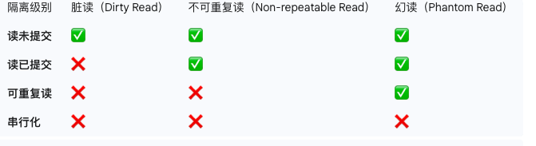
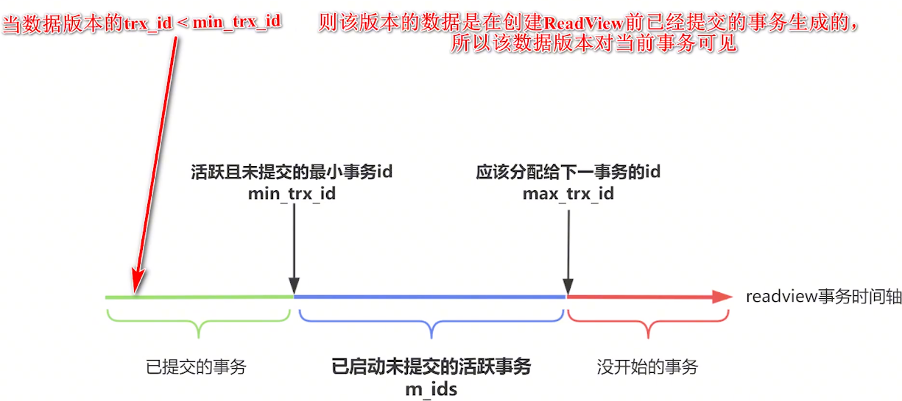

# 快速笔记

事务并发带来的问题

数据库的四种隔离级别

1. 读未提交（最低级别）
2. 读已提交
3. 可重复读（默认）
4. 串行化（加锁实现）



串行化在大量的并发中导致大量的锁竞争和超时问题，性能很差


MVCC（多版本并发控制）


read view

可重复读通过同一个read view 来解决（复用第一次的read view）

读已提交每次读都生成新的read view


新增undo log日志，给表增加一个隐藏字段roll_pointer回滚指针来指向undo log日志，把历史版本串联成一个链表

如何解决需要哪个历史版本呢？

通过一个自增的事务id判断事务id大小来判断哪个事务创建的比较早，记录哪些事务提交了（此处再给表增加隐藏字段trx_id,记录是谁修改的id)





undo log记录数据版本，read view判断这个数据版本对当前事务的可见性


可重复读能解决脏读和不可重复读，但是解决不了幻读，使用串行化隔离级别性能太差，如何解决？

解决：在可重复读的隔离级别下，

第一种：

使用快照读：在可重复读的隔离级别下，使用MVCC去读，每次读同一个版本，避免加锁

两个事务一个先开启，另一个后开启，先开启的事务一select不到id = 1的数据，但是后开启的事务二插入了id = 2的数据，事务一想要插入id = 1（因为快照读的时候没有id = 1的数据），此时并不能插入，所以需要使用当前读，

```mysql
select for update

# 或者

select in share model

# 或者执行增删改
```

这些情况必须要读到最新的数据

执行当前读Mysql会使用临键锁来锁住数据之间的空隙


当然这种不能完全避免幻读

先使用快照读，在使用当前读的时候，就会出现幻读


解决方案：在一个事务查询数据的时候，不允许其他事务增删改这个表的数据

给表加表锁（select for update），

给数据加行锁(如果select for update 使用where，就会给where的范围内加上行锁，临键锁)


mysql缓存池 buffer pool


空间局部性

redo log记录每次磁盘进行的操作，事务提交后就刷新缓存池的内容，如果buffer pool崩溃了，还可以根据redo log来恢复数据，保证数据持久性


顺序IO

redo log记录数据的物理修改，而不是记录数据修改（循环写）

redo log也有自己的redo log buffer，来保证Mysql崩溃时没刷盘

那 MYSQL 中呢,有一个参数叫
innodb_flash_ log_and_ trx_commit


redo log不能用来进行数据的恢复

bin log（追加写）可以实现数据的全量备份恢复（删库跑路的时候记得删）

bin log cache


redis rdb 和 aof


解决redo log 和bin log数据一致性：

MYSQL 呢,将 redo log 拆成了两个步骤去写
prepare 和 commit


# 视频文稿总结

### 揭秘MySQL三大核心日志：Undo Log、Redo Log与Binlog

在MySQL数据库中，为了保证数据的一致性、持久性以及支持事务的回滚和数据恢复，设计了三种核心日志：Undo Log（回滚日志）、Redo Log（重做日志）和Binlog（二进制日志）。理解这三者的作用和协同工作机制，对于深入掌握MySQL至关重要。

#### Undo Log：事务的“后悔药”

**Undo Log** 主要有两个核心作用：实现事务的原子性和多版本并发控制（MVCC）。

*   **保证原子性**：原子性是事务ACID特性之一，要求事务中的所有操作要么全部成功，要么全部失败回滚到事务开始前的状态。Undo Log记录的是数据被修改前的信息。 当事务需要回滚时，无论是用户手动执行`ROLLBACK`，还是数据库因故障中断，都可以利用Undo Log中的记录，将数据恢复到修改之前的版本，从而保证了事务的原子性。

*   **实现MVCC**：在InnoDB存储引擎中，MVCC机制允许在读写并发的情况下，读操作不会被阻塞。这是通过Undo Log和ReadView协同实现的。 当一个事务需要读取某行数据，而该行数据正在被另一个事务修改时，MVCC可以通过Undo Log获取该行数据之前的版本，从而实现非锁定的一致性读。

#### Redo Log：断电也不怕的数据守护者

**Redo Log** 是InnoDB存储引擎层面的日志，它的主要作用是确保事务的持久性。

为了提升性能，MySQL的数据读写并非每次都直接操作磁盘，而是会先在内存中的一个名为**Buffer Pool**的缓冲池中进行。 对数据的修改会先在Buffer Pool中完成，这样的内存页被称为“脏页”。脏页会在未来的某个时刻由后台线程刷写到磁盘。

但如果在这个过程中，MySQL服务器宕机或断电，内存中的脏页数据就会丢失。为了解决这个问题，Redo Log应运而生。它记录了“在某个数据页上做了什么修改”的物理日志。 事务提交时，会先将Redo Log写入磁盘，这个过程是顺序I/O，效率远高于将分散的脏页随机写入磁盘。

即使脏页还未刷盘，只要Redo Log已经持久化，那么在MySQL重启后，就可以根据Redo Log的内容进行重做，将数据的修改恢复出来，从而保证了已提交事务的持久性。

**为什么不直接刷脏页而是写Redo Log？**
主要原因是性能差异。刷写脏页是随机I/O操作，需要在磁盘上找到相应的数据页进行更新，效率较低。而写Redo Log是顺序追加写入，速度快得多。

#### Binlog：数据备份与主从复制的基石

**Binlog** 是MySQL Server层产生的日志，记录了所有对数据库造成更改的操作。 它的主要应用场景是数据备份恢复和主从复制。

*   **数据备份与恢复**：通过全量备份加上Binlog的增量日志，可以将数据库恢复到任意一个时间点。
*   **主从复制**：在主从架构中，主库将Binlog发送给从库，从库重放Binlog中的事件，从而实现与主库的数据同步。

与InnoDB特有的Redo Log不同，Binlog是所有存储引擎都可以使用的。 Redo Log是循环写的，空间固定，而Binlog是追加写的，写满一个文件后会创建新文件继续写入。

#### 两阶段提交：确保Redo Log与Binlog的一致性

由于Redo Log在InnoDB层，Binlog在Server层，一个事务提交时，需要同时保证这两个日志的数据一致性。如果一个写入成功而另一个失败，就会导致主库和从库（或备份）数据不一致。

为了解决这个问题，MySQL引入了**两阶段提交**机制：
1.  **Prepare阶段**：InnoDB将Redo Log写入磁盘，并将其状态标记为“prepare”。
2.  **Commit阶段**：执行器将Binlog写入磁盘，随后InnoDB将Redo Log的状态从“prepare”修改为“commit”。

通过这种方式，保证了只有当Binlog成功写入后，事务才最终被认为是成功提交。如果在任何一步发生崩溃，MySQL在重启恢复时，会检查Redo Log的prepare状态和对应的Binlog是否完整，从而决定是提交还是回滚事务，最终确保了两个日志的一致性。