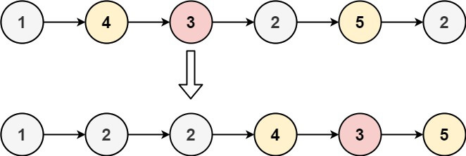
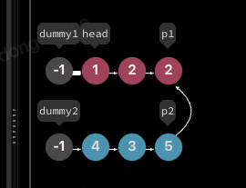
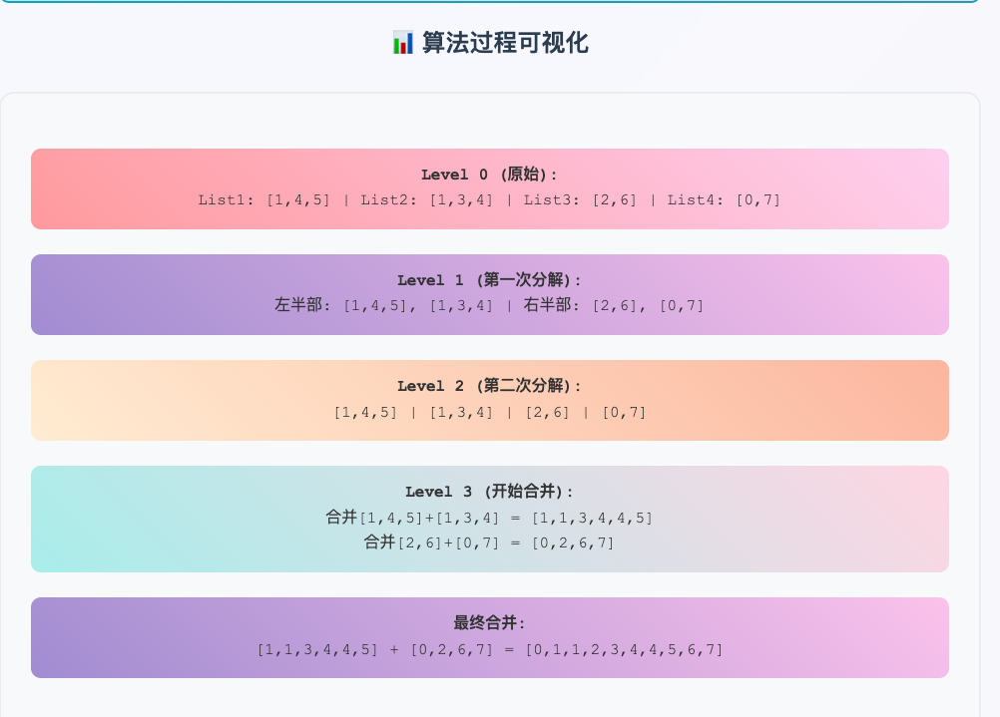
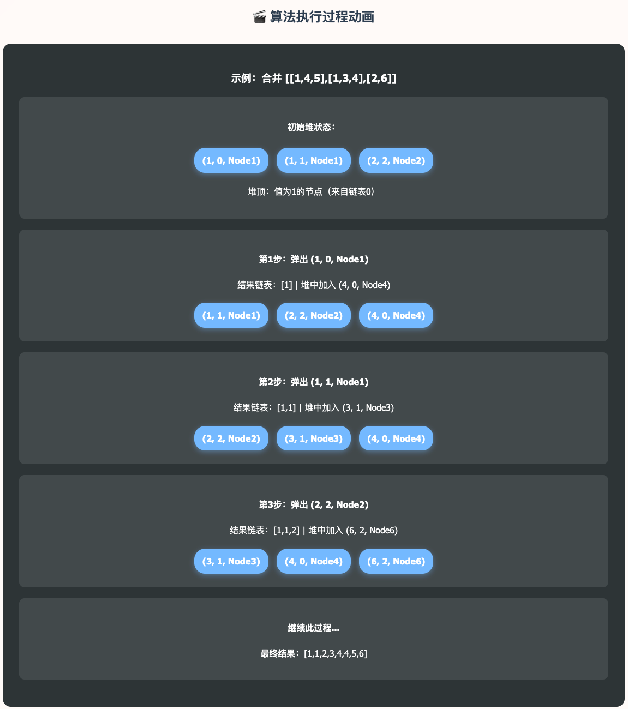
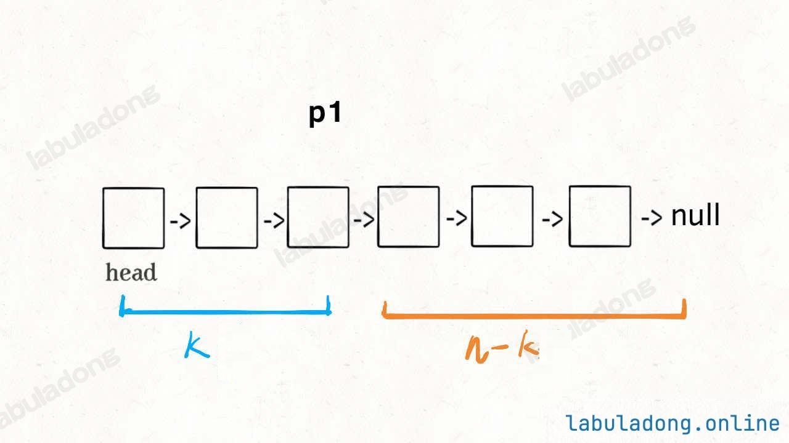
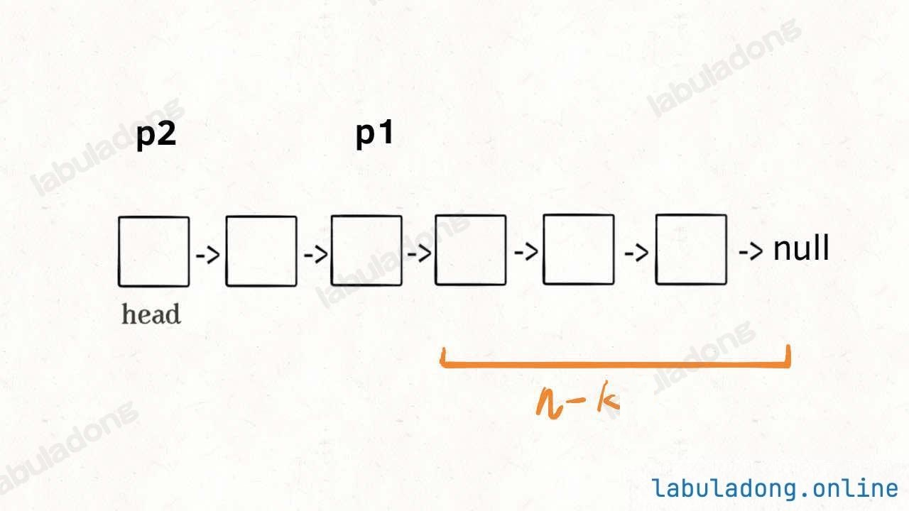
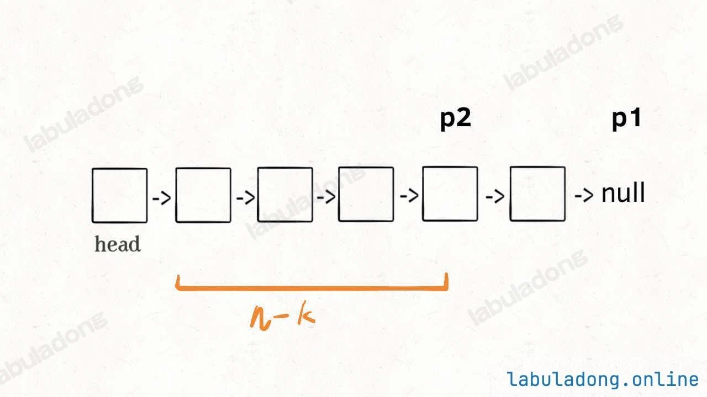
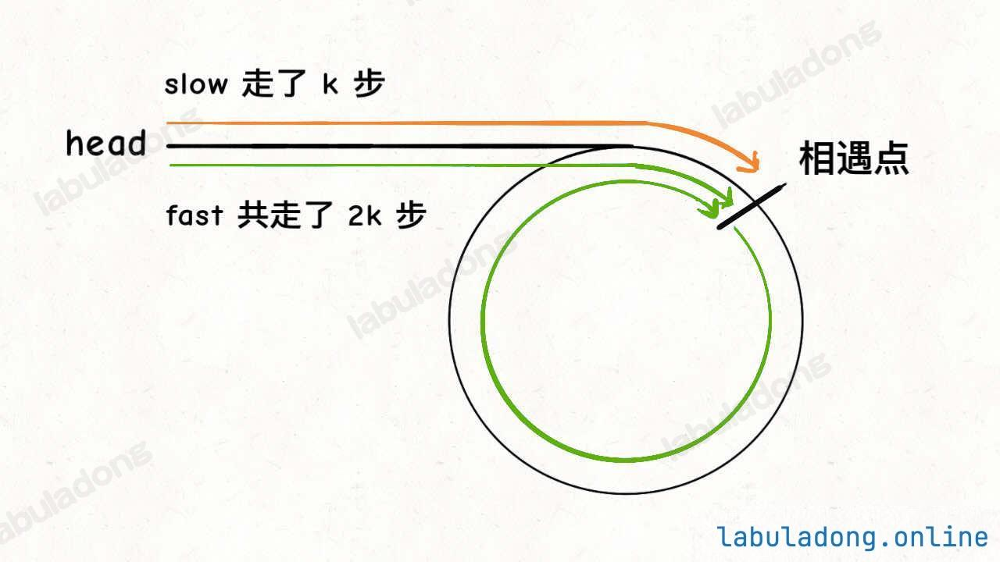
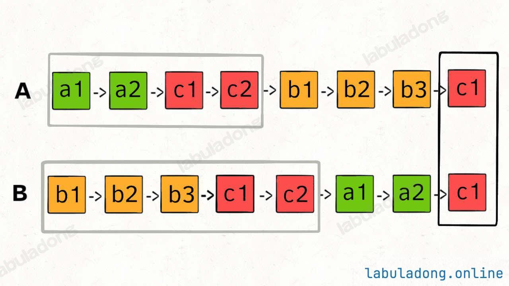

# 双指针技巧解双链表问题


## 1、合并两个有序链表

例题：将两个升序链表合并为一个新的 升序 链表并返回。新链表是通过拼接给定的两个链表的所有节点组成的。


解法：使用**dump虚拟头节点**，逐一对比链表各个数据，将dump虚拟头节点指向小的那个节点（相同的节点随便选一个接），最后有一个**处理点**：当其中一条链表已经遍历完，指针指向null时，可以将另一条链表直接接到dump虚拟头节点的那条链表，不需要继续遍历

可视化动图：


## 2、链表的分解

例题：给你一个链表的头节点 `head` 和一个特定值 `x` ，请你对链表进行分隔，使得所有 **小于** `x` 的节点都出现在 **大于或等于** `x` 的节点之前。

你应当 **保留** 两个分区中每个节点的初始相对位置。




解法：和合并两个有序链表所用的逻辑相似，创建两个由dump虚拟头节点创建的链表（一条是`>x`，一条是`<x`），再遍历源链表比对大小，放入对应的链表，这样还能保证原来的顺序。

> [!important]
>
> 此处处理的时候有一个⚠️注意点
>
> ```python
> class Solution:
>     def partition(self, head: ListNode, x: int) -> ListNode:
>         # 存放小于 x 的链表的虚拟头结点
>         dummy1 = ListNode(-1)
>         # 存放大于等于 x 的链表的虚拟头结点
>         dummy2 = ListNode(-1)
>         # p1, p2 指针负责生成结果链表
>         p1, p2 = dummy1, dummy2
>         # p 负责遍历原链表，类似合并两个有序链表的逻辑
>         # 这里是将一个链表分解成两个链表
>         p = head
>         while p:
>             if p.val >= x:
>                 p2.next = p
>                 p2 = p2.next
>             else:
>                 p1.next = p
>                 p1 = p1.next
>             # 不能直接让 p 指针前进，
>             # p = p.next
>             # 断开原链表中的每个节点的 next 指针
>             temp = p.next
>             p.next = None
>             p = temp
>         # 连接两个链表
>         p1.next = dummy2.next
> 
>         return dummy1.next
> ```
>
> 处理这部分的时候，要把源链表的next指针断开，否则**结果链表**的输出还会包含源链表的内容，会包含一个环，且源链表后面没遍历的会接到结果表，不符合输出结果。
>
> 
>
> 详情见[可视化面板](https://labuladong.online/algo/essential-technique/linked-list-skills-summary/#div_mydata-partition-list)
>
> ```python
> # 不能直接让 p 指针前进，
> # p = p.next
> # 断开原链表中的每个节点的 next 指针
> temp = p.next
> p.next = None
> p = temp
> ```
>
> 


## 3、合并 `k` 个有序链表

这个处理的逻辑和合并2个有序列表有一些共同思路，可以通过逐一合并的思路来进行

但是其时间复杂度为**O(k²n)** - k个链表，每个长度n

- 第1次合并：n + n = 2n
- 第2次合并：2n + n = 3n
- 第3次合并：3n + n = 4n
- ...
- 第k-1次合并：(k-1)n + n = kn
- 总计：2n + 3n + 4n + ... + kn = n(2+3+...+k) = n·k(k+1)/2 - n = **O(k²n)**

空间复杂度：O(1)

对于k过大时，处理起来时间复杂度较高，所以还有一种**分治**的思想。（还有**优先队列**）

### 分治合并（Tree-like Divide & Conquer）

分治合并采用"分而治之"的策略，将K个链表问题分解为更小的子问题，然后合并子问题的解。

**核心思想**

**分治合并**将K个链表问题递归地分解为更小的子问题：

- **分解**：将K个链表分成两半
- **解决**：递归处理每一半
- **合并**：将两个结果合并成一个链表

**复杂度分析：**

- 时间复杂度：O(kn·log k) 
  - 树的深度：log k
  - 每层合并的总节点数：kn
  - 总计：**O(kn·log k)**
- **空间复杂度：O(log k)** - 递归调用栈的深度



---


### 优先队列（最小堆）的方法

**核心思想**

**优先队列方法**使用最小堆来维护每个链表的当前最小节点：

- **初始化**：将每个链表的头节点放入最小堆
- **循环处理**：从堆中取出最小值，加入结果链表
- **更新堆**：将取出节点的下一个节点（如果存在）加入堆
- **重复**：直到堆为空

**复杂度分析：**

- 时间：O(kn·log k)
- 空间：O(k) - 堆的大小




|      特性      |     分治合并     |     优先队列     |
| :------------: | :--------------: | :--------------: |
| **时间复杂度** |  O(kn × log k)   |  O(kn × log k)   |
| **空间复杂度** |     O(log k)     |       O(k)       |
|  **实现难度**  | 中等（递归思维） | 简单（直观逻辑） |
|  **内存使用**  |      递归栈      |      堆存储      |
|  **适用场景**  |    大规模合并    |  需要实时最小值  |

> [!NOTE]
>
> 在实时处理流中，分治合并并不适用，需要使用优先队列
>
> 优先队列可以实时获取当前最小值

---


## 4、寻找单链表的倒数第 `k` 个节点

TODO









## 5、寻找单链表的中点

快慢指针

## 6、判断单链表是否包含环并找出环起点

**快慢指针**




## 7、判断两个单链表是否相交并找出交点

对齐法




## 寻找链表中点

使用**快慢指针**，快指针走两步，慢指针走一步，当快指针为null（尾）时慢指针即为中点

> [!NOTE]
>
> 还要判断奇偶，奇数的话慢指针恰好为中点。偶数的话慢指针会停在中间偏右

