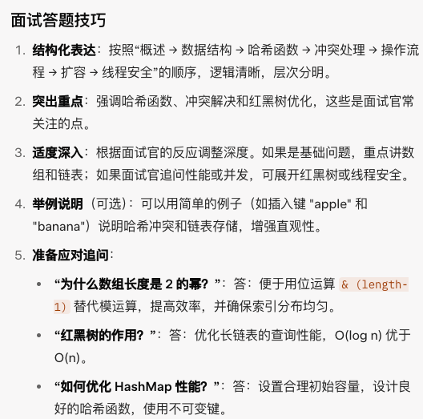

[toc]

---

# part 1

## 1. 你项目中常用哪些集合?

`ArrayList`：适合需要快速随机访问（通过索引）和动态调整大小的场景，如存储有序数据列表
`HashMap`：适合需要快速查找键值对的场景，如缓存、配置映射。
`LinkedList`：适合需要快速查找和去重的场景，如存储唯一 ID 或词汇集合。
`ConcurrentHashMap`：适合多线程环境中需要高效键值对存储和访问的场景，如并发缓存。


## 2. 说一下list、set和map的区别

List系列：有序，可重复，通过索引访问，底层是基于数组和链表来实现的，适合顺序存储

Set系列：一般是无序，元素唯一，快速查找，适合去重，底层基于哈希表和红黑树实现

Map系列：无序，键唯一，键找值，基于哈希表和红黑树实现，适合映射关系

选择建议：

- **有序且允许重复**用`List`
- **唯一且需要快速查找**用`Set`
- 需要**键值映射**用`Map`


## 3. 说一下hashmap的底层原理

> [!tip]
>
> 底层数据结构：数组+链表+红黑树
>
> 接下来的回答中要点出**数组的作用**，**为啥会有冲突**，**如何解决冲突**

- 从基本数据结构的角度来说：

HashMap是底层是基于数组+链表+红黑树

- 再从哈希函数和键定位来说：

当插入一个键值对的时候，HashMap首先调用键的`HashCode()`方法计算哈希值，在Java中通过扰动函数优化分布均匀，然后通过`hash & (数组长度 - 1)`（哈希值和数组长度减一进行与运算）把哈希值映射到数组索引，确定存储位置。数组长度通常为2的幂，以保证高效的位运算（二进制）。


> ```java
> static final int hash(Object key) {
>    int h;
>    return (key == null) ? 0 : (h = key.hashCode()) ^ (h >>> 16);
> }
> ```
>
> 1. 获取原始的哈希值，调用`key.hashCode()`，得到一个32位整数h
> 2. 将这个整数右移16位，位运算，从高16位移到低16位，低16位补0
> 3. 按位异或：将原始哈希值h和右移的值进行异或运算，即相同为0，不同为1，融合了高低位的特征 

>  [!tip] 
>
>  为什么是右移16位？为什么需要扰动函数？


- 还有哈希冲突的处理：

当多个键映射到同一索引时，会发生哈希冲突。HashMap 采用链地址法，将冲突的键值对存储在同一桶的链表中。在 Java 8 中，如果链表长度超过 8 且数组容量达到 64，链表会转换为红黑树以提高查询效率（从 O(n) 降为 O(log n)）。当节点数减少到 6 以下时，红黑树退回链表。

- 核心操作

**插入 (put)**：

1. 计算键的哈希值和索引。
2. 若桶为空，放入新节点；否则在链表/树中查找，键存在则更新值，不存在则添加。
3. 若元素数超过阈值（容量 * 负载因子 0.75），触发扩容。

**查找 (get)**：计算索引，在链表/树中查找键（equals() 比较）。
**删除 (remove)**：类似查找，移除节点并调整链表/树结构。
**时间复杂度**：平均 O(1)，最坏（冲突严重）O(n) 或 O(log n)（红黑树）。

- 扩容机制

**触发条件**：元素数 > 容量 * 负载因子（默认 0.75）。
**过程**：数组扩容为 2 倍，重新计算所有元素的索引（利用高位），迁移到新数组。
**影响**：扩容耗时（O(n)），负载因子平衡空间与性能。

- 线程安全性

**非线程安全**：多线程下可能导致数据丢失或死循环（Java 7 扩容问题）。
**替代方案**：使用 ConcurrentHashMap（分段锁）或 Hashtable（全局锁）。

- 其他特性

**支持 null**：允许一个 null 键（索引 0），多个 null 值。
**键不可变**：键需 immutable（如 String），否则 hashCode 变化导致查找失败。
**权衡**：适合随机访问；若键分布不均，性能可能退化；有序需求用 LinkedHashMap。



> [!tip] 
>
> “HashMap 是基于哈希表的键值对存储结构，底层是一个数组，每个元素（桶）存储单节点或链表。插入时，通过键的 hashCode 和扰动函数计算索引，若冲突则用链表或红黑树（链表长于 8 时转换）存储。查找和删除类似，通过索引定位后遍历链表或树。扩容发生在元素数超过容量 * 负载因子（0.75）时，数组翻倍并重新分配数据。HashMap 非线程安全，适合快速查找场景，如需线程安全可使用 ConcurrentHashMap。”


## 4. hashmap的key和value可以为空吗，如果可以允许key为null，那么null的这个元素是存在哪个桶？

Java HashMap 的 key 和 value 都可以为 null。其中，key 只允许一个 null（因为 null 被视为一个唯一的键），而 value 可以有多个 null。 如果将 null 作为 key 插入 HashMap 时，不会调用 hashCode() 方法，而是直接将它放置在桶索引为 0 的位置（bucket 0）。

> [!tip] 
>
> 为什么key可以为空？
>
> HashMap 允许 key 为 null 是为了提供更高的灵活性和通用性，同时通过特殊处理（将 null key 放入 bucket 0）确保了实现的正确性。这种设计在非并发场景下是安全的，但在需要线程安全的场景下（如 ConcurrentHashMap），则会禁止 null key 以避免复杂性。


## 5. hashmap是线程安全的吗,那想要线程安全怎么办？

不是线程安全的。

有四种方法。（回答1，2，4即可）

- 第一种是手动加锁，使用ReentrantLock，调用lock()方法（要记得释放锁unlock()）;

> [!tip] 
>
> 也可以使用synchronized锁，引出synchronized和ReentrantLock的区别

- 第二种是使用`ConcurrentHashMap`，它是线程安全的，并且性能更好，特点是使用了~~分段锁~~或CAS机制锁粒度更细，只锁住部分数据通，读操作通常无锁，写操作高效，支持高并发，性能优于Colletions.synchronizedMap。


- 第三种是使用`Colletions.synchronizedMap`来包装HashMap，使其变成线程安全，性能比较低，每次操作都会上锁，锁粒度较大。


- 第四种是适用于Hashtable，它也是线程安全的，它不支持键值为null，性能也是比较低的，已经被淘汰了


更推荐使用`ConcurrentHashMap`或者手动加锁

>  [!tip]
>
> | 特性   | Hashtable                       | Collections.synchronizedMap    |
> | ------ | :------------------------------ | ------------------------------ |
> | 锁粒度 | 对象级别（整个 Hashtable 对象） | 对象级别（包装的 mutex 对象）  |
> | 锁实现 | 方法上直接加 synchronized       | 包装方法中使用 synchronized 块 |


## 6. hashmap的时间复杂度是多少

理想情况下要查找的元素在桶的第一位时查找的时间复杂度是O(1)，如果在链表中就是O(n)，当链表过长转化为红黑树的时候，时间复杂度优化为O(log n)


## 7. 说一下hashmap的扩容机制

默认的容量为16，扩容因子为0.75。

当数组中的元素个数为最大的长度的0.75时，hashMap会进行扩容，容量会扩展为原来的两倍，而且涉及到重新哈希和节点迁移


## 8. hashmap是有序的吗？什么map是有序的

无序的

LinkedHashMap：保持元素的插入顺序。如果使用访问顺序构建，那么它将会按最近最少使用（LRU）顺序来排序。

TreeMap：基于红黑树实现，按照键的自然顺序（如果键实现了Comparable接口）或者根据创建TreeMap时提供的Comparator进行排序。


## 9. new Hashmap()初始底层数组长度是多少
默认初始容量是16。


## 10. new Hashmap(14)初始数组长度是多少

初始数组长度是16，因为HashMap的容量总是2的幂，14会向上取整到最近的2的幂（16）。


## 11. 为什么扩容是2倍

扩容为2倍允许使用高效的位运算（hash & (length - 1)）来计算索引，替代取模运算，提升性能。


## 12. 为什么扩容因子是0.75

0.75是时间和空间成本的折中

负载因子过高减少空间开销但增加查找成本；

过低则浪费空间。0.75基于统计经验，平衡了冲突概率和扩容频率。


## 13. 什么时候链表会转成红黑树

在数组容量达到 >= 64 **且** 链表长度 >= 8 时，链表会转换成红黑树

> 当只有容量 >= 64 链表长度 <8 ，不会转换，也不会扩容
>
> 只有链表长度 >= 8 时，但数组容量<64，会进行扩容，而不是转红黑树


## 14. 什么时候红黑树会转成链表

当红黑树节点数减少到6以下时，转换回链表。


## 15. 为什么是6和8

8和6的阈值避免频繁转换导致的抖动；

8基于泊松分布，链表长度超过8的概率很低；

6防止在添加和删除元素时频繁切换结构。


## 16. 当数组长度少于64，链表长度大于8会怎么样

只会进行数组扩容，不会转换红黑树，直到数组容量达到64。


## 17. hashmap对key计算落到哪个桶是用取模运算吗？

不是直接取模，使用hash & (length - 1)计算索引，当length是2的幂时等效于取模，但更高效。


## 18. 为什么要用红黑树？只用链表不行吗？要用树那为什么不是二叉树、平衡二叉树？

- 红黑树在冲突严重时提供O(log n)查询，链表最坏O(n)
- 红黑树是自平衡二叉树，插入删除效率高；普通二叉树可能退化为链表；平衡二叉树（如AVL）旋转开销大，红黑树更适用


## 19. hashmap能直接做缓存吗？有没有不足的地方？

可以，但不足：

- 非线程安全
- 无过期策略
- 可能内存泄漏
- 推荐使用专门缓存库（如Caffeine、Guava Cache）


## 20. hashmap能根据value查询key吗？

不能直接查询，需要遍历所有键值对，时间复杂度O(n)。

而且value可以重复，查询到的key不一定唯一


## 21. hashmap能缩容吗

不能

防止频繁改变容量导致带来不必要的性能开销


## 22. hashmap什么时候会导致死循环？那怎么解决？


> **仅在 JDK7 及更早版本** 的 “头插法” 扩容里会出现死循环。  
> 触发条件：多线程并发执行 `put` 触发 `resize`（扩容），在链表迁移过程中，两个线程同时把同一链表做逆向指针重连，导致成环；后续 `get` 遍历链表时便会死循环。

**JDK8 已改为 “尾插法” 并加入高低位拆分，** 不会成环，但仍可能丢失数据，依旧线程不安全。

**解决：**
1. 不在多线程环境直接使用 `HashMap`；
2. 使用 `ConcurrentHashMap`；（推荐）
3. 外部手动加锁（`synchronized` / `ReentrantLock`）；
4. 用 `Collections.synchronizedMap` 包装（性能差，不推荐高并发场景）。


## 23. 为什么hashmap需要重写key的hashcode和equals方法？
- hashcode用于计算桶索引，equals用于比较键是否相等
- 如果不重写，可能违反约定：相等对象必须有相等hashcode，导致查找失败

因为HashMap在存储和取值时，会先根据key的`hashCode()`计算出所在的桶位置，然后再用`equals()`判断桶中是否存在相同的key。如果只重写`equals()`不重写`hashCode()`，逻辑上相等的对象可能被分配到不同的桶中，取值会失败；如果只重写`hashCode()`不重写`equals()`，在哈希冲突时也会被当作不同的key。因此，使用自定义对象作为key时，必须同时重写`hashCode()`和`equals()`方法，保证“相等的对象hash值一定相等”，以确保HashMap能正确存取数据。


## 24. 你知道linkedhashmap吗？你知道它可以做什么吗
LinkedHashMap是HashMap子类，维护插入或访问顺序。用途：

- 实现LRU缓存
- 保持元素顺序
- 通过accessOrder=true支持访问顺序排序

# part 2


## 25. 说一下hashset的底层原理

HashSet底层是基于HashMap实现的，它只使用了HashMap的key，而value则是一个无意义的Object

向HashSet添加一个元素的时候，底层调用了HashMap的`put(E, V)`方法，将这个元素作为Key，还有一个默认的`PRESENT`作为Value存入。由于HashMap的键是唯一的，所以HashSet的元素是不可重复的


## 26. 说一下ConcurrentHashmap的底层原理

JDK1.8之前：

`ConcurrentHashMap` 采用了**分段锁（Segment）** 的思想。整个 `ConcurrentHashMap` 被分成多个 `Segment`，每个 `Segment` 都是一个独立的 `HashMap`，并带有自己的 `ReentrantLock`。当一个线程修改某个 `Segment` 时，只需要对该 `Segment` 加锁，而其他线程可以自由地访问或修改其他 `Segment`，从而实现了高并发。默认情况下，它有 16 个 `Segment`。

JDK1.8之后：

放弃了分段锁的思想，使用CAS + synchronized的结合，读不加锁，只有在并发写得操作会加锁。

在空桶初始化的时候会使用CAS，


## 27. ConcurrentHashmap和Hashtable的区别

Hashtable几乎所有方法都使用synchronized修饰，也就是全局锁，在并发线程中会阻塞其他线程

ConcurrentHashmap在JDK1.8之前是使用分段锁，JDK1.8后使用CAS + synchronized实现了更细的锁控制，也就是局部锁，高并发的场景性能远超hashtable


## 28. 说一下Arraylist和Linkedlist的区别?

从**数据结构**来说，Arraylist是基于动态数组来实现的，而Linkedlist是基于双向链表来实现的；

ArrayList底层是连续的内存空间，因此可以通过索引快速定位元素，**查询的时间复杂度是O(1)**，但插入或删除元素（特别是中间位置）时，需要移动大量元素，所以**插入、删除较慢**；
 LinkedList的节点在内存中分散存储，每个节点包含前驱和后继指针，因此在**插入和删除时，只需修改指针，速度较快**，时间复杂度是O(1)；但**查询时必须从头或尾开始遍历**，平均复杂度是O(n)。

**扩容方面**
ArrayList在存储满时会触发**动态扩容**，默认扩容为原容量的1.5倍，会涉及到数组的重新创建和数据拷贝；
 LinkedList没有扩容问题，因为它是通过节点链式连接的，按需创建节点。

**占的内存**
LinkedList每个节点都需要额外存储前驱和后继引用，因此相比ArrayList更**耗内存**。

> 链表查找会先进行一次二分查找，只有一次，因为一次的话有首尾节点，再次二分的话就没有中间的指针了

**LinkedList不存在任何二分查找的过程。**
它最多是根据索引位置判断“靠前还是靠后”，从头或尾开始遍历——这只是“优化遍历方向”，不是二分查找。链表没有随机访问能力，无法进行二分查找。


 

## 29. new Arraylist()数组初始长度是多少，说一下Arraylist的扩容机制

new Arraylist()的初始容量是0，当第一次添加元素的时候会进行扩容至10

当容量不足以容纳新元素的时候才会进行扩容，扩容一般是当前容量的1.5倍，先创建一个新的数组，大小为扩容后的容量，再将旧的数组复制到新数组，最后Arraylist内部引用指向新数组


## 30. Arraylist和Linkedlist是线程安全的吗？要线程安全怎么办

他们都是非线程安全的

- 可以使用`Collections.synchronizedList()`方法，把普通的List包装成线程安全的同步List。例如： `List list = Collections.synchronizedList(new ArrayList<>());` 这种方式通过同步锁（synchronized）实现，适合线程少、并发低的场景。

- 使用 **`CopyOnWriteArrayList`**，它是一个线程安全的 `List` 实现，写入时会复制一个新的数组，适合读多写少的场景。


- Vector：但它的所有方法都通过synchronized修饰，性能较低，现在已经不推荐使用。


## 31. 能不能一边循环一边执行删除list的数据？

在forEachh和普通for循环删除List集合是不安全的，会导致`ConcurrentModificationException`异常

建议使用倒序for循环或者迭代器进行删除


## 32. 如何实现list和数组的互转

list转数组：
list.toArray，为了类型安全和性能，更推荐使用 `list.toArray(new String[0])`。

数组转list：
Arrays.asList()：`Arrays.asList()` 返回的 `List` 是一个**固定大小的**，不支持添加或删除操作。
使用stream流的collect