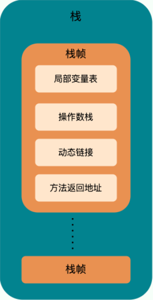
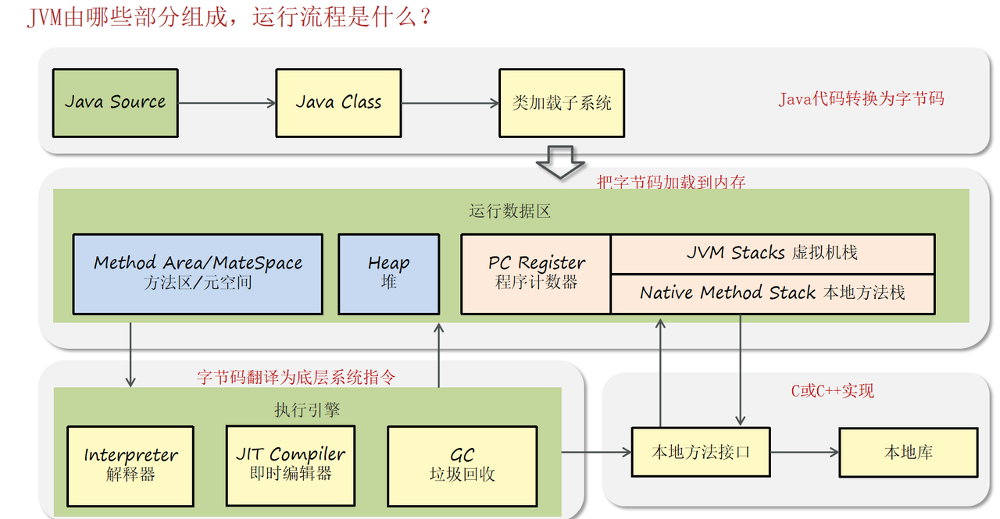
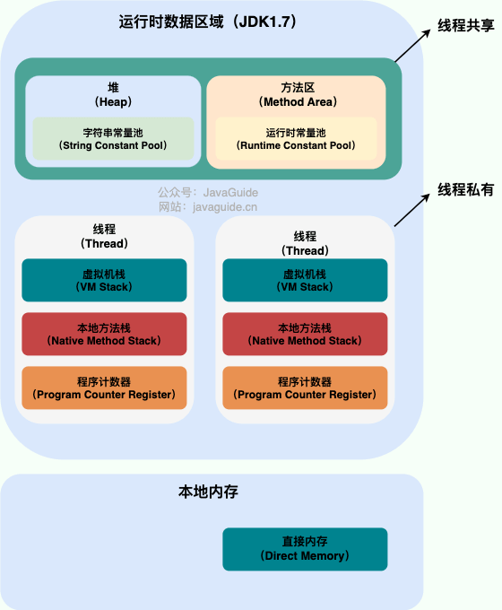
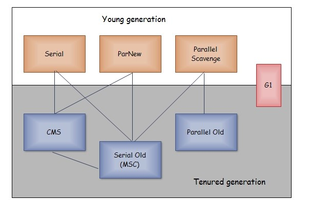
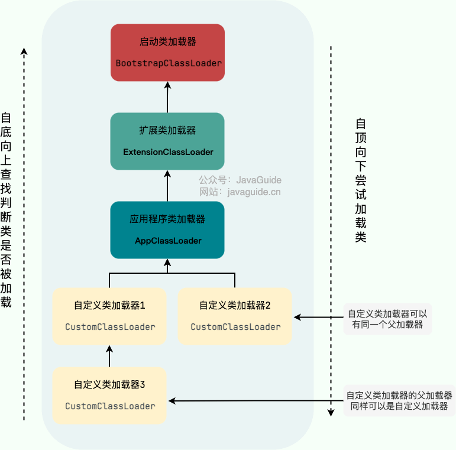

[toc]

## 1.说一下jvm的内存区域,以及每个区域是干什么的

> [!note] 
>
> 类加载器，运行时数据区，字节码执行器

运行时数据区域：

- **程序计数器（PC Register）**

记录正在执行的虚拟机字节码指令的地址（如果正在执行的是本地方法则为空），线程私有，用于线程切换后恢复执行位置。

>  [!warning] 
>
>  程序计数器是唯一一个不会出现 `OutOfMemoryError` 的内存区域，它的生命周期随着线程的创建而创建，随着线程的结束而**销毁**。

- **虚拟机栈（JVM Stack）**

线程私有，存储方法执行的栈帧（局部变量表、操作数栈、常量池引用等），用于方法调用和局部变量存储。

它的生命周期和线程相同，随着线程的创建而创建，随着线程的死亡而死亡。从方法调用直至执行完成的过程，对应着一个栈帧在 Java 虚拟机栈中入栈和出栈的过程。

- **本地方法栈（Native Method Stack）**

线程私有，为本地方法（Native 方法 -> C、C++ 或汇编语言等）服务，功能类似虚拟机栈，它们之间的区别只不过是本地方法栈为本地方法服务，即区别是：**虚拟机栈为虚拟机执行 Java 方法 （也就是字节码）服务，而本地方法栈则为虚拟机使用到的 Native 方法服务。**

- **堆（Heap）**

线程共享，所有对象都在这里分配内存，堆不需要连续内存，并且可以动态增加其内存，存储对象实例和数组，是垃圾回收的主要区域。

可以通过 -Xms 和 -Xmx 这两个虚拟机参数来指定一个程序的堆内存大小，第一个参数设置初始值，第二个参数设置最大值。

- **方法区（Method Area）**

线程共享，存储类信息、常量、静态变量等（JDK8 及以后由元空间实现）。

和堆一样不需要连续的内存，并且可以动态扩展，动态扩展失败一样会抛出 OutOfMemoryError 异常。

- **运行时常量池**

方法区的一部分，存储编译期生成的字面量和符号引用。

- **直接内存**

非 JVM 内存区域，由 NIO 使用，减少数据拷贝。

> [!tip] 
>
> **线程私有的：**
>
> - 程序计数器
> - 虚拟机栈
> - 本地方法栈
>
> **线程共享的：**
>
> - 堆
> - 方法区
> - 直接内存 (非运行时数据区的一部分)

## 2.说一下常见的垃圾收集算法以及他们的特点是什么

> 程序计数器、虚拟机栈和本地方法栈这三个区域属于线程私有的，只存在于线程的生命周期内，线程结束之后就会消失，因此不需要对这三个区域进行垃圾回收。

- **标记-清除（Mark-Sweep）**：
  - **过程**：标记存活对象头部，清除**未标记**对象。
  - **特点**：
    - **优点**：
      - **实现简单**：逻辑直观，无需复杂数据结构或额外内存开销，易于实现。
      - **兼容性强**：基于可达性分析，能处理循环引用，适用于复杂对象图。
      - **暂停时间可控**：在CMS等收集器中，标记可并发执行，减少STW时间。
      - **内存利用率高**：无需预留空间，充分利用堆内存。
    - **缺点**：
      - **内存碎片**：清除后产生不连续空闲块，可能导致大对象还有数组分配失败，触发Full GC或OOM。
      - **效率较低**：标记和清除需扫描整个堆，时间复杂度O(n)，堆大时开销高。
      - **STW暂停长**：传统实现中需暂停应用线程，暂停时间随对象图深度增加。
      - **浮动垃圾**：并发标记时新垃圾可能未被标记，需下次GC处理。
- **标记-整理（Mark-Compact）**：
  - **过程**：标记存活对象，将存活对象移动到内存一端，整理出连续空闲空间，再清除剩余部分。
  - **特点**：
    - **优点**：
      - **无内存碎片**：整理后内存连续，适合大对象分配，减少Full GC。
      - **兼容性强**：基于可达性分析，能处理循环引用，适合老年代。
      - **回收彻底**：一次性清除所有垃圾，无浮动垃圾问题。
    - **缺点**：
      - **整理开销大**：移动存活对象需要更新引用地址，增加CPU和时间开销。
      - **STW时间长**：标记和整理阶段通常需暂停应用线程，暂停时间随存活对象数量增加。
      - **效率较低**：相比标记-清除，多了一步整理，整体耗时较高。
- **复制（Copying）**：
  - **过程**：将内存分为两块（From和To），将存活对象复制到To空间，清除From空间，然后交换From和To角色。
  - **特点**：
    - **优点**：
      - **无内存碎片**：复制后内存连续，适合频繁分配的小对象。
      - **效率高**：在存活对象少时（新生代常见），只需复制少量对象，扫描开销低。
      - **实现简单**：逻辑清晰，易于实现，适合新生代。
    - **缺点**：
      - **内存利用率低**：需要预留一半内存空间，实际可用内存减少。
      - **不适合老年代**：老年代存活对象多，复制开销大，效率低。
      - **引用更新开销**：复制后需更新对象引用，增加少量开销.
- **分代收集（Generational Collection）**：
  - **过程**：
    1. 将堆分为新生代（Eden+两个Survivor）和老年代。
    2. 新生代使用复制算法，回收Eden和From Survivor区，存活对象移到To Survivor或晋升老年代（Minor GC）。
    3. 老年代使用标记-清除 或 标记-整理算法，回收整个堆（Full GC）。
  - **特点**：
    - **优点**：
      - **高效利用对象生命周期**：新生代对象存活率低，复制算法高效；老年代存活率高，标记-整理或标记-清除更合适。
      - **减少GC开销**：Minor GC频繁但快速，Full GC较少，提升吞吐量。
      - **内存碎片控制**：新生代通过复制算法避免碎片，老年代通过标记-整理减少碎片。
      - **灵活性**：可调整新生代和老年代比例（如-XX:NewRatio），优化性能。
    - **缺点**：
      - **复杂性增加**：需管理新生代和老年代的分配、晋升，配置参数较多。
      - **Full GC开销大**：老年代回收需STW，暂停时间长，需优化避免频繁触发。

## 3.说一下常见的垃圾收集器以及他们的特点是什么

以上是 HotSpot 虚拟机中的 7 个垃圾收集器，连线表示垃圾收集器可以配合使用。

> 常见的垃圾收集器有以下四种大类型：
>
> - 串行垃圾收集器：SerialGC、SerialOldGC（守护线程）
> - 并行垃圾收集器：ParallelOldGC、ParNewGC
> - CMS(并发）垃圾收集器：CMSGC，作用在老年代
> - G1垃圾收集器：作用在新生代和老年代

> [!note] 
>
> **Serial 收集器**：单线程，适用于单CPU环境，简单高效。新生代用标记-复制，老年代用标记-整理。适合小型应用。
>
> **ParNew 收集器**：Serial的多线程版，仅作用于新生代，常与CMS配合，适合多核环境。
>
> **Parallel Scavenge 收集器**：多线程，注重吞吐量，适用于后台任务，仅作用于新生代，支持自适应调节。
>
> **Serial Old 收集器**：Serial的老年代版本，单线程，标记-整理算法，适用于Client模式或CMS后备。
>
> **Parallel Old 收集器**：Parallel Scavenge的老年代版本，多线程，标记-整理算法，适合吞吐量优先场景。
>
> **CMS 收集器**：并发标记清除收集器，目标低停顿，适用于老年代，基于标记-清除算法，易产生碎片，JDK 9后废弃。
>
> **G1 收集器**：面向服务端，分区管理，兼顾新生代和老年代，结合标记-复制和标记-整理算法，支持可预测停顿，JDK 9后默认。

**1. Serial 收集器**

它是**单线程的收集器**，只会使用一个线程进行垃圾收集工作。

它的优点是简单高效，在单个 CPU 环境下，由于没有线程交互的开销，因此拥有最高的单线程收集效率。

**新生代采用标记-复制算法，老年代采用标记-整理算法。**

**2. ParNew 收集器**

它是 Serial 收集器的**多线程版本**。

它是许多运行在 Server 模式下的虚拟机的首要选，除了性能原因外，主要是因为除了 Serial 收集器，只有它能与 CMS 收集器配合使用。（Serial收集器也可以，但通常用于Client模式）

> [!caution] 
>
> **ParNew 只作用于新生代，不涉及老年代**

**3. Parallel Scavenge 收集器**

与 ParNew 一样是**多线程收集器**。

其它收集器目标是尽可能缩短垃圾收集时用户线程的停顿时间，而它的目标是达到一个可控制的吞吐量，因此它被称为“吞吐量优先”收集器。这里的吞吐量指 CPU 用于运行用户程序的时间占总时间的比值。

**4. Serial Old 收集器**

是 Serial 收集器的老年代版本，是一个**单线程收集器**，也是给 Client 场景下的虚拟机使用。两大用途：

- 在 JDK 1.5 以及之前版本（Parallel Old 诞生以前）中与 Parallel Scavenge 收集器搭配使用。
- 作为 CMS 收集器的后备预案，在并发收集发生 Concurrent Mode Failure 时使用。

Serial Old 使用**标记-整理算法**

**5. Parallel Old 收集器**

是 Parallel Scavenge 收集器的老年代版本。**多线程**

在注重吞吐量以及 CPU 资源敏感的场合，都可以优先考虑 Parallel Scavenge 加 Parallel Old 收集器。

**6. CMS 收集器**

CMS全称ConcurrentMarkSweep，CMS是**多线程**、以获取最短回收停顿时间为目标的老年代收集器，主要是运用标记清除算法。其最大特点是在进行垃圾回收时，应用仍然能正常运行。

CMS在某些阶段（如初始标记、最终标记）是单线程的

**7. G1 收集器**

G1（Garbage-First），它是一款面向服务端应用的垃圾收集器，在多 CPU 和大内存的场景下有很好的性能。HotSpot 开发团队赋予它的使命是未来可以替换掉 CMS 收集器。

G1被视为 JDK1.7 中 HotSpot 虚拟机的一个重要进化特征。它具备以下特点：

- **并行与并发**：G1 能充分利用 CPU、多核环境下的硬件优势，使用多个 CPU（CPU 或者 CPU 核心）来缩短 Stop-The-World 停顿时间。部分其他收集器原本需要停顿 Java 线程执行的 GC 动作，G1 收集器仍然可以通过并发的方式让 java 程序继续执行。
- **分代收集**：虽然 G1 可以不需要其他收集器配合就能独立管理整个 GC 堆，但是还是保留了分代的概念。
- **空间整合**：与 CMS 的“标记-清除”算法不同，G1 从整体来看是基于“标记-整理”算法实现的收集器；从局部上来看是基于“标记-复制”算法实现的。
- **可预测的停顿**：这是 G1 相对于 CMS 的另一个大优势，降低停顿时间是 G1 和 CMS 共同的关注点，但 G1 除了追求低停顿外，还能建立可预测的停顿时间模型，能让使用者明确指定在一个长度为 M 毫秒的时间片段内，消耗在垃圾收集上的时间不得超过 N 毫秒。

应用于新生代和老年代，在jdk9之后默认使用G1，分成多个区域，新生代和老年代不再物理隔离，每个区域都可以充当eden，survivor，old，humongous，其中humongous专为大对象准备，用复制算法（避免碎片化，响应时间与吞吐量兼顾）；G1 可以直接对新生代和老年代一起回收。

G1算法：

- **新生代**：复制算法

- **老年代**：标记-整理算法（Mixed GC 时）

  

| 收集器            | 作用区域 | 线程       | 算法           | 目标       | 状态            |
| ----------------- | -------- | ---------- | -------------- | ---------- | --------------- |
| Serial            | 新生代   | 单线程     | 标记-复制      | 单线程效率 | 仍可用          |
| Serial Old        | 老年代   | 单线程     | 标记-整理      | CMS 后备   | 仍可用          |
| ParNew            | 新生代   | 多线程     | 标记-复制      | 配合 CMS   | 基本弃用        |
| Parallel Scavenge | 新生代   | 多线程     | 标记-复制      | 吞吐量     | 仍可用          |
| Parallel Old      | 老年代   | 多线程     | 标记-整理      | 吞吐量     | 仍可用          |
| CMS               | 老年代   | 多线程并发 | 标记-清除      | 低停顿     | JDK 14 移除     |
| G1                | 全堆     | 多线程并发 | 标记-复制/整理 | 可预测停顿 | **JDK 9+ 默认** |

## 4.说一下cms的各个阶段过程以及特点(5个阶段)

分为以下四个流程：

- **初始标记：** 短暂停顿，标记直接与 root 相连的对象（根对象）；(非并发)
- **并发标记：** 同时开启 GC 和用户线程，用一个闭包结构去记录可达对象。但在这个阶段结束，这个闭包结构并不能保证包含当前所有的可达对象。因为用户线程可能会不断的更新引用域，所以 GC 线程无法保证可达性分析的实时性。所以这个算法里会跟踪记录这些发生引用更新的地方。
- **重新标记：** 重新标记阶段就是为了修正并发标记期间因为用户程序继续运行而导致标记产生变动的那一部分对象的标记记录，这个阶段的停顿时间一般会比初始标记阶段的时间稍长，远远比并发标记阶段时间短
- **并发清除：** 开启用户线程，同时 GC 线程开始对未标记的区域做清扫。

在整个过程中耗时最长的并发标记和并发清除过程中，收集器线程都可以与用户线程一起工作，不需要进行停顿。

具有以下缺点：

- 吞吐量低：低停顿时间是以牺牲吞吐量为代价的，导致 CPU 利用率不够高。
- 无法处理浮动垃圾，可能出现 Concurrent Mode Failure。浮动垃圾是指并发清除阶段由于用户线程继续运行而产生的垃圾，这部分垃圾只能到下一次 GC 时才能进行回收。由于浮动垃圾的存在，因此需要预留出一部分内存，意味着 CMS 收集不能像其它收集器那样等待老年代快满的时候再回收。如果预留的内存不够存放浮动垃圾，就会出现 Concurrent Mode Failure，这时虚拟机将临时启用 Serial Old 来替代 CMS。
- 标记 - 清除算法导致的空间碎片，往往出现老年代空间剩余，但无法找到足够大连续空间来分配当前对象，不得不提前触发一次 Full GC。

## 5.说一下G1的各个阶段过程以及特点

如果不计算维护 Remembered Set 的操作，G1 收集器的运作大致可划分为以下几个步骤：

- **初始标记**： 短暂停顿（Stop-The-World，STW），标记从 GC Roots 可直接引用的对象，即标记所有直接可达的活跃对象
- **并发标记**：与应用并发运行，标记所有可达对象。 这一阶段可能持续较长时间，取决于堆的大小和对象的数量。
- **最终标记**： 短暂停顿（STW），处理并发标记阶段结束后残留的少量未处理的引用变更。
- **筛选回收**：根据标记结果，选择回收价值高的区域，复制存活对象到新区域，回收旧区域内存。这一阶段包含一个或多个停顿（STW），具体取决于回收的复杂度。

具备如下特点：

- 空间整合：整体来看是基于“标记 - 整理”算法实现的收集器，从局部（两个 Region 之间）上来看是基于“复制”算法实现的，这意味着运行期间不会产生内存空间碎片。
- 可预测的停顿：能让使用者明确指定在一个长度为 M 毫秒的时间片段内，消耗在 GC 上的时间不得超过 N 毫秒。

## 6.你们项目是用哪一个垃圾收集器,为什么用这个?

在生产环境下，组长当时配置了JVM参数，据我了解，当时我们那个项目使用的是G1垃圾收集器， 因为当时我们单节点分配的内存有点大是16GB或者32GB，所以我们选择了G1垃圾收集器。

> [!tip] 
>
> 项目通常使用**G1收集器**，原因：
>
> - 适合大内存应用，堆大小通常超过4GB。
> - 提供可预测的暂停时间，满足交互式应用的低延迟需求。
> - 自动分区管理，减少内存碎片。
> - 相比CMS，G1更现代化，维护成本低。

## 7.什么样的对象会被成为垃圾对象

没有任何引用指向的对象，即不可达对象。

如果要定位什么是垃圾，有两种方式来确定，第一个是引用计数法，第二个是可达性分析算法。

- 被强引用关联的对象不会被回收。
- 被软引用关联的对象只有在内存不够的情况下才会被回收。
- 被弱引用关联的对象一定会被回收，也就是说它只能存活到下一次垃圾回收发生之前。
- 又称为幽灵引用或者幻影引用，一个对象是否有虚引用的存在，不会对其生存时间造成影响，也无法通过虚引用得到一个对象。为一个对象设置虚引用的唯一目的是能在这个对象被回收时收到一个系统通知。

## 8.说一下双亲委派机制以及优点

双亲委派模型并不是一种强制性的约束，只是 JDK 官方推荐的一种方式。如果我们因为某些特殊需求想要打破双亲委派模型，也是可以的。

> [!note] 
>
> **双亲委派机制**：
>
> - 类加载器收到加载请求后，先委托父加载器（ClassLoader）加载，父加载器无法加载时才尝试自己加载。
> - 加载器层级：启动类加载器 → 扩展类加载器 → 应用类加载器 → 自定义加载器。 
>
> **优点**：
>
> - 避免**类重复加载**，保证类唯一性。
> - 提供安全保障，防止核心类（如java.lang.Object）被篡改。
> - 提高加载效率，优先使用系统类。

执行流程：

- 在类加载的时候，系统会首先判断当前类是否被加载过。已经被加载的类会直接返回，否则才会尝试加载（每个父类加载器都会走一遍这个流程）。
- 类加载器在进行类加载的时候，它首先不会自己去尝试加载这个类，而是把这个请求委派给父类加载器去完成（调用父加载器 `loadClass()`方法来加载类）。这样的话，所有的请求最终都会传送到顶层的启动类加载器 `BootstrapClassLoader` 中。
- 只有当父加载器反馈自己无法完成这个加载请求（它的搜索范围中没有找到所需的类）时，子加载器才会尝试自己去加载（调用自己的 `findClass()` 方法来加载类）。
- 如果子类加载器也无法加载这个类，那么它会抛出一个 `ClassNotFoundException` 异常。

## 9.说一下常用的jvm参数有哪些,分别是代表什么意思

**内存**

8G的实例，分到JVM的就4G左右

`-Xms` 含义： JVM 启动时申请的初始堆内存大小。`-Xms512m` 表示初始堆内存为 512 MB。

- 影响应用启动速度和初期性能，通常建议设置成和 `-Xmx` 相同值，避免运行时堆动态扩展导致额外开销。

`-Xmx `含义： JVM 可以使用的最大堆内存大小。`-Xmx4g` 表示最大堆内存为 4 GB。

-  最关键参数之一！直接决定了应用允许创建对象的极限空间。设置过小易引发 `OOM: Java heap space`。

**垃圾回收器**

`-XX:+Use[GCName]GC `(选择收集器)：核心开关参数，指定使用哪种 。`-XX:+UseG1GC`：启用 G1 收集器 。

**垃圾回收日志**

`-Xloggc`:**含义：** 将 GC 日志输出到**指定文件**。（**示例：** `-Xloggc:/var/log/myapp/gc.log` ）

`-XX:+PrintGCDetails`：打印GC日志。

**其它**

`-D`：**含义：** **设置 Java 系统属性。示例：** `-Dserver.port=8081` (设置应用端口)

## 10.四大引用分别是什么,代表什么意思

- **强引用**：普通引用（如Object obj = new Object()），GC不会回收。
- **软引用（SoftReference）**：只有在内存不够的情况下才会被回收，适合缓存。
- **弱引用（WeakReference）**：下次GC时必被回收，适合临时对象。
- **虚引用（PhantomReference）**：不影响对象生命周期，用于跟踪对象被GC回收的时机。唯一目的是能在这个对象被回收时收到一个系统通知。
  - **虚引用与软引用和弱引用的一个区别在于：**虚引用必须和引用队列（ReferenceQueue）联合使用。

## 11.什么是内存溢出,什么是内存泄漏

- **内存溢出（OutOfMemoryError）**：内存不足以分配新对象，会先尝试GC一次或多次，还不够的话，才会内存溢出，如堆、栈或方法区溢出。
- **内存泄漏**：无用对象未被GC回收，持续占用内存，可能导致内存溢出。

## 12.你的项目中出现过内存溢出吗?你是怎么排查并且解决的

服务器太拉，内存不够；全表查询，堆溢出；递归，栈溢出，方法区溢出；Excel导入导出，~~上传可以避免OOM，下载（导出）没办法避免OOM~~

首先可以通过jmap指定打印他的内存快照 dump文件，不过有的情况打印不了，我们会设置jvm参数让程序自动生成dump文件

第二，可以通过工具去分析 dump文件，jdk自带的VisualVM就可以分析

第三，通过查看堆信息的情况，可以大概定位内存溢出是哪行代码出了问题

第四，找到对应的代码，通过阅读上下文的情况，进行修复即可

## 13.怎么解决cpu高

首先可以使用使用top命令查看占用cpu的情况

第二通过top命令查看后，可以查看是哪一个进程占用cpu较高，记录这个进程id

第三可以通过ps 查看当前进程中的线程信息，看看哪个线程的cpu占用较高

第四可以jstack命令打印进行的id，找到这个线程，就可以进一步定位问题代码的行号

> [!tip] 
>
> **常见原因**：
>
> - 死循环或复杂计算逻辑。
> - 频繁GC导致CPU占用。

## 14.你有做过jvm调优吗

> [!important] 
>
> **没做过**

使用 JDK 自带的`jvisualvm`分析 dump 文件(MAT 也能分析)。

**通过观察 GC 频率和停顿时间，来进行 JVM 内存空间调整，使其达到最合理的状态。调整过程记得小步快跑，避免内存剧烈波动影响线上服务。**

有，涉及下面这些方面：

- **堆大小调整**：设置-Xms和-Xmx一致，避免动态扩展。
- **GC优化**：选择G1或CMS，调整-XX:MaxGCPauseMillis或-XX:NewRatio。
- **监控与日志**：开启-XX:+PrintGCDetails，分析GC性能。
- **栈大小调整**：设置-Xss减少线程栈内存占用。 **结果**：减少GC暂停时间，提高系统吞吐量或响应速度。

## 15.配置文件的优先级

命令行参数 → application.properties → application.yml → application.yaml → bootstrap.properties/.yml/.yaml → 配置中心（如 Nacos、Apollo、Spring Cloud Config） → 环境变量（如 JAVA_OPTS、SPRING_APPLICATION_JSON） → JVM 默认配置

