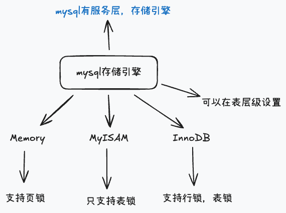
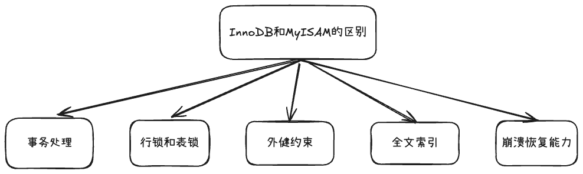

[toc]

---

## 1. 内连接和外连接有什么区别，内连接和外连接的连接条件能放在on和where吗？

内连接(INNER JOIN)：

- 只返回两个表中匹配连接条件的记录

外连接(OUTER JOIN)：

1. 左外连接：返回**左表所有记录** + 右表匹配的记录，右表无匹配项时显示为NULL。
2. 右外连接：返回**右表所有记录** + 左表匹配的记录，左表无匹配项时显示为NULL 。
3. 全外连接：返回两表所有记录，无匹配返回NULL。Mysql不支持。

对于内连接来说，连接条件放在`on`或者`where`结果都是一样的，都是返回匹配的记录

而对于外连接来说，连接条件要写在`on`中，`on`影响连接过程。`where`是写连接完之后的过滤条件，如果在这里写连接条件，可能会将外连接变成内连接。

`ON`中的条件影响连接逻辑
`WHERE`中的条件过滤最终结果，可能改变外连接的语义

## 2. char和varchar的区别

`char`是定长字符串，定义长度是多少就会占用多少，无论实际占用多少（后面是补充空格）存储效率高，但是存在空间浪费。

`varchar`是不定长字符串，只会定义最大长度，但是实际只会占用保存的数据长度。（不会存储多余的空格）

## 3. 说一下事务的隔离级别有哪些？分别解决了什么问题？mysql是什么隔离级别，oracle呢？那不可重复读,脏读,幻读是什么?

事务的隔离级别有四种：读未提交，读已提交，可重复读，串行化

>  读未提交可能出现脏读、不可重复读、幻读
>
>  读已提交可以解决脏读，但是不能解决不可重复读和幻读
>
>  可重复读解决脏读，不可重复读，但是解决不了幻读
>
>  串行化可以解决脏读，不可重复读，幻读

mysql 默认的隔离级别是可重复读，Oracle的默认隔离级别是读已提交

脏读是在并发事务中读到另一个事务未提交的数据

不可重复读是在并发事务中第一次读到的数据和第二次读到的数据不一样

幻读是在并发事务中没有查询到对应数据，但是在插入的时候报已经存在的错误

## 4. 说一下mysql的存储引擎有哪些？说一下InnoDB和MyISAM的区别？

### mysql的存储引擎

**Mysql 3.x-4.x(1995-2004):**

**MyISAM**：最早的存储引擎，简单高效，但功能有限，不支持事务和外键

**ISAM**(MyISAM的前身，已废弃)

---

**Mysql 5.0(2005-2010):**

**InnoDB**：由Innobase公司开发，支持事务和ACID特性，支持行级锁和外键

**Archive**：专门用于数据归档，高压缩比，只支持INSERT和SELECT

**CSV**：以CSV格式存储数据，方便数据导入导出

**Memory (HEAP)**：数据存储在内存中，访问速度极快

---

**Mysql 5.1(2008-2010):**

**Federated**：远程数据访问

**NDB Cluster**：MySQL集群存储引擎，支持分布式计算

---

之后的都是以InnoDB为主，默认引擎均为InnoDB

### InnoDB和MyISAM的区别

事务处理方面：InnoDB支持ACID事务（引出ACID事务是什么？原子性、一致性、隔离性、持久性），MyISAM不支持事务。

行锁和表锁方面：InnoDB支持行级锁定和表级锁定，MyISAM只支持表级锁定。

外键约束方面（维护关联表的数据一致性）：InnoDB支持，MyISAM不支持。

崩溃恢复能力：InnoDB 支持崩溃恢复（redo Log），MyISAM 不支持。

全文索引方面：MyISAM的性能通常比InnoDB好（8.0后性能已经赶上甚至超过了，原因是上面那些区别）。

## 5. 说一下数据库的三范式和反三范式

> [!tip]
>
> - **写操作（插入、更新、删除）多的表**，倾向于使用**三范式**来保证数据一致性和完整性。
> - **读操作（查询）频繁，且对性能要求极高的表或场景**，可以有选择性地使用**反三范式**来优化。

### 数据库三范式（3NF）

首先，我们来说说**三范式（3NF）**，也叫**数据库规范化（Normalization）**。

三范式的核心思想是**减少数据冗余，保证数据的一致性和完整性**。它就像是一种“数据瘦身”的方法，把数据分解到不同的表中，每张表只存储特定类型的信息。

三范式包括三个主要的规则：

### 数据库三范式（3NF）

三范式的核心目标是**减少数据冗余，保证一致性**，通过分表让每张表只存储特定信息。

1. **第一范式（1NF）—原子性**
   - 字段不可再分，不能存多值。
   - 例：地址拆分为省、市、区，而不是一个字段存所有信息。
2. **第二范式（2NF）—消除部分依赖**
   - 非主键字段必须完全依赖主键。
   - 对联合主键表，非主键字段不能只依赖主键的一部分。
3. **第三范式（3NF）—消除传递依赖**
   - 非主键字段不能依赖于其他非主键字段。

**优点**：减少冗余、保证一致性、维护简单。
**缺点**：查询效率低（多表JOIN）、模型复杂。

------

### 反三范式（De-normalization）

反三范式的核心思想是**牺牲部分冗余以换取查询性能**。

**策略**：

- 增加冗余字段，避免JOIN；
- 创建汇总表，存储预计算聚合数据。

**例子**：订单表中冗余存储商品名称和客户姓名，查询订单列表无需JOIN商品表和客户表。

**优点**：查询性能高，逻辑简单。
**缺点**：数据冗余增加、存在一致性风险、更新/插入/删除成本高。

## 6. sql的书写顺序是什么？执行顺序又是什么？

以查询语句为例：

书写顺序：

`with -> select -> distinct -> from -> join -> on -> where -> group by -> having -> order by -> limit`

执行顺序：

`from -> join -> on -> where -> group by -> having -> select  -> distinct -> order by -> limit`

## 7. 说一下mysql的主从复制原理？

MySQL主从复制是一种将一个MySQL数据库实例（主库）的数据变更，同步到另一个或多个数据库实例（从库）的技术。其核心原理是基于MySQL的**二进制日志（binlog）**。

复制过程主要有三个线程：

- **主库I/O线程（Binlog Dump Thread）**：当从库连接上来时，主库会创建一个I/O线程，将**binlog event**（数据变更事件）发送给从库。
- **从库I/O线程（Replica I/O Thread）**：从库连接到主库后，会创建该线程。它负责接收主库I/O线程发过来的binlog event，并将这些事件写入到从库本地的**Relay Log（中继日志）**中。
- **从库SQL线程（Replica SQL Thread）**：该线程负责读取**Relay Log**中的事件，并逐一在从库上执行，从而实现数据的同步。

**基本流程：**

1. **开启binlog**：主库必须开启binlog功能，记录所有的数据修改操作。
2. **从库连接**：从库配置好主库的地址、端口、用户名密码等信息后，连接到主库。
3. **主库发送binlog**：主库I/O线程开始将binlog内容发送给从库。
4. **从库接收和写入**：从库I/O线程接收binlog并写入到本地的Relay Log中。
5. **从库执行**：从库SQL线程读取Relay Log，并在从库上执行相同的SQL语句。

> [!tip]
>
> Mysql读写分离，读不到怎么解决？
>
> - Mybatis手动指定读的数据库
> - Mysql高版本支持配置sql多线程加快relay log落库
>
> 为什么低版本不支持？
>
> 是为了保证顺序执行和数据一致性，架构上只设计了单线程SQL线程处理Relay Log。
>
> - 在低版本中，从库的 **SQL 线程只有一个**，Relay Log 的读取和执行都是单线程完成的。
> - 设计初衷是保证 **严格的顺序执行**，确保主库的事件在从库上按严格顺序重放，避免出现数据不一致或事务错乱。
> - 多线程执行在当时复杂度高，MySQL早期的复制机制只保证了顺序性和一致性，没有引入并行处理机制。

## 8. 说一下mysql有哪些日志文件？

MySQL有多种重要的日志文件，它们用于不同的目的：

- **错误日志（Error Log）**：记录MySQL服务器的启动、关闭、运行中的错误、警告信息。这是诊断MySQL故障的首要文件。
- **二进制日志（Binary Log / Binlog）**：记录所有对数据库的**数据变更**操作，如`INSERT`、`UPDATE`、`DELETE`、`DDL`等。它不记录`SELECT`等查询操作。Binlog是MySQL主从复制和数据恢复（基于时间点的恢复）的基础。
- **查询日志（General Query Log）**：记录所有**接收到的SQL语句**，包括查询、写入、连接等。开启该日志会产生大量数据，通常只用于调试。
- **慢查询日志（Slow Query Log）**：记录执行时间超过指定阈值的SQL语句。它是数据库性能优化的重要工具。
- **重做日志（Redo Log）**：是InnoDB存储引擎特有的日志。它记录了**事务的物理变更**，用于保证事务的持久性（Durability）。即使系统崩溃，也可以通过Redo Log恢复到崩溃前的状态。
- **回滚日志（Undo Log）**：也是InnoDB特有。它记录了数据修改前的状态，用于事务回滚和MVCC（多版本并发控制）。

## 9. 说一下mysql索引的底层数据结构？为什么选择b+树，而不是hash、二叉树、平衡二叉树、红黑树、b树？

索引的底层数据结构是B+树。B+树的特点是非叶子节点不存储具体数据，只存储索引数据和指针。叶子节点存储索引数据和整行数据。

**二叉树**：极端情况下（一直插入越来越大的），会退化成链表，mysql主键默认生成策略是自增，使用二叉树必定会退化成链表

**平衡二叉树**：自旋成本高

**红黑树**：树的节点为类似k-v的结构，一个节点只存一行数据/一个索引，磁盘IO次数多，树的高度较高，不利于索引。

**b树**（矮胖树）：多叉树，减少树高，减少二分查找的次数，但是查询不稳定，非叶子节点和叶子节点都存放数据，有时候第一层，第二层找到，也有可能在第三层找到，所以不稳定；由于页大小限制（16kb），有冗余数据

> mysql页大小：16kb
>
> 操作系统页大小：4kb

hash：适合精准查询

B+树：数据只出现在叶子节点，非叶子节点之存储指针和键值对，查询稳定（都会走完树，比如第三层、第四层），在同样的页大小下，可以存更多的数据，B+树比B树更胖，叶子节点有双向链表，优化范围查找，排好序的数据结构（相关：redo log），非叶子节点有冗余数据，适合带条件，范围查询，模糊查询

> R tree：支持地理位置搜索
>
> full text（全文搜索）：
>
> 这两个一般使用ES

Mysql不适合使用UUID（字符串），无序的，使用B+树会导致节点分裂，使用自增数字可以保证，在插入B+树的时候时间复杂度为O(1)，高效快速

## 10. b树和b+树的区别?

1. B+树的非叶子节点不存储具体数据，只存储索引数据。 
2. B+树的叶子节点之间形成链表结构，优化范围查询。
3. B+树适合做磁盘存储，减少IO操作。

B树和B+树都不适合用在内存

## 11. hashmap为什么不选择b+树?

1. HashMap是一种内存中的数据结构，适合使用红黑树。
2. B+树更适合磁盘中的数据存储，减少IO操作。

## 12. 聚集索引[聚簇索引]和非聚集索引[非聚簇索引]的区别?

`聚集索引[聚簇索引][主键索引][一级索引]`

1. 聚集索引的叶子节点存储整行数据。
2. 非聚集索引的叶子节点存储索引数据和行的ID。
3. 聚集索引的查询稳定，非聚集索引的查询不稳定。

## 13. 介绍一下常见的索引类型?（一般指选了B+树这种数据结构）

主键索引，唯一索引，普通索引，组合索引，联合主键索引，联合唯一索引

1. 主键索引：通过组件约束进行索引。
2. 唯一索引：设定唯一键，保证数据的唯一性。
3. 联合索引：联合多个字段进行索引。
4. 复合索引：包含多个字段的索引。

B+树，hash，全文搜索，R-Tree（地理位置搜索）

hash在精准查询中比B+树性能更好

## 14. 三层的b+树大概可以存储多少数据?

1. 三层B+树大概可以存储两千多万的数据。（一行1kb）
2. 每层叶子节点存储的数据量取决于页的大小和行数据的大小。
3. 建议控制表的大小在2GB以内，避免过多的IO操作。

## 15. 深分页查询如何优化

1. 使用覆盖索引和子查询优化深分页查询。 
2. 通过索引覆盖减少数据库查询的数据量。 
3. 子查询可以减少查询的深度和复杂性。

通过覆盖索引+子查询，也可以使用join，只能个解决几千万的数据，再大的海量数据的话也是没办法解决。

## 16. 什么是回表?怎么优化回表

回表是通过二级索引找到组件值，再通过组件值回到主键索引查询数据。 

1. 优化回表的方法包括使用覆盖索引和尽量避免使用select *。 
2. 覆盖索引可以减少回到主键索引的次数，提高查询效率。

 尽量不使用`select *`，直接使用主键索引

## 17. 什么是覆盖索引

1. 覆盖索引是通过二级索引就能查到select后面的所有字段，避免回到主键索引。
2. 覆盖索引可以减少数据库查询的数据量和IO操作，提高查询效率。

## 18. 什么情况会导致索引失效

1. 不遵循最左匹配原则：查询条件顺序不符合联合索引的顺序。
2. 模糊查询百分号在前面：模糊查询%在前，（空间换时间，反向索引，用来查询这种情况，比如查手机尾号；如果前后都有%的话，反向索引无法解决，ES全文搜索或者Mysql的全文搜索）
3. 范围查询右边的条件失效：范围查询右边的条件不会走索引。
4. 在索引字段上进行了运算或类型转换。（where 等于号左边）（等于号右边不失效）
5. 使用了复合索引但在中间使用了范围查询，导致右边的条件索引失效。

AOP失效、事务失效

## 19. 什么是最左匹配原则?

1. 最左匹配原则：查询条件顺序需要符合联合索引的顺序。 
2. 满足最左匹配原则的查询条件会走索引。
3. 不满足最左匹配原则的查询条件可能不会走索引。

## 20. a、b、c按照顺序建立联合索引,下列情况会不会走索引:

**where a = 1 and b=1 and c=1**

会走，最左匹配原则

**where b=1 and c=1 and a=1** 

会走索引,优化器会自动调整顺序,时期满足最左前缀

**where a = 1 and c=1**

a走索引，跳过了b , c不会走索引

**where b=1 and c=1**

缺少最左列的a索引，b、c都不会走索引

**Where a>1 and b=1**

a可能不走，也可能走索引，要看数据量，进行范围查询，导致b索引失效

**Where a=1 and b>1**

a走索引，b可能走也可能不走，使用了范围查询，导致c失效

## 21. 建立索引一般要考虑什么?

索引不是越多越好，数据量大的时候先考虑加索引和上缓存，先不分库分表，能使用联合索引就使用（复用性高，占内存更小），联合索引怎么建？（能覆盖查询的70%～80%）

建立前缀索引

## 22. 有没有做过sql调优?

有，定位那些有慢sql，查看执行计划

delete、update也可以走索引

执行计划关注以下字段：

主要可以根据几个字段，判断sql是否需要优化，特别是是否能命中索引或命中索引的情况 

- type 通过sql的连接的类型进行优化 （至少要优化到range、index）有哪些类型all、index、ref、uniref、primery(主键索引)、range
- possible_key 通过它查看是否可能会命中索引 
- key 当前sql实际命中的索引 
- key_len 索引占用的大小 
- Extra 额外的优化建议

## 23. 有没有做过数据库调优

选择合适的存储引擎、字段类型、上索引、上缓存、读写分离、分库分表、换一种数据库产品

## 24. 如何定位慢查询

慢SQL日志

500ms

