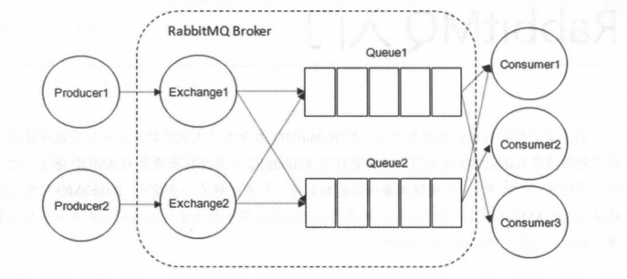
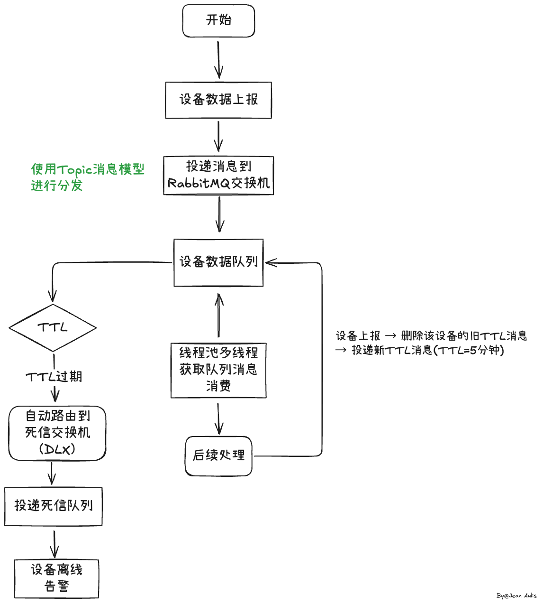

[toc]

---

> [!important]
>
> 消息队列带来的好处：**异步、解耦、削峰。**

## 1. 说一下rabbitmq有哪些消息模型

五种：有交换机；无交换机；

1. 基本消息模型（BasicQueue）
   - 只有一个生产者（Producer）和一个消费者（Consumer）。

   - 一条消息只能被一个消费者消费。

2. 工作消息模型（WorkQueue）
   - 多个消费者“共同消费”一个队列；

   - 常配合线程池、`basicQos`、`ack` 使用。

3. 发布订阅（Publish、Subscribe、FanoutExchange）
   - 一个消息会被**广播**给所有绑定到该交换机的队列；
   - 每个消费者都能收到相同消息。
4. 路由（Direct Exchange）
   - 每条消息有一个 **routing key（路由键）**；
   - 消费队列按**路由键**绑定；
   - 交换机根据 routing key 精确匹配消息路由。
5. 主题（Topic Exchange）（主要使用，最灵活）
   - 路由键支持“模式匹配”，用通配符：
     - `*` 匹配一个单词
     - `#` 匹配多个单词

## 2. 说一下rabbitmq的工作原理

- publisher：生产者
- consumer：消费者
- exchange个：交换机，负责消息路由
- queue：队列，存储消息
- virtualHost：虚拟主机，隔离不同租户的exchange、queue、消息的隔离

1. **生产者发送消息**: 生产者将消息发送到指定的交换机,并指定路由键(routing key)
2. **交换机路由**: 交换机根据类型和绑定规则,将消息路由到一个或多个队列
3. **消息存储**: 消息被存储在队列中等待消费
4. **消费者获取**: 消费者从队列中拉取或被推送消息
5. **消息确认**: 消费者处理完消息后发送 ACK 确认,RabbitMQ 收到确认后删除该消息

## 3. 你在项目中哪里用到了mq？用来做什么？

> [!tip]
>
> 主要应用场景：异步解耦、死信交换机

医疗设备离线告警+线程池设备数据采集与处理模块

> 我们项目里主要在**医疗设备数据采集与处理模块**用到了 RabbitMQ。
> 这个模块负责接收大量 IoT 医疗设备上报的实时数据，比如体温、血压、心率等。
> 这些设备数量很多，如果都直接请求后端接口，会造成高并发压力，线程池容易被打满。
> 所以我们引入 MQ，把上报数据先写入队列，然后由后端异步消费。
>
> ---
>
> **面试官：**
> 那为什么一定要用 MQ？直接用 HTTP 请求或者 Redis 消息也可以吧？
>
> **你：**
> 可以，但是效果差很多。
> 我们使用 MQ 的核心目的有三个：
>
> 1. **解耦** —— 设备端只负责发送消息，不依赖后端服务逻辑，后端可以灵活扩展处理流程；
> 2. **削峰填谷** —— MQ 可以缓存大量上报数据，后端按自己的消费能力慢慢处理，防止瞬时流量压垮系统（缓解系统压力）；
> 3. **可靠性** —— MQ 有 ACK 确认机制和持久化机制，能**确保消息不丢失**。
>
> 如果只用 HTTP 或 Redis，不具备持久化和可靠投递机制，而且无法自然地应对高并发削峰。
>
> > Redis 的持久化是“存活数据快照”，并不能确保信息的可靠性；
> > MQ 的持久化是“消息投递保障链条的一环”。
>
> ---
>
> **面试官：**
> 那你用的 RabbitMQ 是哪种消息模型？为什么选这个？
>
> **你：**
> 我们选的是 **工作队列模型（Work Queue）**。
> 这个模型是一个队列绑定多个消费者，每条消息只会被一个消费者处理。
> 这正好契合我们项目中“线程池并行处理数据”的需求。
> 队列相当于消息缓冲区，而线程池里的线程就是多个消费者，能并行消费，提升处理吞吐量。
>
> ------
>
> **面试官：**
> 为什么不用简单队列或者发布订阅模型呢？
>
> **你：**
> 简单队列模型只支持**一对一通信**，一个生产者对应一个消费者，不支持多消费者分担负载；
> 而发布订阅模型（Fanout）会让同一条消息被**多个消费者同时消费**，适合广播消息，比如推送或日志分发。
> 但在我们的场景下，一条设备数据只需要被处理一次，所以最合适的就是**工作队列模型**。
>
> ---
>
> **面试官：**
>
> 你们项目QPS那么低，为什么还要用RabbitMQ?
>
> **你：**
>
> 虽然目前系统 QPS 很低，每秒只有 1~2 条消息，但我们仍然使用 RabbitMQ，主要基于以下考虑：
>
> 1. **解耦**：设备端只负责发送数据，后端各个处理模块可以独立订阅队列，避免模块耦合；
> 2. **异步处理**：后端业务逻辑可能包括入库、告警、日志等，通过 MQ 异步处理，可以保证设备端响应快速；
> 3. **可靠性**：即使设备网络抖动或服务短时不可用，MQ 的持久化和 ACK 机制可以保证消息不丢失；
> 4. **可扩展性**：未来设备增加或增加新功能时，可以直接增加消费者处理消息，不影响现有业务；
> 5. **削峰填谷**：即便平均 QPS 低，也可能存在突发上报，通过 MQ 缓冲可以保证后端平稳处理。
>
> 所以，使用 MQ 并不是为了处理高 QPS，而是为了**系统架构的健壮性、可靠性和可扩展性**。
>
> ---
>
> 那你们怎么保证 MQ 的消息不丢？
>
> **你：**
> 我们用了 RabbitMQ 的**持久化机制**和**手动确认（ACK）机制**。
>
> 消息持久化保证 MQ 宕机后不会丢失数据；
>
> 手动 ACK 则确保消息真正被业务线程处理成功后再确认，防止未处理完就丢弃。
>
> 如果消费者挂了，RabbitMQ 会自动把消息重新投递给其他可用消费者。
>

## 4. 你们技术选型为什么选择rabbitmq？技术选型谁做的？你怎么考虑的？

不是我选的，组长选的

#### 你是怎么考虑的？

学习成本低，上手成本低，我们项目没有那么高的并发和那么大的数据量。

## 5. 说一下死信交换机（死信队列）的工作原理（流程）

当一个队列中的消息满足下列情况之一时,可以成为死信(dead Letter):

- 消费者返回reject或者nack,且requeue参数设置为false（拒接消费）
- 消息超时未消费
- 队列满了

如果该队列配置了dead-letter-exchange属性,指定了一个交换机,那么队列中的死信就会投递到这个交换机中,而

这个交换机称为死信交换机(Dead Letter Exchange简称DLX)

**正常队列** -> (消息因某些原因变成“死信”) -> 被重新投递到 **死信交换机** -> 死信交换机将消息路由到 **死信队列** -> 应用程序可以消费 **死信队列** 中的消息来进行后续处理。

## 6. 怎么保证mq不丢消息？

消息到 MQ 的过程中搞丢，MQ 自己搞丢，MQ 到消费过程中搞丢。

- 生产者到 RabbitMQ：事务机制和 Confirm 机制，注意：事务机制和 Confirm 机制是互斥的，两者不能共存，会导致 RabbitMQ 报错。
- RabbitMQ 自身：持久化、集群、普通模式、镜像模式。
- RabbitMQ 到消费者：basicAck 机制、死信队列、消息补偿机制。

## 7. 你们项目怎么解决mq的消息积压？

当生产者发送消息的速度超过了消费者处理消息的速度,就会导致队列中的消息堆积,直到队列存储消息达到上限。

最早接收到的消息,可能就会成为死信,会被丢弃,这就是消息堆积问题。

消费者可以使用线程池，惰性队列，但是惰性队列不推荐

解决消息堆积有三种思路:

- 增加更多消费者,提高消费速度
- 在消费者内开启线程池加快消息处理速度
- 扩大队列容积,提高堆积上限

## 8. mq如何保证消费的有序性？

- 拆分多个 queue(消息队列)，每个 queue(消息队列) 一个 consumer(消费者)，就是多一些 queue (消息队列)而已，确实是麻烦点；
- 或者就一个 queue (消息队列)但是对应一个 consumer(消费者)，然后这个 consumer(消费者)内部用内存队列做排队，然后分发给底层不同的 worker 来处理。

## 9. 你项目中怎么保证mq的消费幂等性？

MQ 的消费幂等性主要是防止同一条消息被重复消费导致重复入库或重复扣款。
 RabbitMQ 的投递机制是“至少一次”，所以可能会出现重复消费。

为了保证幂等性，我会给每条消息一个唯一业务 ID，在消费者处理前先判断这个 ID 是否已被消费，比如查 Redis Set 或去重表；如果已存在就跳过，否则正常处理并记录。

此外，对于数据库写入场景，也可以通过唯一索引约束保证幂等性。这样可以确保无论消息被重复投递多少次，最终结果都是一致的。

## 10. 你有做过页面防抖吗？怎么实现？（比如在页面下单重复点了两次下单按钮）

页面防抖我做过，主要是防止用户重复点击造成重复下单。
 前端我会用防抖函数，比如 1 秒内多次点击只触发一次请求。
 但仅靠前端不安全，所以后端我还实现了接口幂等性控制。

具体做法是：后端生成一个唯一防重 Token，前端请求下单时带上这个 Token，后端用 Redis 校验并原子删除。
 同一个 Token 只能成功一次，重复提交会被拒绝。

这样前后端配合就能既防止重复点击，又保证最终只生成一笔有效订单。

## 11. 什么是消息队列？

消息队列就是一个使用队列来通信的组件。

