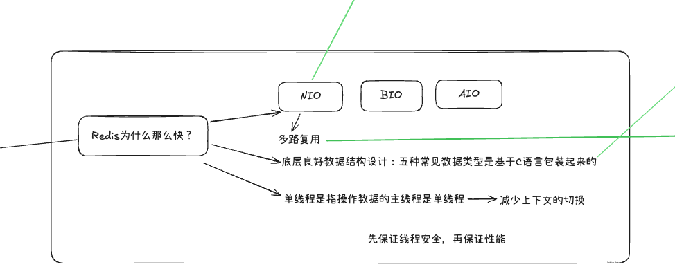

[toc]

---

## 1. (待整理)说一下缓存三兄弟/剑客分别造成的原因和解决方案？

// TODO

缓存三兄弟指的是缓存穿透、缓存击穿和缓存雪崩。

### 造成原因

- **缓存穿透**：原因是查询一个缓存和数据库不存在的数据（业务上不存在的数据），缓存中没有命中，直接穿透到数据库，导致数据库压力大。如果是恶意攻击（如大量查询不存在的键），会更严重。
- **缓存击穿**：原因是一个热点键（高并发访问）突然过期，大量请求同时打到数据库。
- **缓存雪崩**：原因是一大批键同时过期，导致请求洪峰打到数据库。

### 解决方案

- **缓存穿透**：

  - 1）缓存空值，比如查到数据库为空时，缓存一个空字符串或~~null~~(Redis没有null)，并设置短过期时间（如5分钟），避免反复穿透；（治标不治本，只能保证其中一个查询结果，如果查询不一样数据还是会出现问题）

  - 2）用布隆过滤器（Bloom Filter）在入口处过滤不存在的键，我项目中可以用它来预判用户ID是否存在；

    - 如何预判？
    - 原理、底层原理

    正常业务上，应该先查Redis，再查布隆过滤器，然后到数据库。

  - ~~3）加强参数校验，前端或网关层过滤无效请求。~~

>  [!warning]
>
> 可能会问：
>
> - 布隆过滤器误判率怎么控制？（通过调整哈希函数数量和位数组大小，减少哈希冲突）整个重置，不能局部重置
> - bitmap做签到，
> - Redis的key过期以后，布隆过滤器怎么生效的

- **缓存击穿**：

  - 1）预热缓存，在系统启动或定时任务（或者预测热点）中加载热点数据。
    - 缺点：缓存预热时，如果数据量大，可能导致启动慢，需要用异步任务优化。
  - 2）用分布式锁（如Redis的Redisson）在缓存失效时，只让一个线程去数据库**重建缓存**，其他线程等待；
    - 重建缓存之后，释放锁，写入缓存不加锁，双重缓存检查

  - 3）设置热点键永不过期，或用逻辑过期（在值中加过期时间字段，手动检查）；  
    - 会带来其他问题，比如：用户可能会看到旧数据，如何去主动更新Redis数据
    - **缓存淘汰策略**
  - 4）主从复制+哨兵模式，确保Redis高可用。还有分片，适合海量数据写。

- **缓存雪崩**：
  - 1）过期时间加随机值（如基数+随机数），避免同时失效；
  - 2）多级缓存（如JVM本地缓存Caffeine + Redis），本地缓存作为备份；
  - ~~3）限流降级，用Sentinel或Hystrix在高负载时熔断请求；~~

## 2. (待整理)redis的常用数据类型有哪些？分别适用哪些场景？

常用的有String,Hash,List,Set,Sorted Set (ZSet - 有序集合)，常用的有这5种

String是最基础的数据类型，可以存储文本、数字或二进制数据。一个 Key 对应一个 Value。Value 不仅是字符串，也可以是数字。最经典的用法，缓存用户信息、页面片段、热点数据

Hash（哈希）。类似于 Java 中的 Map，是一个键值对集合。非常适合存储对象。存储对象信息、存储用户信息

List（列表）一个简单的字符串有序列表，按插入顺序排序。消息队列、最新列表

Set（集合）Redis 的 Set 是 String 类型的无序、唯一的集合。标签系统、共同好友、抽奖、点赞、收藏

Sorted Set（有序集合 / ZSet）它类似于 Set（元素唯一），但每个元素都会关联一个 score（分数），这个分数用于将元素从小到大排序。 排行榜、优先级队列、时间线

## 3. redis为什么这么快？

基于内存的操作，避免了磁盘IO

采用单线程处理请求，这样做避免了上下文切换的开销；避免使用锁导致的锁开销和死锁问题；使用I/O多路复用，在一个线程内同时监听多个socket

## 4. 说一下redis的缓存淘汰策略? 说一下redis的过期策略?

### 缓存策略

缓存策略主要是用在内存不足的时候决定如何清理缓存数据。

**针对设置了过期时间的key**：

- `volatile-lru`:淘汰最近最少使用的key
- `volatile-lfu`：淘汰使用频率最低的key
- `volatile-ttl`：淘汰即将过期的key
- `volatile-random`：随机淘汰key

**针对所有key：**

- `allkeys-lru`：从所有key中淘汰最近最少使用的
- `allkeys-lfu`：从所有key中淘汰使用频率最低的
- `allkeys-random`：从所有key中随机淘汰

`noeviction`（默认策略）: 不淘汰数据,当内存不足以容纳新写入的数据时，新写入操作会报错OOM，读、删除请求可以继续服务

### 过期策略

**Redis的过期策略：** Redis采用**惰性删除**和**定期删除**相结合的方式：

**惰性删除：** 访问key时检查是否过期，如果过期就删除并返回null。这种方式节省CPU，但可能导致过期key占用内存。

**定期删除：** Redis每秒10次随机抽取一些设置了过期时间的key进行检查，发现过期就删除。这是一个渐进式过程，避免一次删除太多影响性能。

## 5. (待整理)项目中一般用redis来做什么？做缓存的情况下那你们怎么保证数据库和缓存的的一致性？

// TODO

在我的医疗设备健康平台项目中，Redis主要用于几个场景：

- 1）作为缓存，存储热点数据如**用户疗程列表、设备最新上报数据**（用String或Hash结构），减少数据库压力；
- 2）分布式锁，比如在积分扣减时用Redisson防止并发问题；
- ~~3）消息队列的补充（如用List实现简单队列），不过我们主要用RabbitMQ；~~
- 4）会话管理，存储用户Token（用String，设置过期时间）；
- 5）计数器，如设备异常报警计数（用Incr命令）。

做缓存时，保证数据库和Redis一致性是关键，我们用的是“延迟双删”策略结合MQ异步更新。

1. **Cache Aside Pattern（旁路缓存模式）**

2. **延迟双删**

### 具体流程：

读时先查Redis，命中返回；未命中查MySQL，查到后写入Redis。

写时（更新/删除数据）：

1. 先删Redis缓存；
2. 更新MySQL；
3. 用RabbitMQ发延迟消息（延时0.5~1秒），再删一次Redis（防止读写并发导致脏数据）。

>  [!tip]
>
> 为什么延迟删？
>
> 因为更新MySQL可能慢，先删缓存避免旧数据被读到，延迟删处理极端情况。

3. **MQ**

4. **其他一致性方案：我们没用Canal监听Binlog同步（因为项目规模小，引入复杂），但如果数据量大，可以考虑。**

#### canal 工作原理

- canal 模拟 MySQL slave 的交互协议，**伪装自己为 MySQL slave** ，向 MySQL master 发送dump 协议
- MySQL master 收到 dump 请求，开始推送 binary log 给 slave (即 canal )
- canal 解析 binary log 对象(原始为 byte 流)

1. **MySQL 配置准备**

首先需要开启 MySQL 的 binlog 功能，并设置为 ROW 模式。

2. **创建 Canal 专用数据库账号**
3. **配置 Canal Server**
   1. 修改 `conf/canal.properties`（全局配置）
   2. 修改 `conf/example/instance.properties`（实例配置）
4. 开发 Canal Client 消费端
5. Client 消费后的 ACK/Rollback 机制

>  [!tip]
>
> ES查不到数据的话就没必要查Mysql了
>
> ES和Mysql的数据一致性怎么解决 -> 使用MQ

## 6. Redis有哪些持久化策略

// TODO 差总结，精炼版

Redis提供了两种主要的持久化策略来防止数据丢失：

1. **RDB（Redis Database）**：**快照持久化**。它会在指定的时间间隔内，将内存中的所有数据进行快照存储，生成一个**RDB文件**（`dump.rdb`）。
   - **优点**：
     - 对性能影响小，因为在进行快照时，可以fork一个子进程来处理。
     - RDB文件紧凑，适合备份和灾难恢复。
   - **缺点**：
     - 可能造成数据丢失，因为它是定时快照，如果在两次快照之间Redis崩溃，那么这期间的数据就没了。
     - fork子进程会消耗一定的系统资源。
2. **AOF（Append-Only File）**：**增量持久化**。它以日志的形式记录所有**写命令**。Redis会将接收到的每个写命令追加到AOF文件末尾。
   - **优点**：
     - **数据更完整**：可以配置不同的同步策略（如每秒同步），数据丢失的风险很低。
     - AOF文件是可读的，方便进行日志分析和恢复。
   - **缺点**：
     - AOF文件通常比RDB文件大，恢复速度相对较慢。
     - 对性能有一定影响，因为每次写操作都需要记录。

## 7. 说一下哨兵集群的作用是什么？

哨兵（Sentinel）集群是一种高可用性的解决方案，主要的作用有：

1. 监控：持续检查主服务器和从服务器是否正常运行
2. 通知： 当被监控的 Redis 实例发生故障时，Sentinel 可以通过 API 向其他应用程序或管理员发送通知。
3. 自动故障转移：
   - 当主服务器宕机时，Sentinel 之间会进行协商，投票选出一个 Sentinel 来执行故障转移。
   - 选中的 Sentinel 会在众多的从服务器中，通过一系列策略（如优先级、复制偏移量等）选举出一个新的主服务器（`slaveof no one`）。
   - 让其他从服务器去复制新的主服务器（`slaveof <new-master-ip> <new-master-port>`）。
   - 当故障的主服务器重新上线时，它会被自动配置为新主服务器的从服务器。

## 8. 说一下什么是主观下线和客观下线

1. 主观下线（Subjectively Down, SDown）：如果某sentinel节点发现某实例未在规定时间响应,则认为该实例主观下线。
2. 客观下线:若超过指定数量(quorum)的sentinel都认为该实例主观下线,则该实例客观下线。quorum值最好超过Sentinel实例数量的一半。

## 9. 简述全量同步的流程?

- slave节点请求增量同步
- master节点判断replid,发现不一致,拒绝增量同步
- master将完整内存数据生成RDB,发送RDB到slave
- slave清空本地数据,加载master的RDB
- master将RDB期间的命令记录在repl_baklog（环形数组）,并持续将log中的命令发送给slave

repl_baklog是环形数组，接近顺序读写，性能高

注意：repl_baklog大小有上限,写满后会覆盖最早的数据。如果slave断开时间过久,导致尚未备份的数据被覆盖,则无法基于log做增量同步,只能再次全量同步。
