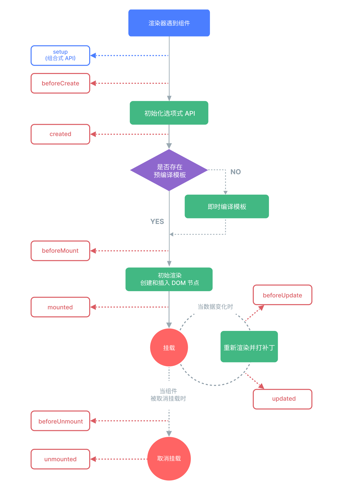

[toc]

---

## 1. js中`=`、`==`、 `===`的区别

`=`：用于对象的赋值；

`==`：比较两个对象是否相等

`===`：不仅比较对象的值，也比较对象的类型是否相等

// TODO

## 2. vue的生命周期

**创建 -> 挂载-> 数据更新 ->销毁**

## 3. v-if和v-show的区别

`v-if` 只有在条件成立时才渲染；若条件不成立，则不渲染。不频繁切换时使用

`v-show` 则会始终渲染，但会根据条件控制其显示与隐藏（css中display控制）。切换频繁，如动画使用。

## 4. 前端了解吗？你有开发过前端吗？

了解，我开发过前端的Ajax

// TODO

## 5. 你有做过页面防抖吗？怎么实现？（比如在页面下单重复点了两次下单按钮）

前端节流防抖

后端可以使用接口幂等性或请求去重，详见：[RabbitMQ篇](./RabbitMQ篇.md)

// TODO