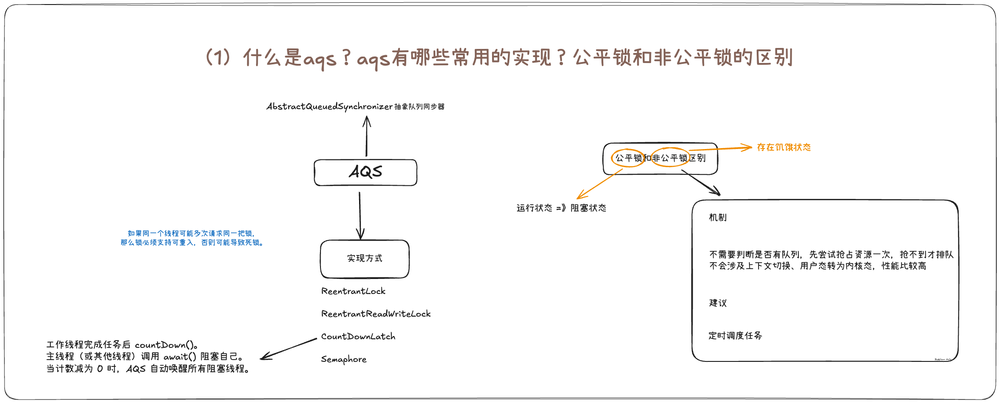
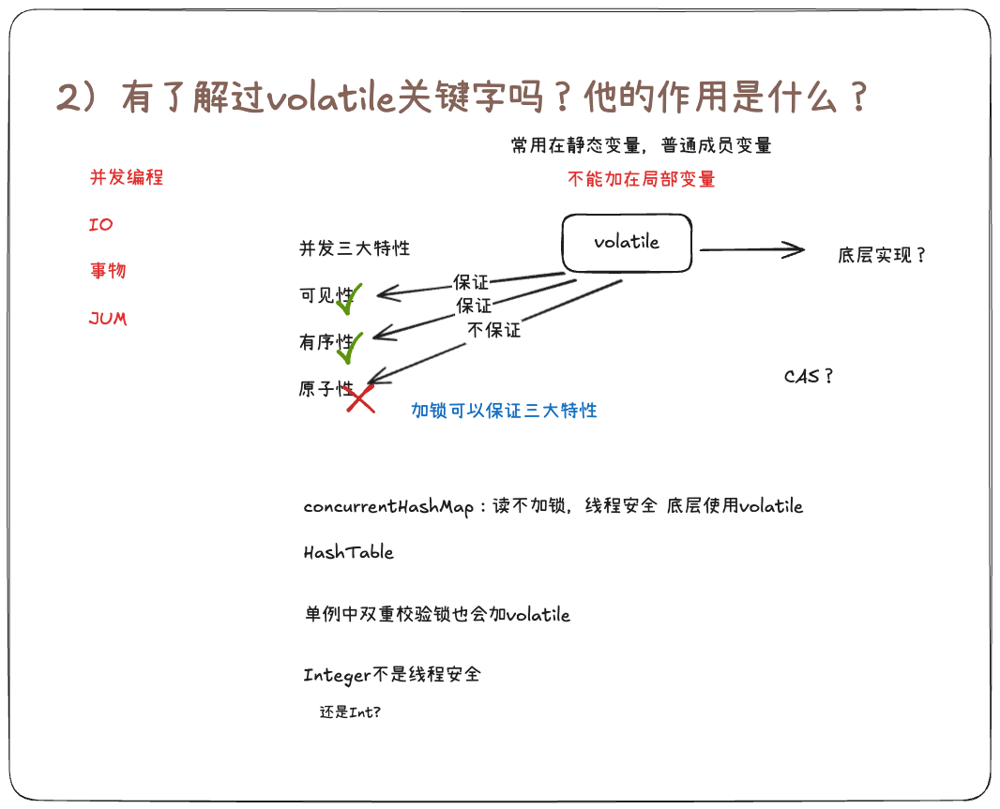
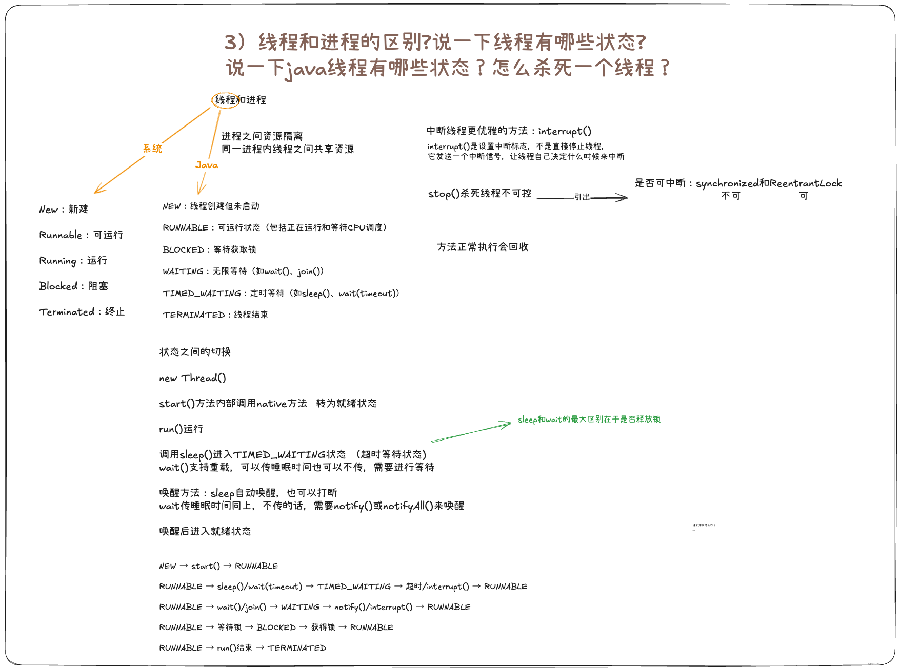
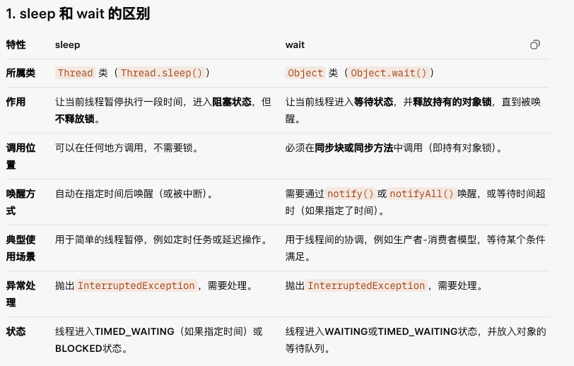
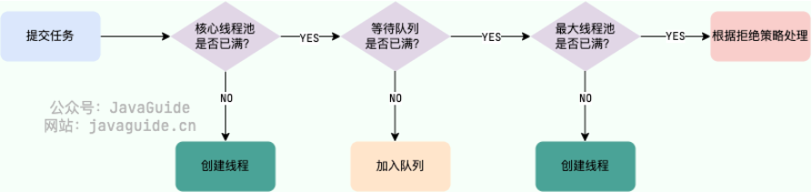

[toc]

---

## 1. 什么是aqs？aqs有哪些常用的实现？公平锁和非公平锁的区别

aps：**A**bstract**Q**ueued**S**ynchronizer，抽象队列同步器，是JUC包中用于实现锁和同步器的核心机制，~~核心设计思想是**模版方法模式**~~。它基于FIFO（先进先出）队列和 CAS（Compare-And-Swap）操作，提供阻塞式锁和相关同步器的框架。

AQS的常用实现有：
ReentrantLock：可重入锁，支持公平锁和非公平锁。
ReentrantReadWriteLock：读写互斥锁，读读共享，读写互斥，写写互斥
Semaphore：信号量，用来控制同时访问某个资源的线程数。
CountDownLatch：倒计时器，用来控制一个或多个线程等待其他线程完成某个操作。

公平锁和非公平锁的区别：
从顺序性来说：公平锁严格遵守FIFO队列顺序，而非公平锁允许插队；
从性能方面来说：非公平锁通常性能优于公平锁，因为它减少了线程切换开销；
适用场景：非公平锁适合高吞吐量的场景，公平锁适合需要严格遵守执行顺序的场景。

## 2. 有了解过volatile关键字吗？他的作用是什么？

我有了解。volatile是Java中的一个关键字，是一个轻量的同步机制，能保证变量的可见性和有序性，但是不能保证原子性。

首先，保证可见性就是线程修改了变量的值，修改后的值马上会被其他线程看到；保证了有序性就是防止指令重排，避免重排后导致的逻辑错误。

## 3. 线程和进程的区别?说一下线程有哪些状态?说一下java线程有哪些状态？怎么杀死一个线程？

进程：是操作系统分配资源的基本单位
线程：是进程内的执行单元
**主要区别**：

1. **资源分配**：进程独占资源，线程共享进程资源。
2. **独立性**：进程间独立，线程间可能相互影响（共享内存）。
3. **开销**：进程创建/切换成本高于线程。
4. **通信**：进程间通信（IPC）复杂，线程间通过共享内存通信更简单。

## 4. 实现多线程有哪些方式？什么是守护和非守护线程？

**实现多线程的方式**：

1. 继承 `Thread` 类，重写 `run` 方法。
2. 实现 `Runnable` 接口，传入 `Thread` 构造器。
3. 实现 `Callable` 接口，使用 `FutureTask` 或线程池获取返回值。
4. 使用线程池（如 `ExecutorService`）管理线程。

**守护线程与非守护线程**：

- **守护线程**：后台运行，JVM退出时自动终止（如垃圾回收线程）。通过 `setDaemon(true)` 设置，需在启动前设置。
- **非守护线程**：前台线程，JVM需等待其执行完成才会退出（如主线程）。默认创建为非守护线程。

## 5. sleep和wait的区别？notify和notifyall的区别？

sleep属于Tread类，作用是让当前线程暂停执行一段时间，进入阻塞状态，但是不释放锁，而wait属于Obeject

# 线程池

## 1. 线程池的作用是什么？

1. **降低资源消耗**：线程池里的线程是可以重复利用的。一旦线程完成了某个任务，它不会立即销毁，而是回到池子里等待下一个任务。这就避免了频繁创建和销毁线程带来的开销。
2. **提高响应速度**：因为线程池里通常会维护一定数量的核心线程，任务来了之后，可以直接交给这些已经存在的、空闲的线程去执行，省去了创建线程的时间，任务能够更快地得到处理。
3. **提高线程的可管理性**：线程池提供了一套统一的机制来管理、监控和控制并发线程的数量。这有助于**防止因线程数量过多而导致的资源耗尽**，从而保证系统的稳定性和高可用性。

>  [!CAUTION]
>
> 《阿里巴巴 Java 开发手册》强制线程池不允许使用 `Executors` 去创建，而是通过 `ThreadPoolExecutor` 构造函数的方式，这样的处理方式让写的同学更加明确线程池的运行规则，规避资源耗尽的风险

## 2. 说一下线程池的工作原理？

> “先核心线程，再任务队列，最后临时线程”

1. **判断核心线程数：**
   - 线程池首先检查当前正在运行的线程数是否**小于** `corePoolSize`（核心线程数）。
   - **如果小于**，则立即创建一个新的**核心线程**来执行这个任务。
2. **尝试放入任务队列：**
   - **如果当前运行的线程数**已经达到或超过 `corePoolSize`，则不会立即创建新线程，而是尝试将任务放入 `workQueue`（任务队列）中。
   - **如果成功入队**，任务就在队列中等待，由空闲的核心线程来执行。
3. **创建临时线程（非核心线程）：**
   - **如果任务队列已满**，线程池会继续检查当前运行的线程数是否**小于** `maximumPoolSize`（最大线程数）。
   - **如果小于**，则创建一个新的**临时线程**来执行这个任务。
4. **执行拒绝策略：**
   - **如果当前线程数**已经达到 `maximumPoolSize`，并且任务队列也已满，线程池将无法处理新任务。
   - 此时，线程池会根据配置的 `handler`（拒绝策略）来决定如何处理，例如：抛出异常、直接丢弃任务、或让提交任务的线程自己来执行。

> 核心线程 -> 任务队列 -> 临时线程 -> 拒绝策略

## 3. 线程池有哪些核心参数？

- `corePoolSize` : 这是线程池中**常驻的核心工作线程数量**。即使这些线程处于空闲状态，它们也不会被销毁（除非设置了 `allowCoreThreadTimeOut`）。当任务提交时，如果当前运行的线程数小于该值，线程池会优先创建新的核心线程来执行任务。
- `maximumPoolSize` : 这是线程池中**允许存在的最大线程数量**。当任务队列已满，并且当前运行的线程数小于此值时，线程池会创建新的**非核心线程（临时线程）**来处理任务。
- `workQueue`: 一个用于**存放待执行任务的阻塞队列**。当线程池中的线程数达到 `corePoolSize` 后，新提交的任务会被放入这个队列中排队等待执行。
- `keepAliveTime`:当线程池中的线程数量**超过 `corePoolSize`** 时，这些**非核心线程**在空闲等待新任务的`最长存活时间`。如果超过这个时间仍然没有新任务，该线程就会被销毁。
- `unit` : 这是一个枚举类型，定义了 `keepAliveTime` 参数的时间单位，如秒、毫秒等。
- `threadFactory` :executor 创建新线程的时候会用到。用于**创建新线程的工厂类**。我们可以通过它来自定义线程的创建，比如给线程指定有意义的名称、设置优先级等，方便后续排查问题。
- `handler` :拒绝策略。当线程池和任务队列都已满，无法再处理新任务时，线程池会**根据此策略来处理被拒绝的任务**，例如抛出异常或丢弃任务。

## 4. 线程池的拒绝策略有哪些？

**`ThreadPoolExecutor` 拒绝策略定义:**

如果当前同时运行的线程数量达到最大线程数量并且队列也已经被放满了任务时，`ThreadPoolExecutor` 定义一些策略:

- `ThreadPoolExecutor.AbortPolicy`：抛出 `RejectedExecutionException`来拒绝新任务的处理。
- `ThreadPoolExecutor.CallerRunsPolicy`：调用执行自己的线程运行任务，也就是直接在调用`execute`方法的线程中运行(`run`)被拒绝的任务，如果执行程序已关闭，则会丢弃该任务。因此这种策略会降低对于新任务提交速度，影响程序的整体性能。如果您的应用程序可以承受此延迟并且你要求任何一个任务请求都要被执行的话，你可以选择这个策略。
- `ThreadPoolExecutor.DiscardPolicy`：不处理新任务，直接丢弃掉。
- `ThreadPoolExecutor.DiscardOldestPolicy`：此策略将丢弃最早的未处理的任务请求。

## 5. 常用有哪些阻塞队列和怎么选择？

新任务来的时候会先判断当前运行的线程数量是否达到核心线程数，如果达到的话，新任务就会被存放在队列中。

不同的线程池会选用不同的阻塞队列，我们可以结合内置线程池来分析。

- `ArrayBlockingQueue`

​		**有界队列**：创建时必须指定固定容量。**这是它最核心的特点，用于防止任务无限堆积导致内存溢出（OOM）**。

​		**数组实现**：内部由数组存储，内存连续。

​		**一把锁**：生产（入队）和消费（出队）共用同一把锁，在高并发场景下吞吐量相对较低。

- 容量为 `Integer.MAX_VALUE` 的 `LinkedBlockingQueue`（无界队列）：`FixedThreadPool` 和 `SingleThreadExector` 。`FixedThreadPool`最多只能创建核心线程数的线程（核心线程数和最大线程数相等），`SingleThreadExector`只能创建一个线程（核心线程数和最大线程数都是 1），二者的任务队列永远不会被放满。

>  [!tip]
>
> 其他阻塞队列
>
> - `SynchronousQueue`（同步队列）：`CachedThreadPool` 。`SynchronousQueue` 没有容量，不存储元素，目的是保证对于提交的任务，如果有空闲线程，则使用空闲线程来处理；否则新建一个线程来处理任务。也就是说，`CachedThreadPool` 的最大线程数是 `Integer.MAX_VALUE` ，可以理解为线程数是可以无限扩展的，可能会创建大量线程，从而导致 OOM。
> - `DelayedWorkQueue`（延迟阻塞队列）：`ScheduledThreadPool` 和 `SingleThreadScheduledExecutor` 。`DelayedWorkQueue` 的内部元素并不是按照放入的时间排序，而是会按照延迟的时间长短对任务进行排序，内部采用的是“堆”的数据结构，可以保证每次出队的任务都是当前队列中执行时间最靠前的。`DelayedWorkQueue` 添加元素满了之后会自动扩容原来容量的 1/2，即永远不会阻塞，最大扩容可达 `Integer.MAX_VALUE`，所以最多只能创建核心线程数的线程。

## 6. 你在项目中怎么设置线程池的线程数？

- **计算密集型任务：** 这种任务大部分时间都在进行 CPU 运算，很少涉及 I/O 操作。如果线程数过多，会导致频繁的上下文切换，反而降低效率。通常建议将线程数设置为 **CPU 核心数 + 1**（或者 CPU 核心数）。例如，`Runtime.getRuntime().availableProcessors()`。
- **I/O 密集型任务：** 这种任务大部分时间都在等待 I/O 操作（如数据库查询、文件读写、网络请求等），CPU 占用率不高。为了充分利用 CPU 在等待 I/O 时的空闲时间，可以创建更多的线程。一个常用的经验公式是 **CPU 核心数 \* (1 + 线程等待时间 / 线程 CPU 时间)**。一个更简单的估算是 **CPU 核心数 \* 2**。

## 7. 常用的线程池有哪些种类？

### FixedThreadPool：

核心线程数和最大线程数相等，线程数是固定的。它使用无界队列，任务数再多也不会创建超过核心线程数的线程。

### SingleThreadExecutor

只有一个线程的线程池。它确保所有任务都在单个线程中按顺序执行。可以看作是线程数为 1 的 `FixedThreadPool`。

### CachedThreadPool

核心线程数为 0，最大线程数为 `Integer.MAX_VALUE`。它使用同步队列，当有任务时会立即创建新线程（如果有空闲线程则复用），线程数会动态增长，空闲线程在 `keepAliveTime` 后会被销毁。

### ScheduledThreadPool

用于执行定时和周期性任务，它使用 `DelayedWorkQueue`，可以延迟或定时执行任务。

# 事务

## 1. 什么是事务？你说一下事务有哪些特性？

事务是数据库操作的一个逻辑单元，是一组操作的集合，要么全部操作成功，要么全部操作失败，从而保证数据的正确性和完整性。

事务的四大特性（ACID）有：原子性、一致性、隔离性、持久性

1). 原子性指的是事务中的这一组操作，是不可分割的最小操作单元了，操作要么全部成功，要么全部失败。

2). 一致性是指在事务操作的前后，必须使数据处于一致的状态。

3). 隔离性指的是数据库中提供了隔离机制，保证事务在不受外部并发操作的影响的独立环境中运行。

4). 持久性就比较简单了，就是事务一旦提交或回滚了，它对数据库的改变就是永久的

## 2. 事务的传播行为有哪些？`REQUIRES_NEW`一般用在什么场景？

------

事务的传播行为（**Propagation Behavior**）定义了当一个方法在一个已有的事务中被调用时，它应该如何参与或创建事务。Spring框架中常用的事务传播行为包括：

- **`REQUIRED`**：这是默认行为。如果当前存在事务，则加入该事务；如果当前没有事务，则创建一个新的事务。
- **`SUPPORTS`**：如果当前存在事务，则加入该事务；如果当前没有事务，则以非事务方式执行。
- **`MANDATORY`**：如果当前存在事务，则加入该事务；如果当前没有事务，则抛出异常。
- **`NEVER`**：以非事务方式执行，如果当前存在事务，则抛出异常。
- **`NOT_SUPPORTED`**：以非事务方式执行，如果当前存在事务，则将其挂起（**suspend**）。
- **`REQUIRES_NEW`**：**创建一个新的事务**，并且**挂起**当前已有的事务。
- **`NESTED`**：如果当前存在事务，则创建一个**嵌套（nested）事务**，这个嵌套事务是外部事务的一部分。如果外部事务回滚，嵌套事务也会回滚。但嵌套事务可以独立于外部事务进行部分回滚。如果当前没有事务，则创建一个新事务，行为类似于 `REQUIRED`。

**`REQUIRES_NEW`** 的常用场景是：

- **日志记录或监控**：在主业务逻辑失败时，你仍然需要确保记录日志的操作能够成功提交，不被主事务的回滚所影响。
- **独立子操作**：某个操作（如发送邮件、短信通知）即使主业务失败也必须成功，或者需要独立于主业务进行提交或回滚。
- **解耦**：当需要确保某个子操作的原子性，且不希望它的失败影响到外部主事务，或者它的成功不依赖于主事务的提交。

## 3. 首先说一下导致事务失效有哪些场景？

------

事务失效（**Transaction Ineffectiveness**）通常是由于开发者在使用 Spring 事务注解 `@Transactional` 时，没有遵循其内部工作原理而导致的。常见场景包括：

- **非`public`方法**：`@Transactional` 注解只对 **`public`** 方法生效。这是因为 Spring AOP（面向切面编程）的动态代理机制是基于接口或类的，只有 `public` 方法才会被代理拦截。如果你的方法是 `protected`、`private` 或默认（包私有）访问修饰符，事务将不会生效。
- **在同一个类中调用**：当一个被 `@Transactional` 注解的方法被其**同一个类内部**的另一个方法调用时，事务会失效。这是因为`a.b()`这种**内部调用**本质上是`this.b()`，它会绕过 Spring AOP 的代理对象，直接调用原始对象的方法，因此事务代理不会起作用。
- **捕获了异常但没有抛出**：如果 `@Transactional` 方法内部抛出了异常，但是你使用 `try...catch` 块捕获了它，并且没有重新抛出（`throw`），Spring 就不会感知到这个异常，因此事务无法回滚。默认情况下，Spring 只对**运行时异常**（`RuntimeException`）和 **`Error`** 进行回滚。
- **错误的`rollbackFor`配置**：如果你需要对**检查型异常**（**Checked Exception**，如`IOException`、`SQLException`）进行回滚，但没有在 `@Transactional` 中显式配置 `rollbackFor = Exception.class`，那么事务在遇到这类异常时也不会回滚。
- **数据库引擎不支持事务**：例如，MySQL 的 `MyISAM` 存储引擎不支持事务，只有 `InnoDB` 引擎才支持。

## 4. 你在项目中有使用过多线程吗？（提示：面试必问，一定要结合的我们准备的实际项目中找一个业务场景来迁移使用线程池，而且还要合理的）

有的面试官，我之前做过一个物联网平台的项目，

IoT实时接收AMQP消息队列中的传感器数据的时候，使用了线程池来解决大量消息堆积的问题，加快数据落库

>  [!tip]
>
> 有，在我们商城日均订单量在8-10w单，大约3%-5%用户超时未支付，每天要处理 2400-5000 个超时订单，我们每天都要处理这些超时的订单，在这里用到了线程池的技术，定时任务分页查询每页取 100 条订单，单线程处理时，5000 个订单需要约 50分钟（平均每个订单处理耗时约 0.84 秒）用线程池并发处理后，同样 5000 个订单只需要10-15分钟，效率提升了 3-4 倍
> 具体实现时，线程池参数是这样配置的：
> 核心线程数设为 8（服务器是 4 核 CPU，按 CPU 核心数的 2 倍配置）
> 最大线程数 16（核心线程数的 2 倍，应对峰值）
> 任务队列容量 2000（经过压测，这个容量能缓冲大促期间的订单峰值）
> 空闲线程存活时间 60 秒（避免频繁创建销毁线程）

>  [!important]
>
> 可能会问：
>
> 详见 [09-15.md](09-15.md) 
>
> 1. 线程池的作用
> 1. 线程池的工作原理
> 1. 线程池的七大核心参数
> 1. 线程池的核心参数
> 1. 线程池常用的种类

## 5. 说一下cap定理和base理论？

### CAP定理

CAP定理是分布式系统设计的基础，由Eric Brewer提出，指Consistency（一致性）、Availability（可用性）、Partition tolerance（分区容错性）三者不可兼得，只能取其二。在网络分区（P）不可避免时，要在C和A间权衡。

- **C(Consistency, 一致性)**：所有节点同一时刻数据一致，如银行转账必须强一致。
- **A(Availability, 可用性)**：每个请求都能收到响应，即使是失败响应（系统始终可用）。
- **P(Partition tolerance, 分区容错性)**：系统在网络分区（节点间通信故障）时仍能继续运行（分布式系统必须满足）。

例如，MySQL主从复制偏CP（主库写，从库读，但分区时可能不一致）；Redis集群偏AP（异步复制，分区时可用但不强一致）。

- CP系统（如HBase）：牺牲A，确保C和P，适合金融场景。
- AP系统（如Cassandra）：牺牲C，确保A和P，适合社交网络。
- CA系统（如传统单机数据库）：牺牲P，但分布式环境下P不可避。

证明依据：网络分区不可避免（P必须），若分区发生，需选择放弃C（允许临时不一致）或A（部分节点 downtime）。

### BASE理论

BASE理论是eBay的Dan Pritchett基于CAP的实际应用，是Basically Available（基本可用）、Soft state（软状态）、Eventually consistent（最终一致性）的缩写。强调在分布式系统中牺牲强一致，转而追求高可用和最终一致，适合电商、社交等场景。

**BA（Basically Available，基本可用）**：系统整体可用，但允许部分失效（如响应降级）。

**S（Soft State，软状态）**：数据状态可临时不一致，需通过异步更新维护。

**E（Eventual Consistency，最终一致性）**：数据最终会一致，但不保证实时（例如DNS系统）。

与ACID（原子性、一致性、隔离性、持久性）对比：BASE牺牲强一致性换取可用性，适合大数据、高并发场景如电商推荐系统。

项目中，我们的微服务用Nacos（AP模型），订单服务追求最终一致（用MQ异步），而用户登录用Redis锁追求强一致（CP）。

## 6. 你项目中哪里用到了分布式事务？你们这个场景为什么选择at模式不选择其他模式？说一下seata的at模式原理？

在项目中，分布式事务主要用在订单支付场景：~~用户支付后，需要扣减积分（会员服务）、更新订单状态（订单服务）、发短信通知（消息服务）~~，这些跨微服务，用Seata保证一致性。（调用了其他的微服务openFeign）

> [!Caution] 
>
> 再具体一些，不然经不住拷打

为什么选择AT模式：AT（Automatic Transaction）是Seata的默认模式，适合我们这种**对一致性要求不高但开发简单**的场景（最终一致够用）。

> [!Caution] 
>
> 选一个具体的场景

**为什么不选择其他的模式？**

不像TCC（Try-Confirm-Cancel）需要手动写补偿逻辑，侵入性强；SAGA适合长事务，但我们的事务链短；XA太重，性能差。我们订单不是金融级强一致，AT的自动回滚和低侵入性正好（只需加@GlobalTransactional注解）。

Seata AT模式原理：基于两阶段提交（2PC）。第一阶段（Prepare）：事务协调器（TC）通知资源管理器（RM）执行本地事务，RM用Undo Log记录回滚镜像（before/after image），但不提交；第二阶段（Commit/Rollback）：如果所有RM成功，TC通知Commit；任意失败，TC通知Rollback，用Undo Log自动回滚。~~分支事务用Branch Table记录，全局用Global Table管理。Seata Server（TC）用DB/Redis/File存储事务状态。~~