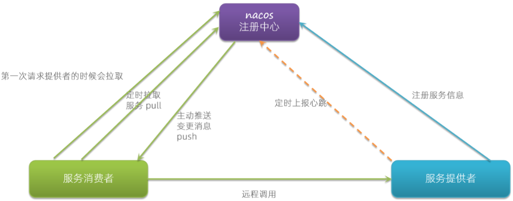

[toc]

---

## 1. 项目中你们是怎么拆分微服务的

// TODO

好的，面试官，我们项目是按业务模块功能来分的~~比如说我们的医疗项目中的用户服务，订单服务，设备服务等等~~

## 2. 说一下服务注册与发现的原理

作用：协调远程调用

当**服务提供者**启动时，会向**注册中心**（如Eureka、Consul）注册，注册信息包括**服务名、IP、端口和健康状态**等元数据。服务提供者会通过**心跳机制**与注册中心保持通信，以续约并确认自身健康状态。若心跳超时，注册中心会将其标记为不可用或移除。

注册中心会保存服务提供者的元数据，定时检查服务提供者健康状态

**服务消费者**通过注册中心拉取可用服务列表，动态感知服务实例的上下线（服务发现）。消费者结合**负载均衡器**（如Ribbon）选择目标实例发起调用，支持动态路由和故障转移。

## 3. 你们项目一般用网关来做什么？

用来做负载均衡和路由，作为一个统一的入口

> [!tip] 
>
> 不要讲限流，鉴权

## 4. 你们项目有多少个微服务？有哪些微服务？

// TODO

项目有大约10个微服务，有用户微服务、设备管理微服务、健康数据服务、预警服务、订单服务、商品服务、网关服务、支付服务、社区服务、消息推送服务

> [!tip] 
>
> 