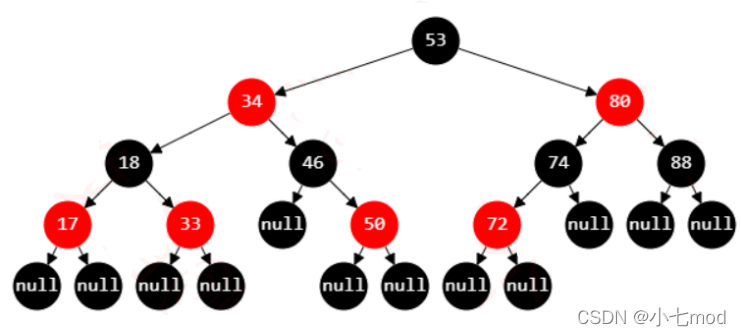

[toc]

---

## 红黑树

- 节点是红色或**黑色**
- 根是**黑色**
- 叶子节点（外部节点，空节点）都是**黑色**，这里的叶子节点指的是最底层的空节点（外部节点），下图中的那些null节点才是叶子节点，null节点的父节点在红黑树里不将其看作叶子节点
- 红色节点的子节点都是**黑色**
  - 红色节点的父节点都是**黑色**
  - 从根节点到叶子节点的所有路径上不能有 2 个连续的红色节点
- 从任一节点到叶子节点的所有路径都包含相同数目的**黑色**节点

------------------------------------------------
版权声明：本文为CSDN博主「小七mod」的原创文章，遵循CC 4.0 BY-SA版权协议，转载请附上原文出处链接及本声明。
原文链接：https://blog.csdn.net/cy973071263/article/details/122543826