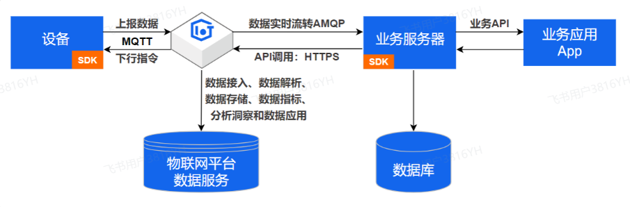

[toc]

---

## 1. 介绍一下你们是怎么对接接收物联网平台的数据的？

我们对接阿里云SDK来完成对接。

我们是使用MQTT协议来进行设备数据上报阿里IoT平台，当然，这一块是由我们项目组的其他人进行的，我是负责设备上传后的接收落库，具体是这样的：

我们使用阿里云的SDK来完成对接，使用阿里云的提供的AMQP客户端建立连接，使用缓存池创建多个线程加快数据的落库，我们还使用了Redis缓存一份设备的最新数据，来减少数据库的压力。

> [!important]
>
> 可能会问：
>
> 详见 [线程池](./并发编程篇.md) 
>
> 1. 线程池的作用
> 1. 线程池的工作原理
> 1. 线程池的七大核心参数
> 1. 线程池的核心参数
> 1. 线程池常用的种类 

## 2. 你有对接过一些第三方吗？说一下小程序登录的流程

有对接过第三方，比如小程序登录，还有阿里云的一些服务，比如OSS、IoT、天气预报、物流查询等。

首先，前端调用wx.login()获取临时登录凭证code，然后传给后端。
后端拿到code后，结合配置的appid和appsecret，调用微信的code2Session接口获取用户的openid和session_key（如果用户已授权给同主体其他应用时才返回UnionID）。
接着，根据openid查询数据库判断用户是否已存在，如果不存在就创建新用户记录。

对于需要手机号的场景，我们采用了额外的授权流程：
后端先根据getAccessToken接口（需要grant_type、appid、secret）获取access_token，再根据前端传入的code（phoneCode）和access_token（URL参数）向微信接口getPhoneNumber发起请求获取手机号

最后，将用户信息封装到JWT token中返回给小程序，后续的业务请求都携带这个token。

> 在多线程环境下，我使用ThreadLocal来存储当前线程的用户信息，确保在同一个请求处理过程中能正确获取到当前用户数据，避免线程间的数据混乱。具体是在拦截器中解析JWT后将用户信息存入ThreadLocal，业务方法中通过工具类获取，请求结束后及时清理避免内存泄漏。