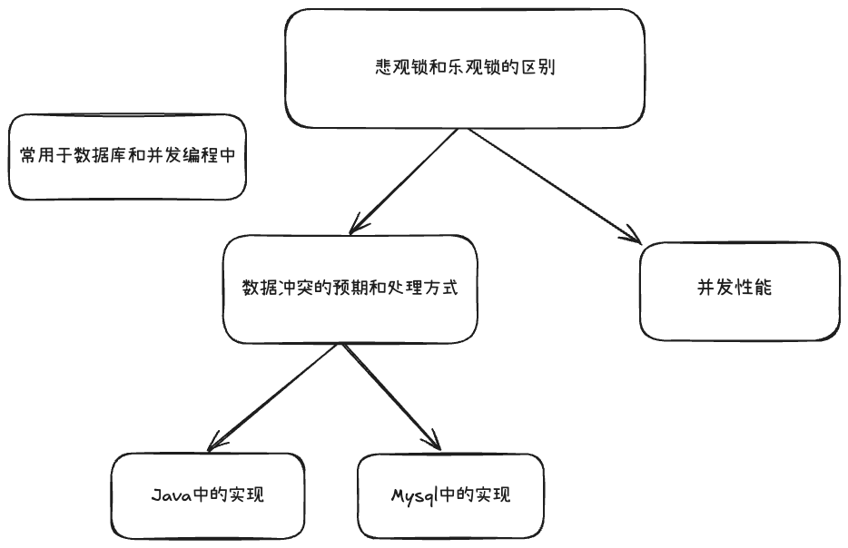
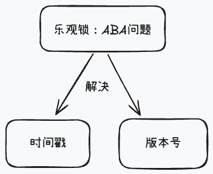
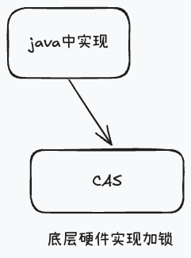
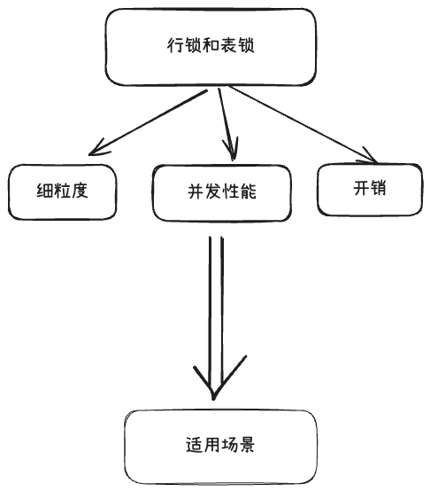
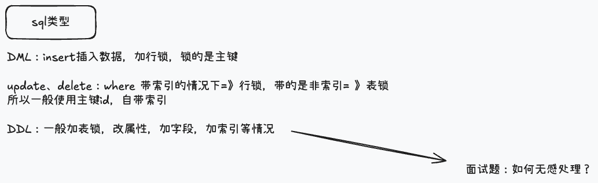
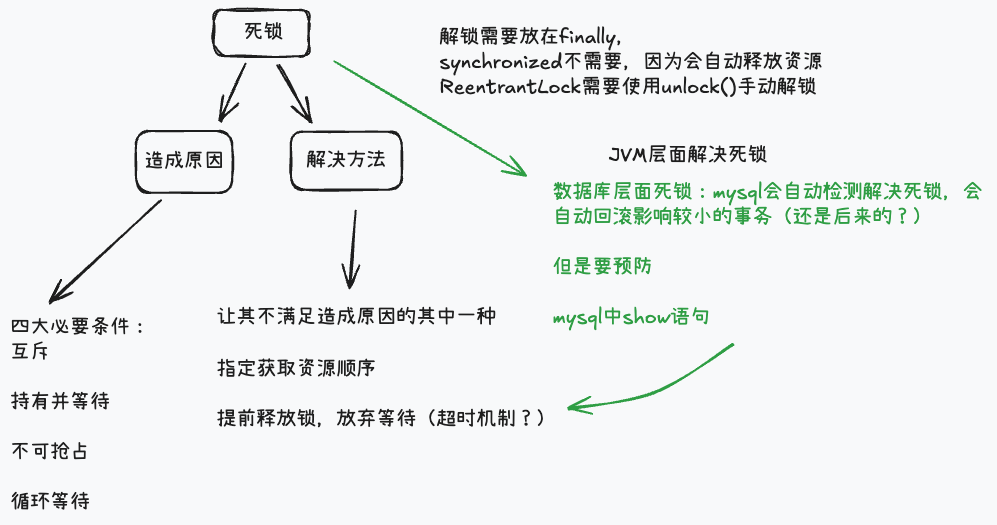

[toc]

---

## 1. 说一下悲观锁和乐观锁的区别？还有行锁和表锁的区别？什么时候会上表锁？什么时候会上行锁？

### 悲观锁和乐观锁的区别？

>  [!tip]
>
>  主要在加锁时机不同、给出建议，使用哪种

他们两个的主要区别体现在对数据冲突的预期和处理方式，**悲观锁**的核心思想是认为数据总会被修改，所以在读取或者增删改数据的时候，先上锁再操作，阻塞其他事务对数据的修改；而**乐观锁**则是认为数据一般不会被修改，所以等提交更新的时候再检查数据是否被别的事务修改，有冲突就回滚或者重试。

再从并发性能方面来说，悲观锁适合写操作频繁，冲突概率高的业务，但是会导致阻塞，降低并发性能；而乐观锁适合读多写少，冲突概率低的业务，不会产生阻塞，但是冲突时重试会带来第一定的性能开销


>  [!tip]
>
> 悲观锁和乐观锁是一种并发控制策略，常用在数据库和并发编程中。
>
> Java中synchronized和ReentrantLock都可以实现悲观锁，mysql中使用for update来实现；
>
> 乐观锁一般是通过版本号或者时间戳进行控制








### 行锁和表锁的区别？什么时候会上表锁？什么时候会上行锁？

从细粒度上来说：行锁（Row Lock）只锁某一行或者几行的数据；而表锁锁住的是一整个表

从并发性能来说，行锁的并发性能高，只要操作的数据行不同，就不会阻塞等待，但是开销大（锁的数量多，加锁，释放锁，死锁检测的维护成本高）；表锁的并发性能低，一个事务对表加锁后，其他事务会被阻塞

>   [!tip]
>
>   行锁触发条件:
>
>   在行锁但查询的是没有索引条件，以及锁的行数超过阈值时，会升级为表锁


**行锁**：适合高并发、单行操作，性能更优

**表锁**：适合批量操作或低并发场景

**上锁性能**表锁性能高






## 2. 什么是死锁？造成死锁的原因是什么？怎么解决死锁？

**死锁（Deadlock）** 是指两个或多个事务（或线程）在执行过程中，互相持有对方需要的资源，并且都在等待对方释放，最终导致这些事务永远无法继续执行下去的情况。

原因：四大必要条件

1. **互斥**：资源只能被一个事务独占，其他事务只能等待。
2. **持有并等待**：事务持有至少一个资源，同时等待其他事务持有的资源。
3. **不可抢占**：资源无法被强制抢夺，只能由持有者主动释放。
4. **循环等待**：多个事务形成环状依赖，每个事务等待下一个事务释放资源。


解决：

1. 让其不满足造成原因的其中一种
   - **互斥**：尽量使用共享资源，减少独占。
   - **持有并等待**：要求事务一次性申请所有资源，失败则不持有任何资源。
   - **不可抢占**：允许系统强制抢占资源。
   - **循环等待**：定义资源获取顺序（如按ID排序），避免循环依赖。
2. 指定获取资源顺序
3. 提前释放锁，放弃等待




## 3. 项目中使用分布式锁场景及Redisson原理

> [!tip]
>
> 波哥版：
>
> 分布式锁主要是满足多进程的互斥性，如果是简单分布式锁只需要利用redis的setnx即可实现。但是Redisson的分布式锁有更多高级特性，例如：可重入、自动续期、阻塞重试等，因此就没有选择使用setnx来实现。
>
> Redisson底层是基于Redis的hash结构来记录获取锁的线程信息，结构是这样的：key是锁名称，hasKey是线程标示，hashValue是锁重入次数。这样就可以实现锁的可重入性。
>
> 然后Redisson的分布式锁允许自定义锁的超时自动释放时间，如果没有设置或者设置的值为-1，则自动释放时间为30秒，并且会开启一个WatchDog机制。WatchDog就是一个定时任务，每隔（leaseTime/3）秒就会执行一次，会重置锁的expire时间为30秒，从而实现所的自动续期
>
> 至于阻塞重试机制，则是基于Redis的发布订阅机制。如果设置了waitTime大于0，则获取锁失败的线程会订阅一个当前锁的频道，然后等待。获取锁成功的线程在执行完业务释放锁后会向频道内发送通知，收到通知的线程会再次尝试获取锁，重复这个过程直到获取锁成功或者重试时长超过waitTime

在项目中我用过Redisson实现分布式锁，主要用于分布式环境下的资源互斥访问，比如库存扣减、分布式任务调度、缓存一致性控制等场景。

例如在库存扣减时，如果多个请求同时操作同一个商品库存，就可能出现并发修改问题。通过Redisson分布式锁可以确保同一时间只有一个线程能够执行校验和扣减逻辑，从而保证数据一致性。

Redisson相比直接用`setnx`实现的简单分布式锁，提供了更多高级特性，比如：**可重入、自动续期、阻塞重试、红锁机制等**。

它的底层原理是基于Redis的**SET NX EX命令和Lua脚本**实现的原子操作：

- **获取锁时**，Redisson会执行一段Lua脚本，如果锁不存在，就SET key并设置过期时间（防止死锁）；同时在Redis的hash结构中记录线程ID和重入次数，从而实现锁的**可重入性**。
- **释放锁时**，同样使用Lua脚本，只有锁的持有线程才能删除key；如果是可重入锁，则递减重入计数，计数为0时才真正删除key。
- **自动续期（WatchDog）机制**：当加锁线程未设置过期时间或设置为-1时，Redisson会默认设置30秒超时，并启动一个守护线程，每隔`ttl/3`秒自动续期，把锁的过期时间刷新回30秒，防止业务执行时间过长导致锁提前释放。
- **阻塞重试机制**：如果获取锁失败且设置了`waitTime`>0，Redisson会通过Redis的发布订阅机制阻塞等待，当锁释放时收到通知后重新尝试获取锁。
- **红锁机制（RedLock）**：在多Redis节点部署下，Redisson可以在N个节点中获取大多数（N/2+1）节点锁才算成功，用来保证在分布式Redis环境下的可靠性和容错性。

在底层实现上，Redisson大量使用Lua脚本保证**操作的原子性**，从而避免了分布式环境下可能出现的竞态条件。同时，它的WatchDog机制保证了锁在业务未完成前不会意外过期。

> 额外点：雪花算法需注意机器ID唯一分配（如Zookeeper)，否则冲突；MySQL主从延迟可能导致读从不一致，需读主或异步补偿；Redis AOF过大需定期rewrite；Redisson锁需处理网络分区，建议结合业务重试机制，避免死锁或饥饿。
>


## 4. 说一下synchronized和ReentrantLock的区别？synchronized可以作用在哪些地方？锁的是什么？说一下synchronized的锁升级？可逆吗？

### `synchronized` 和 `ReentrantLock` 的区别

从来源方面来说，synchronized是JVM内置，ReentrantLock是来源于`java.util.concurrent.locks`包(JUC库)。

从公平性来说，synchronized是只支持非公平锁的，不能保证先等待的线程先获得锁，而ReentrantLock支持公平锁和非公平锁。

从中断响应的角度来说，synchronized等待锁的时候是不可中断的，ReentrantLock在等待锁时可使用`lockInterruptibly()`方法中断

synchronized在执行完同步块或者方法后会自动释放，ReentrantLock则需要使用unlock()手动释放，否则可能导致死锁

synchronized在尝试加锁的过程中，只能阻塞等待，可能会导致一直获取不到锁，变成僵尸进程，而ReentrantLock会使用tryLock()方法获取锁，这个方法有一个超时机制

> [!tip] 
>
> 条件队列（Condition Queue）是 **并发编程里与锁（Lock）配合使用的一种等待/通知机制**。它的本质是一个“等待队列”，当线程在某个条件不满足时，就会被阻塞挂起，直到被其他线程显式唤醒。


### synchronized可以用在那些地方?锁的是什么？

可以作用在实例方法中，锁的是当前对象this；也可以作用在静态方法中，锁的是类的.class对象；也可以作用在代码块中，锁的是synchronized传入的对象

### 说一下synchronized的锁升级？可逆吗？

首先是**无锁状态**：当对象刚创建的时候，此时是**无锁状态**，没有线程竞争
				↓
当有一个线程访问的时候，锁会偏向该线程，也就是**偏向锁**
				↓
当有两个线程竞争，会升级为**轻量级锁**，使用CAS自旋尝试获取锁
				↓
当自旋失败或者竞争激烈时，会升级为**重量级锁**，线程会被阻塞挂起

锁的升级是不可逆的，主要的目的是减少锁管理和性能开销

> [!tip] 
>
> 自旋（Spin）是 **多线程并发编程中的一种等待策略**，指的是线程在获取锁时，如果发现锁被占用，并不是立即阻塞挂起，而是在 **循环里反复尝试获取锁**，直到成功为止。

> [!NOte] 
>
> 并发和并行
>
> | 特性         |            并发            |            并行            |
> | :----------- | :------------------------: | :------------------------: |
> | **核心概念** |      **处理**多个任务      |    **同时执行**多个任务    |
> | **硬件要求** |        单核即可实现        |    **必须多核**或多CPU     |
> | **微观视角** |      任务**交替执行**      |      任务**同时执行**      |
> | **关注点**   | 程序的设计与结构，避免阻塞 | 程序的执行速度，提升吞吐量 |
> | **比喻**     |  一个咖啡师同时做两杯咖啡  |   两个咖啡师各做一杯咖啡   |
>
> 并行是并发的特殊情况是真正的“同时”


synchronized在JDK1.6之后性能优化明显，它俩性能接近

| 对比点       | `synchronized`                              | `ReentrantLock`                                       |
| ------------ | ------------------------------------------- | ----------------------------------------------------- |
| **用法**     | 关键字，语法层面支持，JVM 内置              | 类库实现（`java.util.concurrent.locks` 包）           |
| **可重入性** | 可重入                                      | 可重入                                                |
| **公平性**   | 非公平（不能保证先等待的线程先获得锁）      | 可选公平/非公平（构造函数可指定）                     |
| **中断响应** | 等待锁时不可中断                            | 等待锁时可中断（`lockInterruptibly()`）               |
| **尝试加锁** | 只能阻塞等待                                | 可 `tryLock()` 尝试获取锁（超时机制）                 |
| **释放**     | 自动释放（执行完同步块/方法后自动释放）     | 必须手动释放（`unlock()`），否则可能死锁              |
| **条件队列** | 没有显式条件队列，只能 `wait()/notify()`    | 支持多个条件队列（`newCondition()`）                  |
| **性能**     | JDK1.6 之后性能优化明显（偏向锁、轻量级锁） | 更灵活，但加解锁需要更多代码，性能接近 `synchronized` |


## 5. synchronized底层原理

以重量级锁为例，比如 T0、T1 两个线程同时执行加锁代码，已经出现了竞争（代码如下）

```plain
synchronized(obj) { // 加锁
    ...
} // 解锁
```

1. 当执行到行1 的代码时，会根据 obj 的对象头**找到**或**创建**此对象对应的 Monitor 对象（C++对象）
2. 检查 Monitor 对象的 owner 属性，用 Cas 操作去设置 owner 为当前线程，Cas 是原子操作，只能有一个线程能成功

1. 假设 T0 Cas 成功，那么 T0 就加锁成功，可以继续执行 synchronized 代码块内的部分
2. T1 这边 Cas 失败，会自旋若干次，重新尝试加锁，如果

1. 重试过程中 T0 释放了锁，则 T1 不必阻塞，加锁成功
2. 重试时 T0 仍持有锁，则 T1 会进入 Monitor 的等待队列阻塞，将来 T0 解锁后会唤醒它恢复运行（去重新抢锁）

> [!tip]
>
> synchronized 是线程同步关键字，比如 T0、T1 两个线程同时执行加锁代码，已经出现了竞争（代码如下）
>
> ```Plain
> synchronized(obj) { // 加锁
>     ...
> } // 解锁
> ```
>
> 1. 对象头与 Monitor
>    - 每个 Java 对象都有一个对象头（Object Header），其中包含
>      - Mark Word：存储对象的哈希码、分代年龄、锁状态等信息。
>      - Klass Pointer：指向对象所属类的元数据指针。
>    - 当对象被用作锁时，Mark Word 会指向一个Monitor 对象。Monitor 是 JVM 实现的一种锁机制，其结构包含三个核心组件：
>      - Owner：指向持有该 Monitor 的线程。
>      - EntryList（Entry Set）：竞争锁失败的线程会进入该队列阻塞等待。
>      - WaitSet：调用 `wait()` 方法的线程会释放锁并进入该队列等待唤醒。
> 2. 获取锁
>    - 当线程执行到 `synchronized` 代码块或方法时，会检查对象头的 Mark Word 是否指向当前 Monitor，检查 Monitor 对象的 owner 属性，用 Cas 操作去设置 owner 为当前线程，Cas 是原子操作，只能有一个线程能成功
>    - 假设 T0 Cas 成功，那么 T0 就加锁成功，可以继续执行 synchronized 代码块内的部分
>    - T1 这边 Cas 失败
>      - 如果是轻量级锁，会自旋若干次（一般10次，但是具体jvm策略决定），重新尝试加锁，如果
>        - 重试过程中 T0 释放了锁，则 T1 不必阻塞，加锁成功
>        - 重试时 T0 仍持有锁，则 T1 会进入 Monitor 的等待队列阻塞，将来 T0 解锁后会唤醒它恢复运行（去重新抢锁）
>      - 如果是重量级锁，直接进入 Monitor 的等待队列阻塞，将来 T0 解锁后会唤醒它恢复运行（去重新抢锁）
>    - 当线程在同步代码块中调用 `wait()` 方法时：
>      - 进入 WaitSet：线程进入 WaitSet 并转为 WAITING 状态。
>      - 其他线程唤醒：当其他线程调用 `notify()` 或 `notifyAll()` 时：
>        - `notify()`：随机唤醒 WaitSet 中的一个线程，该线程进入 EntryList 重新竞争锁。
>        - `notifyAll()`：唤醒 WaitSet 中的所有线程，它们都进入 EntryList 竞争锁
> 3. 释放锁
>    - 线程执行完同步代码块：将 Monitor 的 Owner 置为 null，并唤醒 EntryList 中的一个线程（通常是 FIFO，但不保证）。
>    - EntryList 中的线程竞争锁：被唤醒的线程重新尝试获取锁，重复上述流程。

### 5.4【追问】 synchronized 锁升级

synchronized 锁有三个级别：偏向锁、轻量级锁、重量级锁，性能从左到右逐渐降低

- 如果就一个线程对同一对象加锁，此时就用偏向锁
- 又来一个线程，与前一个线程交替为对象加锁，但只是交替，没有竞争，此时要升级为轻量级锁
- 如果多个线程加锁时发生了竞争，必须升级为重量级锁

【说明】

- 自 java 6 开始对 synchronized 提供了锁升级功能，之前只有重量级锁
- 但从 java 15 开始，偏向锁被标记为已废弃，将来会移除（因为实际带来的性能提升不明显，某些情况下反而影响性能）

