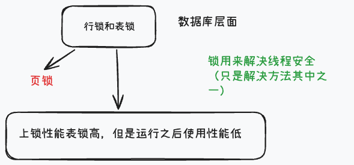

[toc]

---

## 1. 说一下悲观锁和乐观锁的区别？还有行锁和表锁的区别？什么时候会上表锁？什么时候会上行锁？

### 悲观锁和乐观锁的区别？

从名字上面就能大概了解这两个锁的思想，他们两个的主要区别体现在对数据冲突的预期和处理方式，**悲观锁**的核心思想是认为数据总会被修改，所以在读取或者增删改数据的时候，先上锁再操作，阻塞其他事务对数据的修改；而**乐观锁**则是认为数据一般不会被修改，所以等提交更新的时候再检查数据是否被别的事务修改，有冲突就回滚或者重试。

再从并发性能方面来说，悲观锁适合写操作频繁，冲突概率高的业务，但是会导致阻塞，降低并发性能；而乐观锁适合读多写少，冲突概率低的业务，不会产生阻塞，但是冲突时重试会带来第一定的性能开销

>  [!tip]
>
> 悲观锁和乐观锁是一种并发控制策略，常用在数据库和并发编程中。
>
> Java中synchronized和ReentrantLock都可以实现悲观锁，mysql中使用for update来实现；
>
> 乐观锁一般是通过版本号或者时间戳进行控制

>  [!tip]
>
> 主要在加锁时机不同、给出建议，使用哪种

### 行锁和表锁的区别？什么时候会上表锁？什么时候会上行锁？

从细粒度上来说：行锁（Row Lock）只锁某一行或者几行的数据；而表锁锁住的是一整个表

从并发性能来说，行锁的并发性能高，只要操作的数据行不同，就不会阻塞等待，但是开销大（锁的数量多，加锁，释放锁，死锁检测的维护成本高）；表锁的并发性能低，一个事务对表加锁后，其他事务会被阻塞

>   [!tip]
>
>   行锁触发条件:
>
>   在行锁但查询的是没有索引条件，以及锁的行数超过阈值时，会升级为表锁

**行锁**：适合高并发、单行操作，性能更优

**表锁**：适合批量操作或低并发场景

**上锁性能**表锁性能高

## 2. 什么是死锁？造成死锁的原因是什么？怎么解决死锁？

**死锁（Deadlock）** 是指两个或多个事务（或线程）在执行过程中，互相持有对方需要的资源，并且都在等待对方释放，最终导致这些事务永远无法继续执行下去的情况。

常见原因有以下几种：

1. **锁的获取顺序不一致**
   - 不同事务以不同的顺序请求锁，比如事务1 先锁 `id=1` 再锁 `id=2`，事务2 反过来。
2. **事务未提交，长时间持有锁**
   - 一个事务持有资源过久，阻塞其他事务，容易导致循环等待。
3. **资源竞争激烈**
   - 多个事务频繁访问相同的数据或索引，增加死锁概率。
4. **索引缺失导致锁范围扩大**
   - 例如 InnoDB 本来可以用行锁，但因为条件没有走索引，退化成表锁，死锁概率更高。
5. **应用层逻辑导致的循环依赖**
   - 比如转账、订单更新等业务逻辑里，事务之间相互依赖。

（1）避免死锁（预防）

- **统一加锁顺序**
  - 比如规定所有事务必须先锁定 `id 小的记录`，再锁定 `id 大的记录`。
- **尽量缩短事务时间**
  - 提交要快，减少锁持有时间。
- **减少锁范围**
  - 尽量使用行锁而不是表锁。
  - 查询条件带索引，避免全表扫描导致锁住整表。
- **分解大事务**
  - 把一个大事务拆分成多个小事务，减少资源争用。

（2）检测和解除死锁

**数据库自动检测**

- InnoDB 内置死锁检测机制，会选择一个“受害事务”回滚，从而打破僵局。

**应用层处理**

- 捕获死锁异常，重新执行事务。
- 一般写成 **重试机制**（例如重试 3 次）。

## 3. (待整理)项目中使用分布式锁场景及Redisson原理

项目中分布式锁常用于：如~~电商库存扣减（防止超卖）~~直接描述，不要说“超。。。”、分布式任务调度（确保单节点执行）、缓存一致性维护（避免并发更新）。

Redisson（Java Redis客户端）底层原理：基于Redis的SETNX（或SET with NX/EX）实现分布式锁，支持可重入、红锁等。

- **获取锁**：使用Lua脚本原子执行：如果key不存在，SET key value EX ttl（设置过期时间防死锁）；可重入时用Hash结构记录线程ID和重入计数。
- **释放锁**：Lua脚本检查线程ID匹配后，递减计数或DEL key。
- **红锁**：多节点Redis集群下，获取多数节点锁（N/2+1）以防单点故障。
- **Watch Dog**：自动续期机制，守护线程每ttl/3时间续期锁，防止任务超时释放。

额外点：雪花算法需注意机器ID唯一分配（如Zookeeper），否则冲突；MySQL主从延迟可能导致读从不一致，需读主或异步补偿；Redis AOF过大需定期rewrite；Redisson锁需处理网络分区，建议结合业务重试机制，避免死锁或饥饿。

