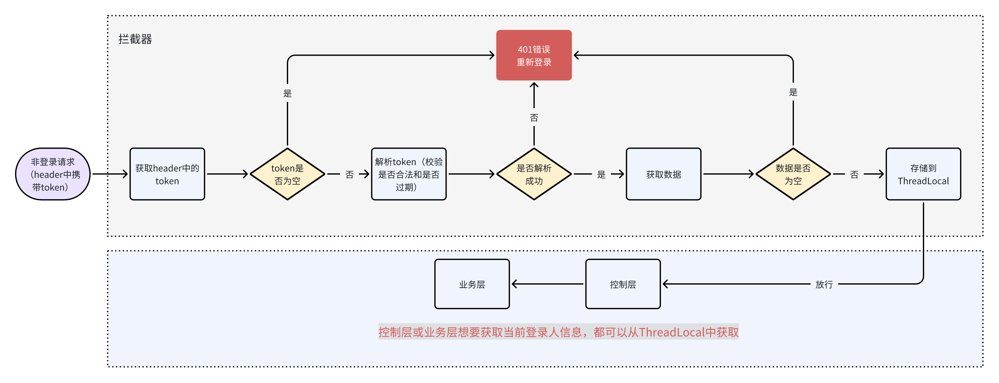

# 9月12号

## （1）你有对接过一些第三方吗？说一下小程序登录的流程

有对接过第三方，比如小程序登录，还有阿里云的一些服务，比如OSS、IoT、天气预报、物流查询等。

首先，前端调用wx.login()获取临时登录凭证code，然后传给后端。
后端拿到code后，结合配置的appid和appsecret，调用微信的code2Session接口获取用户的openid和session_key（如果用户已授权给同主体其他应用时才返回UnionID）。
接着，根据openid查询数据库判断用户是否已存在，如果不存在就创建新用户记录。

对于需要手机号的场景，我们采用了额外的授权流程：
后端先根据getAccessToken接口（需要grant_type、appid、secret）获取access_token，再根据前端传入的code（phoneCode）和access_token（URL参数）向微信接口getPhoneNumber发起请求获取手机号

最后，将用户信息封装到JWT token中返回给小程序，后续的业务请求都携带这个token。

> 在多线程环境下，我使用ThreadLocal来存储当前线程的用户信息，确保在同一个请求处理过程中能正确获取到当前用户数据，避免线程间的数据混乱。具体是在拦截器中解析JWT后将用户信息存入ThreadLocal，业务方法中通过工具类获取，请求结束后及时清理避免内存泄漏。

## （2）你知道本地线程变量吗？你在项目中用它来做什么？使用上一般要注意什么？

本地线程变量也就是ThreadLocal，它是Java提供的一个线程隔离机制，通过无锁操作让每个线程都拥有自己独立的变量副本。

> ThreadLocal的好处是保证了线程安全，因为每个请求都是在独立的线程中处理的，所以不会出现多个用户之间数据混乱的问题。

在我们项目中，主要在用户身份认证这块使用了ThreadLocal。具体场景是这样的：当非登录请求的请求头携带token进来的时候，拦截器获取并解析JWT token，校验合法之后就把用户的信息存储到ThreadLocal中。这样在整个请求处理过程中，不管是Controller层、Service层还是Dao层，都可以通过ThreadLocal来获取当前登录用户的信息，而不需要在每个方法参数中都传递用户对象。

> 我们封装了一个UserContext工具类来管理ThreadLocal：
> 比如setCurrentUser()方法用来存储用户信息，getCurrentUser()方法用来获取当前用户，还有removeCurrentUser()方法用来清理数据。

> [!important]
>
> 但是使用ThreadLocal也要注意内存泄漏的问题，所以我们在请求处理完成后，会在拦截器的afterCompletion方法中调用`ThreadLocal.remove()`来及时清理数据，避免线程池复用线程导致内存泄漏。
>
> ### 为什么不在postHandle方法使用ThreadLocal.remove()？
>
> postHandle只有在Controller方法正常执行完成后才会被调用，如果Controller层抛出异常，postHandle就不会执行，这样ThreadLocal中的数据就无法被清理，造成内存泄漏。而afterCompletion无论是否发生异常都会被调用，更加可靠。
>

## （3）什么是线程安全？怎么解决线程安全问题？

线程安全是指在多线程环境下，多个线程同时访问共享资源时，程序能够正确执行并且保证数据的一致性，不会出现数据混乱或者不可预期的结果。 简单来说，就是当多线程同时操作同一个数据时，不会互相影响导致数据错误。

**为什么出现非线程安全的问题？**主要有三个原因：第一是原子性问题，比如i++操作被中途打断；第二是可见性问题，一个线程修改了变量但其他线程看不到；第三是有序性问题，编译器指令重排序导致执行顺序与预期不符。

解决方法：

在设计的时候，避免资源共享，使用无状态的类，不使用成员变量，数据都存储在局部变量中；使用ThreadLocal实现线程隔离，每个线程都有自己的变量副本。

如果无法避免共享，就进行同步控制：使用线程安全的工具类，比如ConcurrentHashMap、AtomicInteger；使用synchronized或者ReentrantLock；使用volatile关键字保证变量的可见性和禁止指令重排（不能保证原子性）；还有乐观锁和悲观锁。

> [!tip]
>
> 总结如下
>
> - 使用ThreadLocal实现线程隔离；
> - 使用乐观锁或悲观锁；
> - 使用线程安全的集合类（如ConcurrentHashMap）
> - 使用volatile关键字保证变量可见性
> - 使用不可变对象
> - 使用原子类或原子操作保证操作的原子性；（AtomicInteger、AtomicLong）
> - ~~使用synchronized或ReentrantLock实现同步控制~~；
> - ~~还有通过分布式锁来解决分布式环境下的并发问题~~。

## （4）你可以给我看一下你们公司的代码或者聊天记录吗？

非常抱歉，面试官，不可以，涉及到客户数据、业务流程等信息，我们公司是有严格的保密规定的。我也相信贵公司不会随意把自己内部的信息泄漏给外部人员。

## （5）你觉得自己的水平怎么样？在公司属于什么级别？

我能独立完成模块级开发，掌握SpringBoot和MySQL技术栈，在我之前公司担任初中级开发工程师。我希望在Redis缓存、数据库调优、微服务架构等方面继续深入学习，逐步承担更多架构设计责任。

