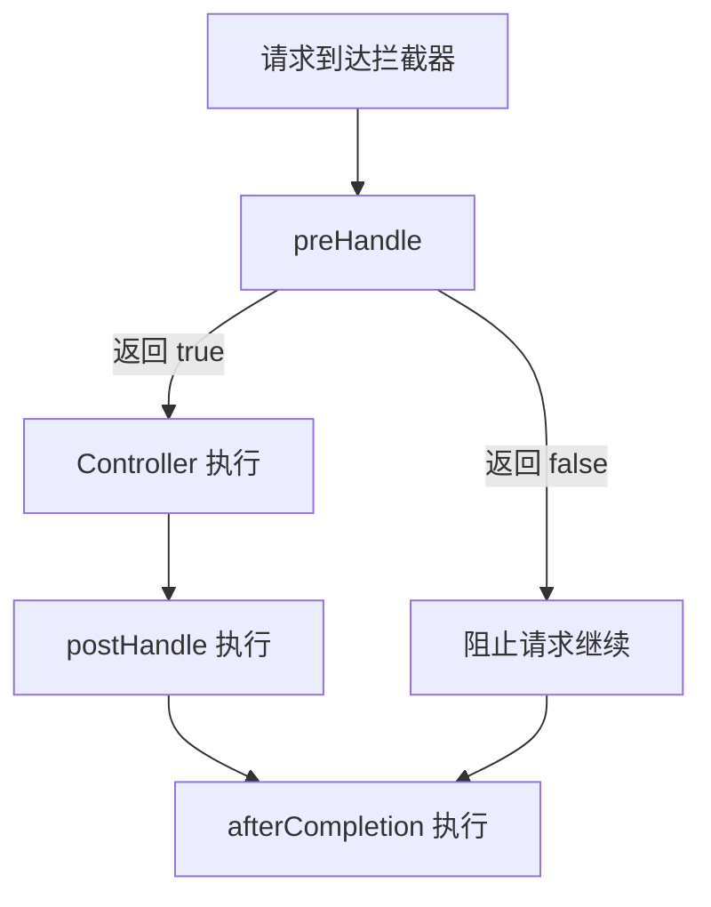

# 8月28号


[toc]


## （1）你们项目是怎么处理异常的？你说一下怎么实现全局自定义异常处理器

我们项目使用全局异常处理器

>  [!tip]
>
> 也可以使用AOP进行处理异常

通过两个核心注解来实现，一个是`@RestControllerAdvice`和`@Exceptionhandler`这两个注解来实现

首先创建一个 `GlobalExceptionHandler`类(普通Java类)，用`@RestControllerAdvice`标记为全局异常处理器

再使用`@Exceptionhandler`来定义要处理的异常方法


## （2）你说一下过滤器和拦截器的区别

> - 过滤器（Filter）：当有一堆请求，只希望符合预期的请求进来。
>
> - 拦截器（Interceptor）：想要干涉预期的请求。
>
> - 监听器（Listener）：想要监听这些请求具体做了什么。

 可以从细粒度，实现和技术栈，作用范围

过滤器(Filter)是基于Servlet规范，FilterChain，责任链设计。拦截进入Selrvlet但未进入Spring容器的请求，可以拦截到方法的请求和响应，常用来做：过滤敏感词汇（防止sql注入），设置字符编码，URL级别的权限访问控制，压缩响应信息等。

拦截器(Interceptor)基于Spring AOP的思想实现，只拦截Controller的请求，需要重写`HandlerInterceptor`接口可以在方法执行前(preHandle)，执行后(afterCompletion)进行操作，还有回调操作(postHandle)。常用来做：日志记录，性能监控。




>  [!caution]
>
> 只有 preHandle 返回 true 的话，其他两个方法才会执行。

先经过过滤器才会到拦截器

> [!tip]
>
> 使用**过滤器**：当你的功能与 Spring 无关，且需要拦截所有请求（包括静态资源）时，比如编码格式转换、统一的日志记录、跨域设置等。
>
> 使用**拦截器**：当你的功能与 Spring **业务**强相关，且需要精确到 Controller 方法执行时，比如用户登录状态校验、权限控制、请求耗时统计等。
>
> 过滤器是**外围**的、更底层的处理，而拦截器是**内部**的、更精细的业务处理。在 Spring 项目中，处理业务逻辑相关的增强，通常都推荐使用拦截器。
>
> ```mermaid
> graph TD
>     A[客户端 Client] --> B[Tomcat 容器]
>     B --> C[Filter 过滤器]
>     C --> D[DispatcherServlet Servlet]
>     D --> E[Interceptor 前置 preHandle]
>     E --> F[Controller 方法执行]
>     F --> G[Interceptor 后置 postHandle/afterCompletion]
>     G --> H[DispatcherServlet 视图处理返回]
>     H --> I[Filter 返回链]
>     I --> J[响应给客户端]
> ```
>
> 

## （3）你们是怎么保存用户登录信息的？你们的jwt需要在服务端存储吗？如果jwt过期了用户不就要重新登录了吗？你们怎么处理的？

使用JWT来保存信息

> [!tip]
>
> 还有Seesion，cookie等

不需要在服务器进行存储

> [!tip]
>
> 保存在客户端，每次请求把Token放在HTTP请求头(无状态Stateless)，JWT由三部分组成：头部(header)描述签名算法和了类型，载荷(payload)存放用户信息和声明，还有签名(signature)部分，用来验证消息是否被篡改
>
> ```css
> header.payload.signature
> ```

是的，jwt过期后就无法需要重新登陆，我们使用双token校验的方法来解决频繁重复的问题

>  [!tip]
>
>  登陆成功之后返回两个token给客户端，一个访问令牌（Access Token）和一个刷新令牌（Refresh Token）
>
>  - Access Token：一般有效期比较短，用来访问受保护的资源。
>
>  - Refresh Token：有效期很长，比如7天，用来在Access Token过期后获取新的Access Token。
>
>  如果是关于登陆认证（比当前问题范围大一些），需要回答双token三认证：基于双token，如果用户退出登陆，马上把Refresh token加入Redis的黑名单，再次登陆时先检查是否在黑名单，如果不在，判断它是否过期，如果一切正常，才下发Access Token


## （4）最后你有什么想问我们的

对技术面：我想了解贵公司的现在的业务，还有在业务上的规划或者方向

对HR面：我想了解一下贵公司作息时间，还有绩效和薪资体系大概是怎么样的

好的，我这边没有问题了，谢谢面试官。

## （5）你的期望薪资是多少？暂时我们给不到你要的期望薪资，你还考虑吗？

我的期望薪资是13k

可以考虑

