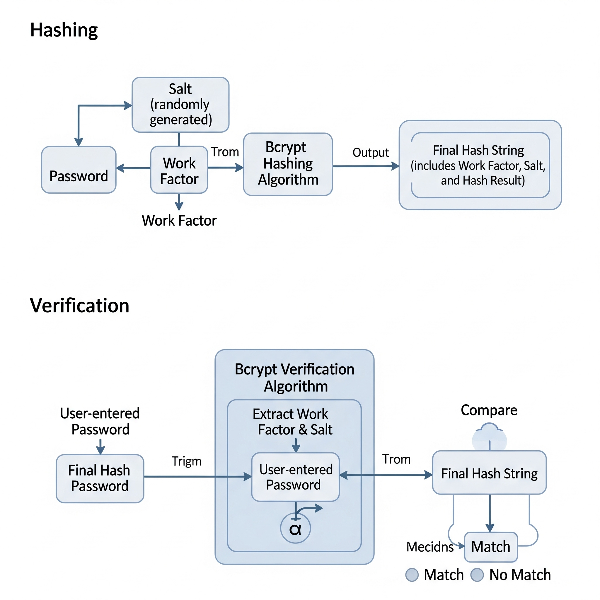

# 8月30号

[toc]


## （1）说一下jwt由哪些部分组成？说一下jwt为什么可以防篡改和检查过时？

JWT由三部分组成：头部(header)描述签名算法和类型，载荷(payload)存放用户信息和声明，还有签名(signature)部分，用来验证消息是否被篡改

```css
header.payload.signature
```

签名部分会校验是否被篡改，载荷(payload)里面保存了过期时间戳，签名部分保证了载荷的内容可信，所以这个过期时间戳可信

## （2）说一下加解密和编解码的区别？说一下对称加密和非对称加密的区别？常用有哪些对称和非对称算法？

### 加解密和编解码的区别

- **编解码（Encode/Decode）**：是数据格式的转换，目的在于适应传输、存储或者兼容性需求。它公开透明，任何人只要知道规则，就能还原原始数据。比如 Base64、URL 编码、字符编码。**没有安全性**。
- **加解密（Encrypt/Decrypt）**：是数据安全保护，目的在于防止未授权访问。它依赖密钥，算法可以公开，但只有拥有正确密钥的人才能解密还原。比如 AES、RSA。**强调安全性**。

> [!tip]
>
> 从使用途径，使用方式来回答

------

### 对称加密和非对称加密的区别

- **对称加密**：加密和解密使用同一个密钥。速度快，适合大数据量，但密钥分发困难。
- **非对称加密**：使用公钥和私钥，公钥加密只能私钥解密，私钥加密只能公钥解密。安全性高，适合身份认证和密钥交换，但速度慢。

> [!tip]
>
> 公钥和私钥不能随便取，一般是一对的

------

### 常见的算法

- **对称加密算法**：**AES**、DES、3DES、SM4。
- **非对称加密算法**：**RSA**、ECC、DSA、SM2。


## （3）hash算法可逆吗？什么是加盐？md5和Bcrypt的区别？签名为什么可以解决防篡改的问题？

不可逆。

加盐是在对密码Hash之前添加**随机且唯一**的字符串（盐值），解决彩虹表攻击和相同密码识别，盐值通常和Hash值一起存储，不需要保密。

- MD5需要手动实现加盐，而且生成Hash值快速


- Bcrypt实现了自动加盐，有一个可调整的工作因子

和JWT放篡改类似




> [!tip]
>
> 为什么不可逆？
>
> 信息压缩：输出的哈希值都是固定的，也就是大量信息被丢弃，输出的值只能验证原来的内容是否被修改过，但是不能还原出原来完整的内容。
>
> 雪崩效应：哈希算法对数据敏感，微小的改动也会导致最终的哈希值发生巨大变化，很难方向推导。
>
> 哈希碰撞：即使存在两个不同的输入，它们输出的哈希值相同，这种概率非常的小（MD5有约1.8×10^19^个值，SHA-256有约3.4×10^38^个值）虽然小，但是也存在，所以无法确定唯一的输入

> [!tip]
>
> 盐值在注册时生成随机盐值（可以集合用户名，时间戳来生成），通过密码+盐值进行Hash，最后存储盐值和Hash
>
> ```tex
> 数据库存储格式：
> 用户ID | 盐值 | 密码Hash值
> 1001 | aB3$kL9x | hash(password+aB3$kL9x)
> 1002 | mN7@pQ2z | hash(password+mN7@pQ2z)
> ```

## （4）最快什么时候可以入职

三个工作日内

> [!tip]
>
> 不要太久，也不要太快，不差这几天，等确定的在找房子

因为我需要在这附近租房子

我现在住在黄村地铁站附近

## （5）你在公司或者项目组中主要负责什么角色

主要是负责后端开发的工作，也参与一些数据表设计，流程图绘画。

> [!tip]
>
> 不仅编码，还有设计：数据库，流程图，接口设计
