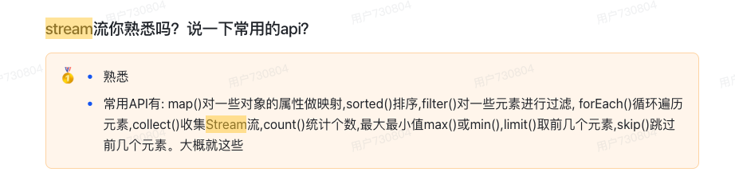
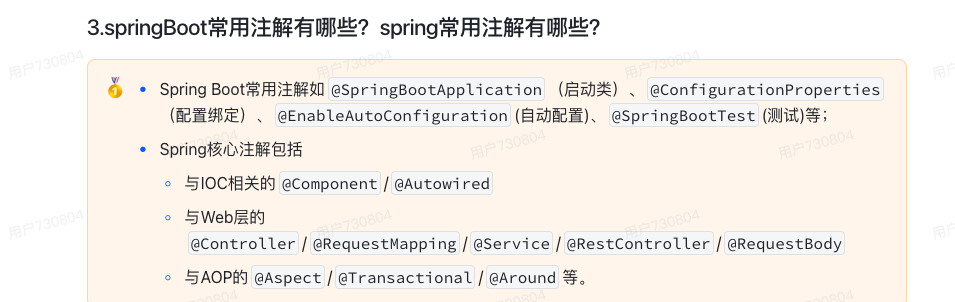
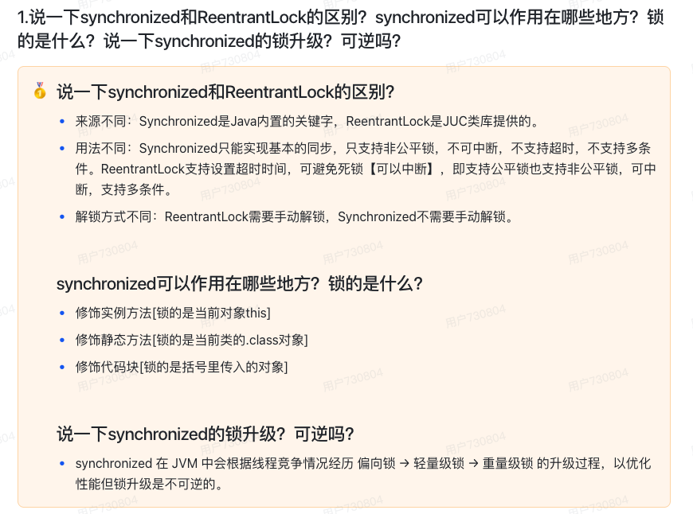

# 9月1号

## （1）stream流你熟悉吗？说一下常用的api？



- filter()：按条件过滤元素
- distinct()：去重（依赖 `hashCode` 和 `equals`）
- limit(n)：截取前n个
- skip(n)：跳过前n个
- collect()：收集stream流
- forEach()：循环遍历元素
- sorted()：排序
- count()、max()、min()

## （2)springBoot常用注解有哪些？spring常用注解有哪些？

SpringBoot:

@SpringBootApplication：标记启动类

@EnableAutoConfiguration：自动配置

@ConfigurationProperties：绑定配置文件

@RestController：@Controller + @ResponseBody返回JSON数据

@SpringBootTest：标记测试类

@ControllerAdvice：全局异常处理器


spring:

@Component：声明一个Bean，交给Spring管理

@Service:本质也是@Component

@Controller

@Bean

@Configuratiion

@RequestMapping


@Autowired


@Aspect

@Around/@Before/@After

@Transactional




## （3)说一下synchronized和ReentrantLock的区别？synchronized可以作用在哪些地方？锁的是什么？说一下synchronized的锁升级？可逆吗？


1. `synchronized` 和 `ReentrantLock` 的区别

| 对比点       | `synchronized`                              | `ReentrantLock`                                       |
| ------------ | ------------------------------------------- | ----------------------------------------------------- |
| **用法**     | 关键字，语法层面支持，JVM 内置              | 类库实现（`java.util.concurrent.locks` 包）           |
| **可重入性** | 可重入                                      | 可重入                                                |
| **公平性**   | 非公平（不能保证先等待的线程先获得锁）      | 可选公平/非公平（构造函数可指定）                     |
| **中断响应** | 等待锁时不可中断                            | 等待锁时可中断（`lockInterruptibly()`）               |
| **尝试加锁** | 只能阻塞等待                                | 可 `tryLock()` 尝试获取锁（超时机制）                 |
| **释放**     | 自动释放（执行完同步块/方法后自动释放）     | 必须手动释放（`unlock()`），否则可能死锁              |
| **条件队列** | 没有显式条件队列，只能 `wait()/notify()`    | 支持多个条件队列（`newCondition()`）                  |
| **性能**     | JDK1.6 之后性能优化明显（偏向锁、轻量级锁） | 更灵活，但加解锁需要更多代码，性能接近 `synchronized` |

**总结**：

- 如果能用 `synchronized`，推荐优先用它（语法简洁，JVM 优化好）。
- `ReentrantLock` 适合需要：**公平锁、可中断锁、尝试加锁、多个条件队列**的场景。

2. `synchronized` 可以作用在哪些地方

- **实例方法**：锁当前对象实例 (`this`)

  ```java
  public synchronized void method() {}
  ```

- **静态方法**：锁当前类的 `Class` 对象

  ```java
  public static synchronized void staticMethod() {}
  ```

- **代码块**：指定锁对象，可以是 `this`、某个对象、某个 `Class` 对象

  ```java
  synchronized(this) { ... }
  synchronized(SomeClass.class) { ... }
  synchronized(lockObject) { ... }
  ```

**结论**：

- **非静态方法** → 锁对象实例（同一个对象才能互斥）。
- **静态方法** → 锁类对象（全局互斥）。
- **代码块** → 锁定指定对象。

------

3. `synchronized` 的锁升级过程

`synchronized` 在 JVM 中的实现依赖 **对象头（Mark Word）**，JDK 1.6 引入了 **锁升级机制** 来提升性能：

1. **无锁状态**：对象刚创建时，没有线程竞争。
2. **偏向锁**：当只有一个线程访问时，锁会偏向该线程，下次进入时无需 CAS 竞争，性能最好。
3. **轻量级锁**：如果有第二个线程竞争，升级为轻量级锁，使用 CAS 自旋尝试获取锁。
4. **重量级锁**：自旋失败或竞争激烈时，升级为重量级锁，线程会被阻塞挂起（进入 OS 的互斥量）。

------

4. 锁升级是否可逆？

- **偏向锁** → 可以被撤销（升级为轻量级锁），但**不会再退回偏向锁**。
- **轻量级锁** → 可以升级为重量级锁，但**不会降级**。
- **重量级锁** → 永远是重量级，不能降级。

**结论**：
 锁的升级是 **单向的，不可逆**，这样做是为了避免频繁升级/降级带来的性能消耗。

------

总结一句话：

- `synchronized` 是 JVM 内置锁，简单可靠，支持锁升级（偏向→轻量→重量），不可逆。
- `ReentrantLock` 是手写锁，更灵活（公平、可中断、tryLock、多条件队列），但要手动释放。
- `synchronized` 锁的对象可以是 **对象实例**、**类对象**、**任意指定对象**。




## （4）你们公司的项目开发流程是怎么样的？

需求分析：原型文档，PRD文档

评估工期：根据接口数，入参，出参，是否有第三方接口

分析模块之间关系

表设计，接口设计

E-R图（实体-关系图）

>  [!tip]
>
> datagrip可以生成E-R图，也可以使用AI

接口文档

写代码


## （5)你有没有在工作过程中和同事有分歧或者冲突的时候？有的话举一个例子？当时是怎么处理的？


9月3号
（1）说一下悲观锁和乐观锁的区别？还有行锁和表锁的区别？什么时候会上表锁？什么时候会上行锁？
（2）说一下mysql的存储引擎有哪些？说一下InnoDB和MyISAM的区别？
（3）什么是死锁？造成死锁的原因是什么？怎么解决死锁？
（4）项目上线了吗？
（5）你们有做单元测试吗？怎么做单元测试的？