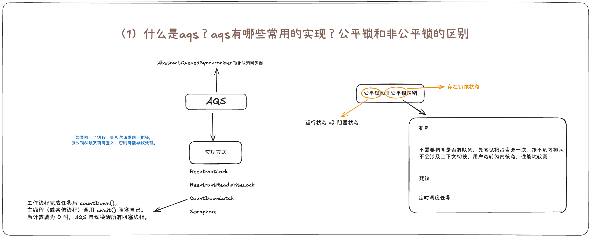
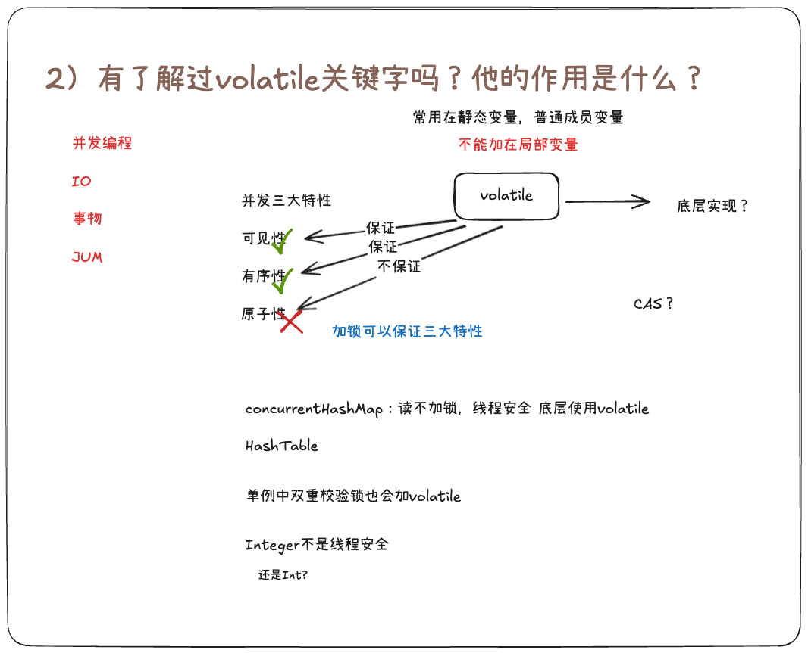
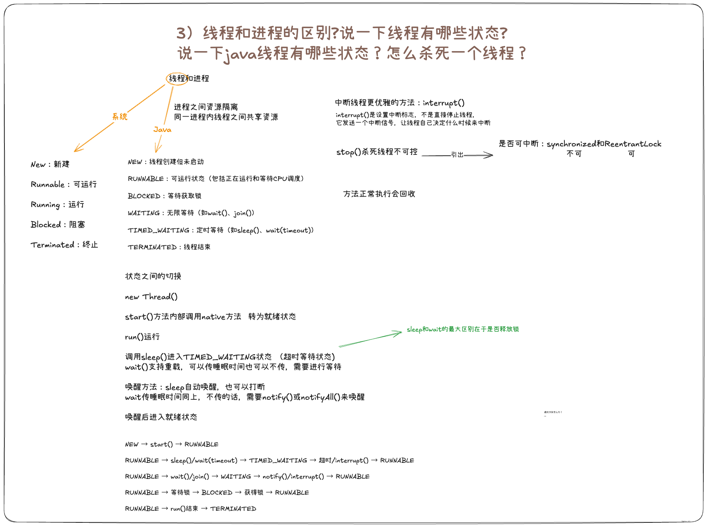

# 9月4号

## （1）什么是aqs？aqs有哪些常用的实现？公平锁和非公平锁的区别

aqs：**A**bstract**Q**ueued**S**ynchronizer，抽象队列同步器，是JUC包中用于实现锁和同步器的核心机制，核心设计思想是**模版方法模式**。它基于FIFO（先进先出）队列和 CAS（Compare-And-Swap）操作，提供阻塞式锁和相关同步器的框架。

AQS的常用实现有：
ReentrantLock：可重入锁，支持公平锁和非公平锁。
ReentrantReadWriteLock：读写互斥锁，读读共享，读写互斥，写写互斥
Semaphore：信号量，用来控制同时访问某个资源的线程数。
CountDownLatch：倒计时器，用来控制一个或多个线程等待其他线程完成某个操作。

公平锁和非公平锁的区别：
从顺序性来说：公平锁严格遵守FIFO队列顺序，而非公平锁允许插队；
从性能方面来说：非公平锁通常性能优于公平锁，因为它减少了线程切换开销；
适用场景：非公平锁适合高吞吐量的场景，公平锁适合需要严格遵守执行顺序的场景。

## （2）有了解过volatile关键字吗？他的作用是什么？

我有了解。volatile是Java中的一个关键字，是一个轻量的同步机制，能保证变量的可见性和有序性，但是不能保证原子性。

首先，保证可见性就是线程修改了变量的值，修改后的值马上会被其他线程看到；保证了有序性就是防止指令重排，避免重排后导致的逻辑错误。

## （3）线程和进程的区别?说一下线程有哪些状态?说一下java线程有哪些状态？怎么杀死一个线程？

进程：是操作系统分配资源的基本单位
线程：是进程内的执行单元
**主要区别**：

1. **资源分配**：进程独占资源，线程共享进程资源。
2. **独立性**：进程间独立，线程间可能相互影响（共享内存）。
3. **开销**：进程创建/切换成本高于线程。
4. **通信**：进程间通信（IPC）复杂，线程间通过共享内存通信更简单。

## （4）你做过的项目或者需求有出现过延期吗？

问就是没有。

>  [!tip] 
>
> 和项目经理沟通，要提前

## （5）如果你在实际开发中遇到问题，你怎么去解决，怎么去沟通？

叼他，解决提出问题的人

