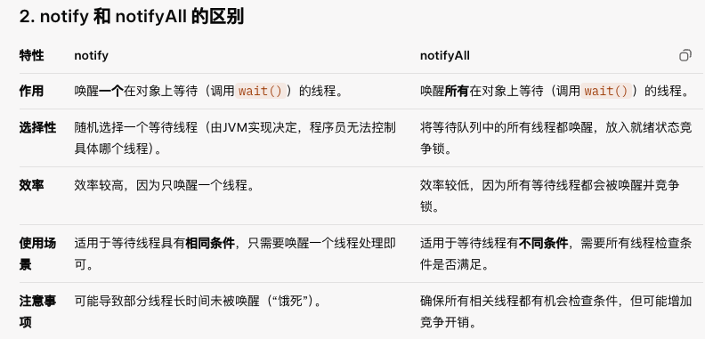

# 9月5号

## （1）接口和抽象类的区别

首先，从定义和实现的角度来说，接口只定义了方法签名，但是没有实现，实现类必须提供所有方法的实现；抽象类可以包含抽象方法和具体方法，子类需要实现抽象方法，可以继承具体方法。

从多来说继承性方面来说，接口支持多实现，一个类可以实现多个接口；抽象类不支持多继承，一个类只能继承一个抽象类。

还有接口只能定义常量，而且没有构造方法；抽象类可以定义普通成员变量和常量，也有构造方法，子类实例化的时候会调用。

适用场景：接口适合指定某一种标准或者规范，抽象类适合适合定义有继承关系的类层次结构

## （2）实现多线程有哪些方式？什么是守护和非守护线程？

**实现多线程的方式**：
1. 继承 `Thread` 类，重写 `run` 方法。
2. 实现 `Runnable` 接口，传入 `Thread` 构造器。
3. 实现 `Callable` 接口，使用 `FutureTask` 或线程池获取返回值。
4. 使用线程池（如 `ExecutorService`）管理线程。

**守护线程与非守护线程**：

- **守护线程**：后台运行，JVM退出时自动终止（如垃圾回收线程）。通过 `setDaemon(true)` 设置，需在启动前设置。
- **非守护线程**：前台线程，JVM需等待其执行完成才会退出（如主线程）。默认创建为非守护线程。

## （3）sleep和wait的区别？notify和notifyall的区别？

## （4）假如你现在回头，回到半年前，再重新实现一遍现在的系统，你会做什么改变

- 增加代码的复用性, 将老需求与新需求的公共业务模块或代码抽取出来,增加代码复用性;
- 提高代码的扩展性, 半年前我写的那个业务逻辑没有想太多, 没有想到后面的业务可以扩展更多, 如果重来的话,我会使用一些设计模式,方便后续功能的扩展;

## （5）你们公司是外包还是自研？你对自研和外包怎么看？

两家公司:

 我上一家公司是外包,比较专注于做一些智能设备,无人商店,智能自习室，智能医疗设备等;

 另一家是小型自研的,做的是医疗相关的项目等