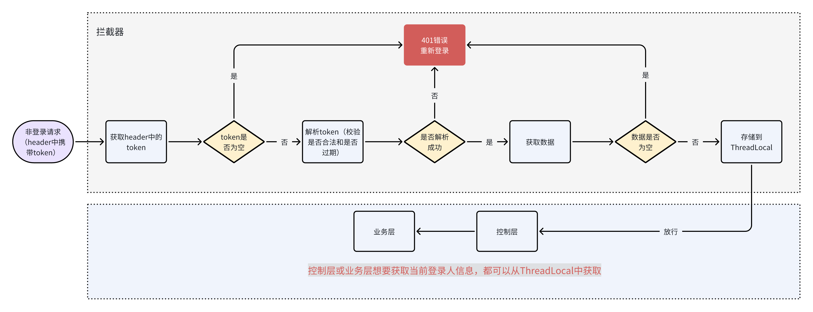

# 9月12号

## （1）你有对接过一些第三方吗？说一下小程序登录的流程

有对接过第三方，比如小程序登录，还有阿里云的一些服务，比如OSS、IoT、天气预报、物流查询等。

我们的微信登录采用了静默授权的方式：

首先，前端调用wx.login()获取临时登录凭证code，然后传给后端。
后端拿到code后，结合配置的appid和appsecret，调用微信的code2Session接口获取用户的openid和session_key。
接着，根据openid查询数据库判断用户是否已存在，如果不存在就创建新用户记录。

对于需要手机号的场景，我们采用了额外的授权流程：
用户点击"获取手机号"按钮触发wx.getPhoneNumber()，获得包含加密手机号信息的code。
后端使用之前获取的session_key对加密的手机号数据进行解密，得到真实手机号完成用户注册。

最后，将用户信息封装到JWT token中返回给小程序，后续的业务请求都携带这个token。

在多线程环境下，我使用ThreadLocal来存储当前线程的用户信息，确保在同一个请求处理过程中能正确获取到当前用户数据，避免线程间的数据混乱。具体是在拦截器中解析JWT后将用户信息存入ThreadLocal，业务方法中通过工具类获取，请求结束后及时清理避免内存泄漏。

## （2）你知道本地线程变量吗？你在项目中用它来做什么？使用上一般要注意什么？

本地线程变量也就是ThreadLocal，它是Java提供的一个线程隔离机制，可以让每个线程都拥有自己独立的变量副本。

在我们项目中，主要在用户身份认证这块使用了ThreadLocal。具体场景是这样的：

当用户请求进来后，我们在拦截器中会解析JWT token获取用户信息，然后将这个用户信息存储到ThreadLocal中。这样在整个请求处理过程中，不管是Controller层、Service层还是Dao层，都可以通过ThreadLocal来获取当前登录用户的信息，而不需要在每个方法参数中都传递用户对象。

我们封装了一个UserContext工具类来管理ThreadLocal：
比如setCurrentUser()方法用来存储用户信息，getCurrentUser()方法用来获取当前用户，还有removeCurrentUser()方法用来清理数据。

ThreadLocal的好处是保证了线程安全，因为每个请求都是在独立的线程中处理的，所以不会出现多个用户之间数据混乱的问题。

但是使用ThreadLocal也要注意内存泄漏的问题，所以我们在请求处理完成后，会在拦截器的afterCompletion方法中调用ThreadLocal.remove()来及时清理数据，避免内存占用过多。

这种方式让我们的代码更加简洁，避免了在每个方法中都要传递用户参数，提高了开发效率。

## （3）什么是线程安全？怎么解决线程安全问题？

## （4）你可以给我看一下你们公司的代码或者聊天记录吗？

很抱歉，面试官，不可以，这涉及到公司的一些机密信息。我相信贵公司也不愿意把自己内部的信息给外部人员吧

## （5）你觉得自己的水平怎么样？在公司属于什么级别？

