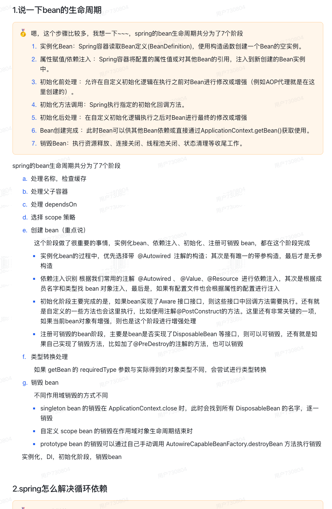
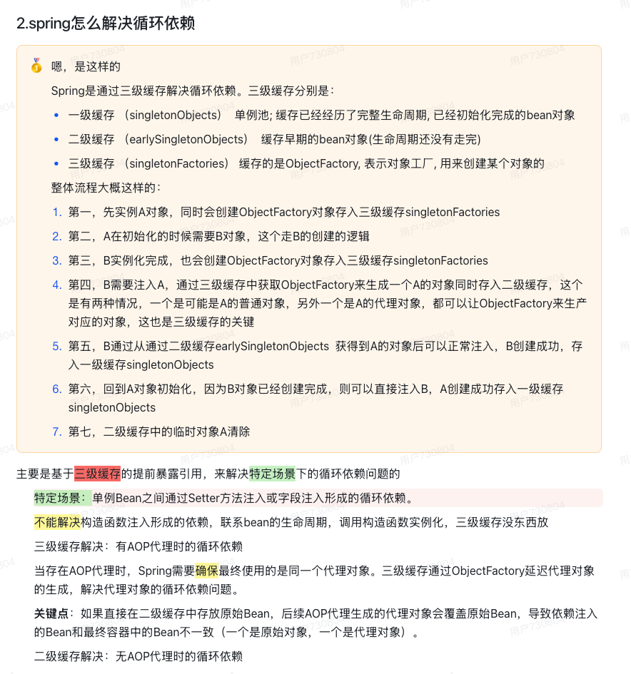
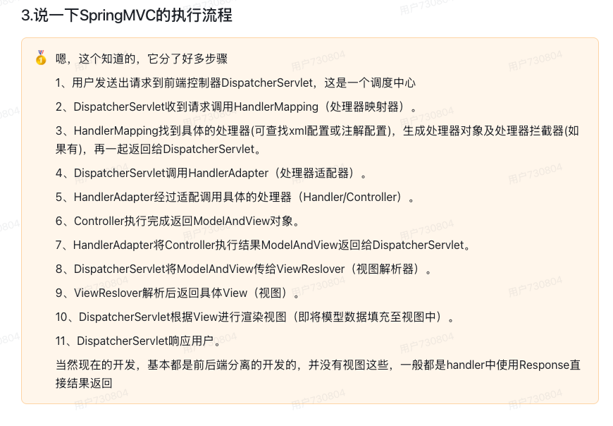
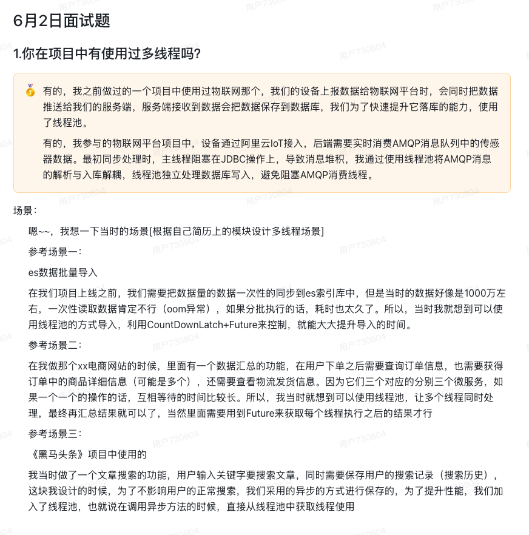

# 9月22号

## （1）说一下你理解的spring？DI注入有几种方式？推荐用哪种DI？

Spring是一个以IoC和AOP为核心的轻量级容器框架，目的是简化企业级Java开发。

- IoC/DI：控制反转和依赖注入，将对象创建的控制权交给容器，DI依赖注入是IoC的实现方式，通过容器管理Bean的依赖关系。
- AOP：面向切面编程，无侵入增强方法，
- 模块化设计：Spring 提供多个模块，如 Spring MVC（Web 开发）、Spring Data（数据访问）、Spring Security（安全）、Spring Boot（快速开发）等，

Spring的DI注入主要有三种方式：

1. 构造函数注入：通过类的构造函数注入，适合强依赖，保证对象不可变性和完整性。
2. Setter注入：通过Setter方法注入，适合可选依赖或需动态更新的场景。
3. 字段注入：直接在字段上加`@Autowired`，虽然方便但隐藏依赖，不推荐生产代码。
4. 还有方法注入

在实际项目中，我们优先使用构造函数注入核心依赖，用Setter注入可选配置，避免字段注入以保证代码可测试性。

> [!important]
>
> 可能会问：
>
> 1. 关于AOP？
> 2. 什么是IoC/DI？
> 3. ~~自动装配原理~~
> 4. ---
> 5. Bean 生命周期
> 6. 循环依赖

## （2）说一下bean的生命周期

- 分为实例化、属性赋值、初始化、销毁这4个大阶段;

- 再是初始化的具体操作,有Aware接口的依赖注入、BeanPostProcessor在初始化前后的处理以及InitializingBean和init-method的初始化操作;

- 销毁的具体操作,有注册相关销毁回调接口,最后通过DisposableBean和destory-method进行销毁。

Bean生命周期的主要阶段

1. **实例化（Instantiation）**：Spring 容器通过反射机制调用构造函数，创建 Bean 的空实例对象。
2. **属性赋值（Populate Properties）**：Spring 根据配置或注解，将 Bean 的属性和依赖注入其中。
3. **初始化前处理（Pre-Initialization）**：调用 `BeanPostProcessor` 的 `postProcessBeforeInitialization()` 方法进行前置处理。
4. **初始化（Initialization）**：执行 `@PostConstruct`、`InitializingBean` 或 `init-method` 等方法，完成 Bean 的初始化。
5. **初始化后处理（Post-Initialization）**：调用 `BeanPostProcessor` 的 `postProcessAfterInitialization()` 方法进行后置处理，通常用于生成代理对象。
6. **使用阶段（In Use）**：Bean 已经准备好，被应用程序获取并使用。
7. **销毁前处理（Pre-Destruction）**：在容器关闭时，调用 `@PreDestroy`、`DisposableBean` 或 `destroy-method` 等方法来销毁 Bean。

> [!important] 
>
> 可能会问:
>
> 1. Bean实例化的三种方法（静态工厂，实例工厂，构造函数）

## （3）spring怎么解决循环依赖？spring框架有帮我们自动解决构造注入的循环依赖问题吗？为什么框架也不能自动解决？

## Spring如何解决循环依赖

- **什么是循环依赖** 循环依赖是指在软件系统中，两个或多个组件相互依赖，形成一个闭环的依赖关系。

  **Spring如何解决循环依赖** Spring主要通过**三级缓存**机制来解决循环依赖：

  1. **一级缓存(singletonObjects)** - 单例池，缓存已经经历了完整生命周期、已经初始化完成的Bean对象
  2. **二级缓存(earlySingletonObjects)** - 缓存早期的Bean对象（生命周期还没有走完的半成品Bean）
  3. **三级缓存(singletonFactories)** - 缓存ObjectFactory对象工厂，用来创建某个对象

  **详细解决过程：**

  1. **实例化A对象**：先实例化A对象，同时创建ObjectFactory对象存入三级缓存singletonFactories
  2. **A初始化需要B**：A在初始化时需要注入B对象，触发B的创建逻辑
  3. **实例化B对象**：B实例化完成，也会创建ObjectFactory对象存入三级缓存singletonFactories
  4. **B需要注入A**：B初始化时需要注入A，通过三级缓存中的ObjectFactory生成A对象并存入二级缓存（可能是A的普通对象或代理对象）
  5. **B创建完成**：B从二级缓存earlySingletonObjects获得A对象后完成注入，B创建成功并存入一级缓存singletonObjects
  6. **A创建完成**：回到A对象初始化，因为B对象已创建完成，直接注入B，A创建成功存入一级缓存singletonObjects
  7. **清理临时对象**：清除二级缓存中的临时A对象

- B创建完成后，A也能完成创建

## 构造注入的循环依赖问题

**Spring框架无法自动解决构造注入的循环依赖**，原因如下：

### 为什么不能解决？

1. **时机问题** - 构造注入发生在对象实例化时，此时对象还未创建完成，无法提前暴露
2. **依赖顺序** - 构造注入要求在创建对象时就必须提供所有依赖，形成死锁
3. **技术限制** - Java对象必须先通过构造函数创建实例，才能进行后续操作

> [!note]
>
> beanfactory和factorybean的区别

## （4）说一下SpringMVC的执行流程

### 1. 请求接收阶段

用户发送HTTP请求到服务器，请求首先被**DispatcherServlet**（前端控制器）接收。DispatcherServlet是SpringMVC的核心组件，负责统一处理所有的请求。

### 2. 处理器映射阶段

DispatcherServlet调用**HandlerMapping**（处理器映射器）来查找能够处理当前请求的Handler（通常是Controller中的某个方法）。HandlerMapping会根据请求的URL、请求方法等信息来确定具体的处理器。

### 3. 处理器适配阶段

找到Handler后，DispatcherServlet通过**HandlerAdapter**（处理器适配器）来执行具体的Handler。HandlerAdapter的作用是适配不同类型的Handler，使得DispatcherServlet能够以统一的方式调用各种Handler。

### 4. 业务处理阶段

HandlerAdapter调用具体的**Controller**方法执行业务逻辑。Controller处理完业务逻辑后，通常会返回一个ModelAndView对象，其中包含了视图名称和模型数据。

### 5. 视图解析阶段

DispatcherServlet将ModelAndView传递给**ViewResolver**（视图解析器）。ViewResolver根据视图名称解析出具体的View对象，比如JSP页面、Thymeleaf模板等。

### 6. 视图渲染阶段

**View**对象负责将模型数据渲染成最终的响应内容。View会将Controller传递的数据填充到模板中，生成完整的HTML页面或其他格式的响应。

### 7. 响应返回阶段

最终的响应内容通过DispatcherServlet返回给客户端浏览器。

## （5）你在项目中有使用过多线程吗？（提示：面试必问，一定要结合的我们准备的实际项目中找一个业务场景来迁移使用线程池，而且还要合理的）

有的面试官，我之前做过一个物联网平台的项目，

IoT实时接收AMQP消息队列中的传感器数据的时候，使用了线程池来解决大量消息堆积的问题，加快数据落库

> [!tip]
>
> 有，在我们商城日均订单量在8-10w单，大约3%-5%用户超时未支付，每天要处理 2400-5000 个超时订单，我们每天都要处理这些超时的订单，在这里用到了线程池的技术，定时任务分页查询每页取 100 条订单，单线程处理时，5000 个订单需要约 50分钟（平均每个订单处理耗时约 0.84 秒）用线程池并发处理后，同样 5000 个订单只需要10-15分钟，效率提升了 3-4 倍
> 具体实现时，线程池参数是这样配置的：
> 核心线程数设为 8（服务器是 4 核 CPU，按 CPU 核心数的 2 倍配置）
> 最大线程数 16（核心线程数的 2 倍，应对峰值）
> 任务队列容量 2000（经过压测，这个容量能缓冲大促期间的订单峰值）
> 空闲线程存活时间 60 秒（避免频繁创建销毁线程）

> [!important]
>
> 可能会问：
>
> 详见 [09-15.md](09-15.md) 
>
> 1. 线程池的作用
> 1. 线程池的工作原理
> 1. 线程池的七大核心参数
> 1. 线程池的核心参数
> 1. 线程池常用的种类

