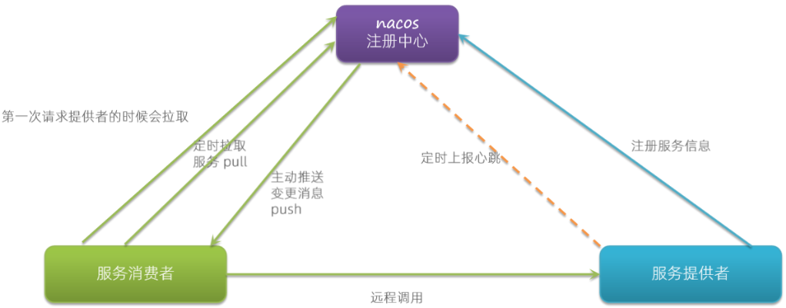
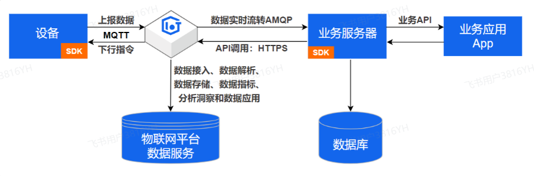

# 9月23号

## （1）项目中你们是怎么拆分微服务的

好的，面试官，我们项目是按业务模块功能来分的，比如说我们的医疗项目中的用户服务，订单服务，设备服务等等

## （2）说一下服务注册与发现的原理

作用：协调远程调用

当**服务提供者**启动时，会向**注册中心**（如Eureka、Consul）注册，注册信息包括**服务名、IP、端口和健康状态**等元数据。服务提供者会通过**心跳机制**与注册中心保持通信，以续约并确认自身健康状态。若心跳超时，注册中心会将其标记为不可用或移除。

注册中心会保存服务提供者的元数据，定时检查服务提供者健康状态

**服务消费者**通过注册中心拉取可用服务列表，动态感知服务实例的上下线（服务发现）。消费者结合**负载均衡器**（如Ribbon）选择目标实例发起调用，支持动态路由和故障转移。

## （3）介绍一下你们是怎么对接接收物联网平台的数据的？

我们对接阿里云SDK来完成对接。

我们是使用MQTT协议来进行设备数据上报阿里IoT平台，当然，这一块是由我们项目组的其他人进行的，我是负责设备上传后的接收落库，具体是这样的：

我们使用阿里云的SDK来完成对接，使用阿里云的提供的AMQP客户端建立连接，使用缓存池创建多个线程加快数据的落库，我们还使用了Redis缓存一份设备的最新数据，来减少数据库的压力。

> [!important]
>
> 可能会问：
>
> 详见 [09-15.md](09-15.md) 
>
> 1. 线程池的作用
> 1. 线程池的工作原理
> 1. 线程池的七大核心参数
> 1. 线程池的核心参数
> 1. 线程池常用的种类 

## （4）介绍一下mybatis的一级和二级缓存

MyBatis是Java持久层框架，其缓存机制提升查询性能。

- **一级缓存**：SqlSession级别（默认开启）。同一SqlSession内，相同SQL和参数的查询结果缓存到缓存中。下次相同查询直接从缓存取。事务提交/关闭时清空。作用域小，适合短生命周期操作。
- **二级缓存**：Mapper级别（需手动开启，在mapper.xml配置`<cache>`）。跨SqlSession共享，存储在 PerpetualCache（默认HashMap，可用Ehcache/Redis替换）。查询先查二级、再一级、再数据库。更新操作会清空相关缓存。支持序列化，适合读多写少场景。

注意：一级缓存线程不安全，多线程需新SqlSession；二级缓存需配置eviction策略（如LRU）避免内存溢出。

> [!important]
>
> 类似：
>
> ​	隔离级别：可重复读
>
> 可能会问：
>
> 1. `#`和`$`的区别
> 2. 问到底层原理则战略性放弃

## （5）说一下udp和tcp的区别，说一下tcp的三次握手和四次挥手？为什么不是两次握手？为什么四次挥手要等待2MSL？

>  [!tip]
>
> https基于TCP

**UDP和TCP的区别**

UDP（用户数据报协议）和 TCP（传输控制协议）是传输层协议，主要区别如下：

UDP是无连接的，也就是无需建立连接，直接发送数据包，这样可能会导致数据丢包，重复乱序的问题，由于不需要连接，所以头部开销小，传输效率高，支持一对一，一对多，多对多，常用来做语音通话。

TCP时有连接的，通信前需要通过三次握手来建立可靠连接，减少了数据包的丢失，保证了数据的可靠性，但是头部较大，可靠性开销机制较高，只支持一对一通信，适合文件传输的情况。

1. **连接性**：
   - UDP 是无连接的，发送数据前无需建立连接，直接发送数据包。
   - TCP 是有连接的，通信前需要通过三次握手建立可靠连接。
2. **可靠性**：
   - UDP 不保证数据可靠送达，数据可能丢失、重复或乱序，无重传机制。
   - TCP 提供可靠传输，通过序列号、确认应答、重传机制、流量控制和拥塞控制确保数据准确送达。
3. **传输效率**：
   - UDP 头部开销小（8字节），传输效率高，适合实时性要求高的场景，如视频流、语音通话。
   - TCP 头部较大（20字节或更多），因可靠性机制开销较高，适合需要高可靠性的场景，如文件传输、网页浏览。
4. **传输模式**：
   - UDP 支持一对一、一对多、多对多的通信，适合广播或多播。
   - TCP 仅支持一对一通信。
5. **应用场景**：
   - UDP：DNS查询、实时音视频、在线游戏。
   - TCP：HTTP/HTTPS、FTP、SMTP（邮件传输）。

**TCP 的三次握手**

TCP 建立连接的过程称为三次握手，目的是确保双方都准备好通信，并确认双方的发送和接收能力。过程如下：

1. **第一次握手**：客户端向服务器发送一个 SYN（同步）报文，表示请求建立连接，包含一个初始序列号（Seq=x）。
2. **第二次握手**：服务器收到 SYN 后，回复一个 SYN+ACK（同步+确认）报文，表示同意建立连接，包含自己的初始序列号（Seq=y）和对客户端序列号的确认（Ack=x+1）。
3. **第三次握手**：客户端收到服务器的 SYN+ACK 后，发送一个 ACK（确认）报文，确认服务器的序列号（Ack=y+1），连接正式建立。

### 

**为什么不是两次握手？**

两次握手无法确保双方都确认了对方的发送和接收能力，可能导致连接不可靠。原因如下：

- 如果只有两次握手（客户端发 SYN，服务器回 ACK），服务器无法确认客户端是否收到自己的 ACK。
- 若客户端发送的 SYN 在网络中延迟，服务器可能认为这是一个新连接请求，而客户端早已放弃，导致“半连接”问题。
- 三次握手通过客户端的最终 ACK 确认，确保双方都明确连接已建立，避免因网络延迟导致的误连接。

**TCP 的四次挥手**

TCP 断开连接的过程称为四次挥手，确保双方有序关闭连接。过程如下：

1. **第一次挥手**：主动关闭方（通常是客户端）发送 FIN（结束）报文，表示自己数据发送完毕，请求关闭连接。
2. **第二次挥手**：被动关闭方（通常是服务器）收到 FIN 后，发送 ACK（确认）报文，表示已收到关闭请求，但可能还有数据要发送。
3. **第三次挥手**：被动关闭方发送完数据后，发送 FIN 报文，表示自己也准备关闭连接。
4. **第四次挥手**：主动关闭方收到 FIN 后，发送 ACK 报文确认，连接正式关闭。

**为什么四次挥手要等待 2MSL？**

在四次挥手的最后，主动关闭方发送 ACK 后会等待 2MSL（最大报文段生存时间，Maximum Segment Lifetime，通常为 2-4 分钟）。原因如下：

1. **确保 ACK 被对方收到**：
   - 如果主动关闭方的 ACK 丢失，被动关闭方会重传 FIN。等待 2MSL 确保被动关闭方收到 ACK 或重传的 FIN 得到处理，避免被动关闭方误以为连接未关闭。
2. **清除网络中的旧报文**：
   - 网络中可能存在延迟的旧报文，等待 2MSL 确保这些报文失效，避免干扰新连接（尤其是同一端口复用时）。

> [!tip]
>
> MSL: 报文最大生存时间

2MSL 是报文在网络中的最大往返时间，等待这个时间可以最大程度保证连接的可靠关闭。

> [!important]
>
> 