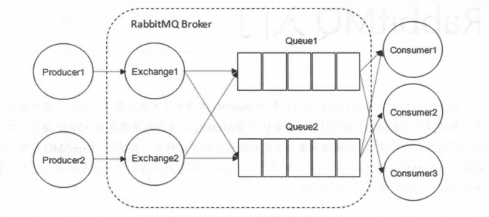

# 10月12号

## （1）说一下rabbitmq有哪些消息模型

1. 基本消息队列（BasicQueue）

2. 工作消息队列（WorkQueue）

3. 发布订阅（Publish、Subscribe）

   1. FanoutExchange:广播

   2. Direct Exchange:路由

   3. Topic Exchange:主题（主要使用）

      

> 变形：交换机有哪些类型
>
> 3种：广播、路由、主题

## （2）说一下rabbitmq的工作原理

生产者把消息发送到交换机,交换机根据路由规则把消息转发到对应的队列,消费者从队列中取出消息进行处理。

- publisher：生产者
- consumer：消费者
- exchange个：交换机，负责消息路由
- queue：队列，存储消息
- virtualHost：虚拟主机，隔离不同租户的exchange、queue、消息的隔离

1. **生产者发送消息**:生产者将消息发送到指定的交换机,并指定路由键(routing key)
2. **交换机路由**:交换机根据类型和绑定规则,将消息路由到一个或多个队列
3. **消息存储**:消息被存储在队列中等待消费
4. **消费者获取**:消费者从队列中拉取或被推送消息
5. **消息确认**:消费者处理完消息后发送 ACK 确认,RabbitMQ 收到确认后删除该消息

## （3）你在项目中哪里用到了mq？用来做什么？

- 医疗设备数据采集与处理

## （4）你们技术选型为什么选择rabbitmq？技术选型谁做的？你怎么考虑的？

在刚进入公司的时候就已经选好了，并不是我选的，组长选的

### 你是怎么考虑的？

学习成本低，上手成本低，我们项目没有那么高的并发和那么大的数据量。

## （5）说一下死信交换机（死信队列）的工作原理（流程）

当一个队列中的消息满足下列情况之一时,可以成为死信(dead Letter):

- 消费者返回reject或者nack,且requeue参数设置为false
- 消息超时未消费
- 队列满了

如果该队列配置了dead-letter-exchange属性,指定了一个交换机,那么队列中的死信就会投递到这个交换机中,而

这个交换机称为死信交换机(Dead Letter Exchange简称DLX)

**正常队列** -> (消息因某些原因变成“死信”) -> 被重新投递到 **死信交换机** -> 死信交换机将消息路由到 **死信队列** -> 应用程序可以消费 **死信队列** 中的消息来进行后续处理。

---

### 你们项目哪里使用了死信交换机？

#### 下单超时

**问题背景**: 用户预约挂号或下单后，系统需要为其锁定资源（如号源、商品库存）15分钟。如果用户在此期间未完成支付，系统必须自动取消订单，释放资源给其他用户。

#### 日志处理

**问题背景**：

**解决方案**：

#### 医疗设备耗材库存预警与自动补货

**问题背景**：血糖仪、心率监测仪等设备需要定期更换耗材（如试纸、电极片）。当耗材库存低于安全阈值时，需要及时预警并触发补货流程。

**解决方案**：

#### 健康数据异常复查机制

**问题背景**：智能医疗设备（如血糖仪）上报的数据可能因为设备故障、用户操作不当等原因出现极端异常值。如果立即触发高等级警报，可能会导致“警报疲劳”和不必要的恐慌。需要一个机制来在短时间内进行二次确认。

**解决方案**：

#### 预约挂号超时未支付自动取消

**问题背景**：用户预约挂号后需要在15分钟内支付，否则自动释放号源。

**解决方案**：使用死信交换机实现延迟消息，15分钟后检查订单状态，若未支付则取消订单并释放号源。

#### 健康计划任务失败重试

**问题背景**：用户的健康计划（如每日服药提醒）由于网络等原因推送失败，需要重试。

**解决方案**：将失败的消息发送到死信队列，然后由重试消费者按照重试策略（如间隔时间逐渐延长）进行重试。

#### **异步任务失败重试**

例如发送短信、推送消息等异步任务，如果第一次失败，可以进入死信队列，然后由死信队列消费者进行重试或记录。

**问题背景**：用户的健康计划（如每日服药提醒）或发送验证码短信等异步任务，可能因为外部服务（如推送服务器、短信网关）临时故障或网络波动而失败。我们不希望这些失败是永久性的，而是应该在一段时间后进行重试。

**解决方案**：

