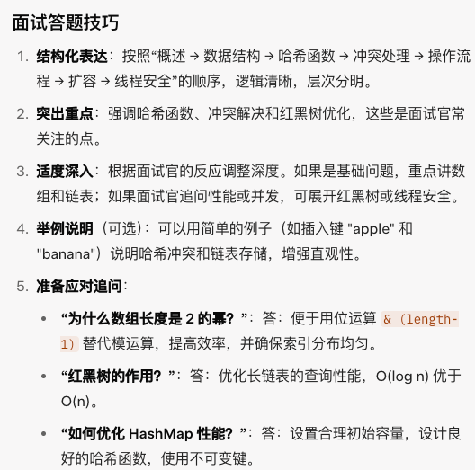

# HashMap合集

## 你项目中常用哪些集合?

`ArrayList`：适合需要快速随机访问（通过索引）和动态调整大小的场景，如存储有序数据列表
`HashMap`：适合需要快速查找键值对的场景，如缓存、配置映射。
`LinkedList`：适合需要快速查找和去重的场景，如存储唯一 ID 或词汇集合。
`ConcurrentHashMap`：适合多线程环境中需要高效键值对存储和访问的场景，如并发缓存。


## 说一下list、set和map的区别

List系列：有序，可重复，通过索引访问，底层是基于数组和链表来实现的，适合顺序存储

Set系列：一般是无序，元素唯一，快速查找，适合去重，底层基于哈希表和红黑树实现

Map系列：无序，键唯一，键找值，基于哈希表和红黑树实现，适合映射关系

选择建议：
**有序且允许重复**用`List`
**唯一且需要快速查找**用`Set`
需要**键值映射**用`Map`


## 说一下hashmap的底层原理

### 从基本数据结构的角度来说：

HashMap是一种基于哈希表的数据结构，用来存储键值对（Key-Value），支持高效的插入、查找和删除操作，平均时间复杂度为O(1)，底层主要由数组（桶数组）组成，每个桶可以存储单节点、链表，在JDk8及以上还可以存储红黑树

### 再从哈希函数和键定位来说：

当插入一个键值对的时候，HashMap首先调用键的`HashCode()`方法计算哈希值，在Java中通过扰动函数优化分布均匀，然后通过`hash & (数组长度 - 1)`（哈希值和数组长度减一进行与运算）把哈希值映射到数组索引，确定存储位置。数组长度通常为2的幂，以保证高效的位运算（二进制）。


> ```java
> static final int hash(Object key) {
>     int h;
>     return (key == null) ? 0 : (h = key.hashCode()) ^ (h >>> 16);
> }
> ```
>
> 1. 获取原始的哈希值，调用`key.hashCode()`，得到一个32位整数h
> 2. 将这个整数右移16位，位运算，从高16位移到低16位，低16位补0
> 3. 按位异或：将原始哈希值h和右移的值进行异或运算，即相同为0，不同为1，融合了高低位的特征 
>

>  [!tip]
>
> 为什么是右移16位？为什么需要扰动函数？


### 还有哈希冲突的处理：

当多个键映射到同一索引时，会发生哈希冲突。HashMap 采用链地址法，将冲突的键值对存储在同一桶的链表中。在 Java 8 中，如果链表长度超过 8 且数组容量达到 64，链表会转换为红黑树以提高查询效率（从 O(n) 降为 O(log n)）。当节点数减少到 6 以下时，红黑树退回链表。

### 核心操作

**插入 (put)**：

1. 计算键的哈希值和索引。
2. 若桶为空，放入新节点；否则在链表/树中查找，键存在则更新值，不存在则添加。
3. 若元素数超过阈值（容量 * 负载因子 0.75），触发扩容。

**查找 (get)**：计算索引，在链表/树中查找键（equals() 比较）。
**删除 (remove)**：类似查找，移除节点并调整链表/树结构。
**时间复杂度**：平均 O(1)，最坏（冲突严重）O(n) 或 O(log n)（红黑树）。

###  扩容机制

**触发条件**：元素数 > 容量 * 负载因子（默认 0.75）。
**过程**：数组扩容为 2 倍，重新计算所有元素的索引（利用高位），迁移到新数组。
**影响**：扩容耗时（O(n)），负载因子平衡空间与性能。

### 线程安全性

**非线程安全**：多线程下可能导致数据丢失或死循环（Java 7 扩容问题）。
**替代方案**：使用 ConcurrentHashMap（分段锁）或 Hashtable（全局锁）。

### 其他特性

**支持 null**：允许一个 null 键（索引 0），多个 null 值。
**键不可变**：键需 immutable（如 String），否则 hashCode 变化导致查找失败。
**权衡**：适合随机访问；若键分布不均，性能可能退化；有序需求用 LinkedHashMap。



> [!tip]
>
> “HashMap 是基于哈希表的键值对存储结构，底层是一个数组，每个元素（桶）存储单节点或链表。插入时，通过键的 hashCode 和扰动函数计算索引，若冲突则用链表或红黑树（链表长于 8 时转换）存储。查找和删除类似，通过索引定位后遍历链表或树。扩容发生在元素数超过容量 * 负载因子（0.75）时，数组翻倍并重新分配数据。HashMap 非线程安全，适合快速查找场景，如需线程安全可使用 ConcurrentHashMap。”

## hashmap的key和value可以为空吗，如果可以允许key为null，那么null的这个元素是存在哪个桶？

Java HashMap 的 key 和 value 都可以为 null。其中，key 只允许一个 null（因为 null 被视为一个唯一的键），而 value 可以有多个 null。 如果将 null 作为 key 插入 HashMap 时，不会调用 hashCode() 方法，而是直接将它放置在桶索引为 0 的位置（bucket 0）。

> [!tip]
>
> 为什么key可以为空？
>
> HashMap 允许 key 为 null 是为了提供更高的灵活性和通用性，同时通过特殊处理（将 null key 放入 bucket 0）确保了实现的正确性。这种设计在非并发场景下是安全的，但在需要线程安全的场景下（如 ConcurrentHashMap），则会禁止 null key 以避免复杂性。


## hashmap是线程安全的吗,那想要线程安全怎么办？

不是线程安全的。

有四种方法。第一种是手动加锁，使用ReentrantLock，调用lock()方法（要记得释放锁unlock()）;

> [!tip]
>
> 也可以使用synchronized锁，引出synchronized和ReentrantLock的区别

第二种是使用`ConcurrentHashMap`，它是线程安全的，并且性能更好，特点是使用了~~分段锁~~或CAS机制锁粒度更细，只锁住部分数据通，读操作通常无锁，写操作高效，支持高并发，性能优于Colletions.synchronizedMap。

第三种是使用`Colletions.synchronizedMap`来包装HashMap，使其变成线程安全，性能比较低，每次操作都会上锁，锁粒度较大。

第四种是适用于Hashtable，它也是线程安全的，它不支持键值为null，性能也是比较低的，已经被淘汰了

更推荐使用`ConcurrentHashMap`或者手动加锁

> [!tip]
>
> | 特性   | Hashtable                       | Collections.synchronizedMap    |
> | ------ | :------------------------------ | ------------------------------ |
> | 锁粒度 | 对象级别（整个 Hashtable 对象） | 对象级别（包装的 mutex 对象）  |
> | 锁实现 | 方法上直接加 synchronized       | 包装方法中使用 synchronized 块 |


## hashmap的时间复杂度是多少

理想情况下要查找的元素在桶的第一位时查找的时间复杂度是O(1)，如果在链表中就是O(n)，当链表过长转化为红黑树的时候，时间复杂度优化为O(log n)


## 说一下hashmap的扩容机制

默认的容量为16，扩容因子为0.75。

当数组中的元素个数为最大的长度的0.75时，hashMap会进行扩容，容量会扩展为原来的两倍，而且涉及到重新哈希和节点迁移


## hashmap是有序的吗？什么map是有序的


## new Hashmap()初始底层数组长度是多少


## new Hashmap(14)初始数组长度是多少


## 为什么扩容是2倍


## 为什么扩容因子是0.75


## 什么时候链表会转成红黑树


## 什么时候红黑树会转成链表


## 为什么是6和8


## 当数组长度少于64，链表长度大于8会怎么样


## hashmap对key计算落到哪个桶是用取模运算吗？


## 为什么要用红黑树？只用链表不行吗？要用树那为什么不是二叉树、平衡二叉树？


## hashmap能直接做缓存吗？有没有不足的地方？


## hashmap能根据value查询key吗？


## hashmap能缩容吗


## hashmap什么时候会导致死循环？那怎么解决？


## 为什么hashmap需要重写key的hashcode和equals方法？


## 你知道linkedhashmap吗？你知道它可以做什么吗


# part 2


## 说一下hashset的底层原理


## 说一下ConcurrentHashmap的底层原理


## ConcurrentHashmap和Hashtable的区别


## 说一下Arraylist和Linkedlist的区别?


## new Arraylist()数组初始长度是多少


## Arraylist和Linkedlist是线程安全的吗？要线程安全怎么办


## 说一下Arraylist的扩容机制


## 能不能一边循环一边执行删除list的数据？


## 如何实现list和数组的互转

