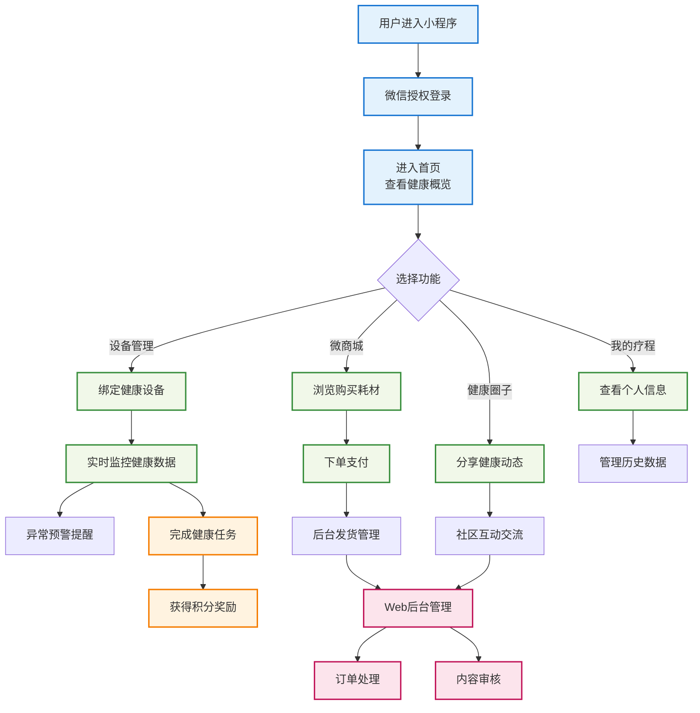
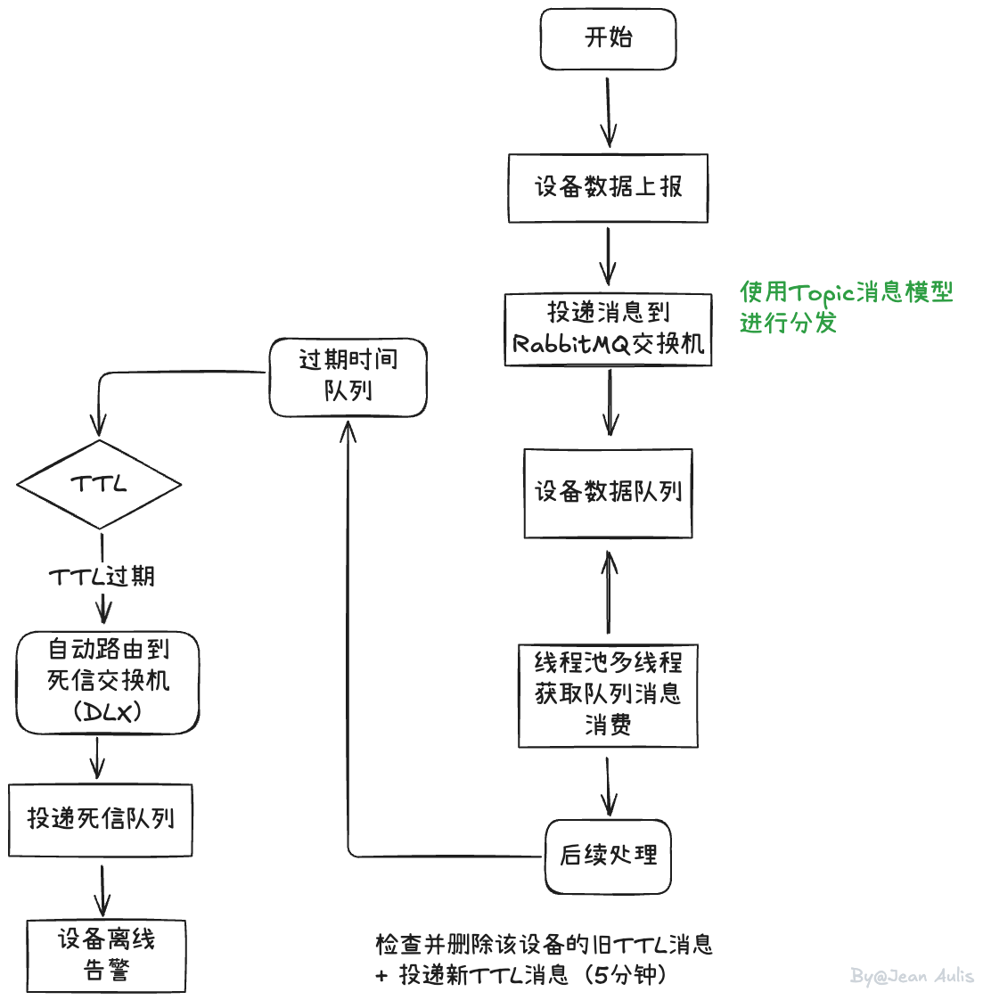
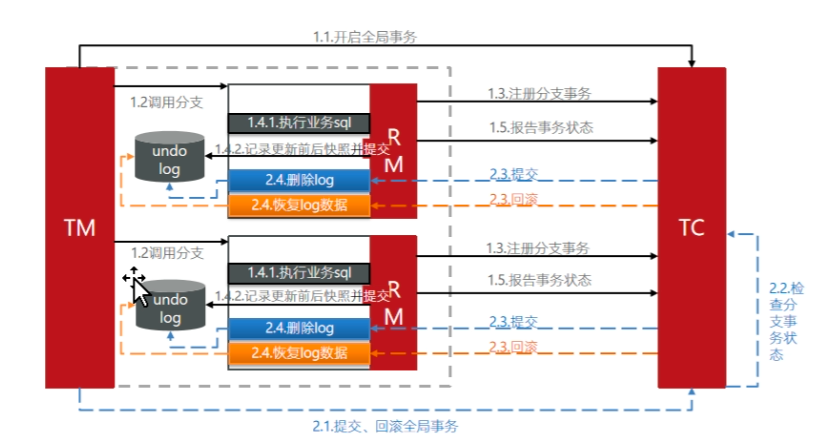
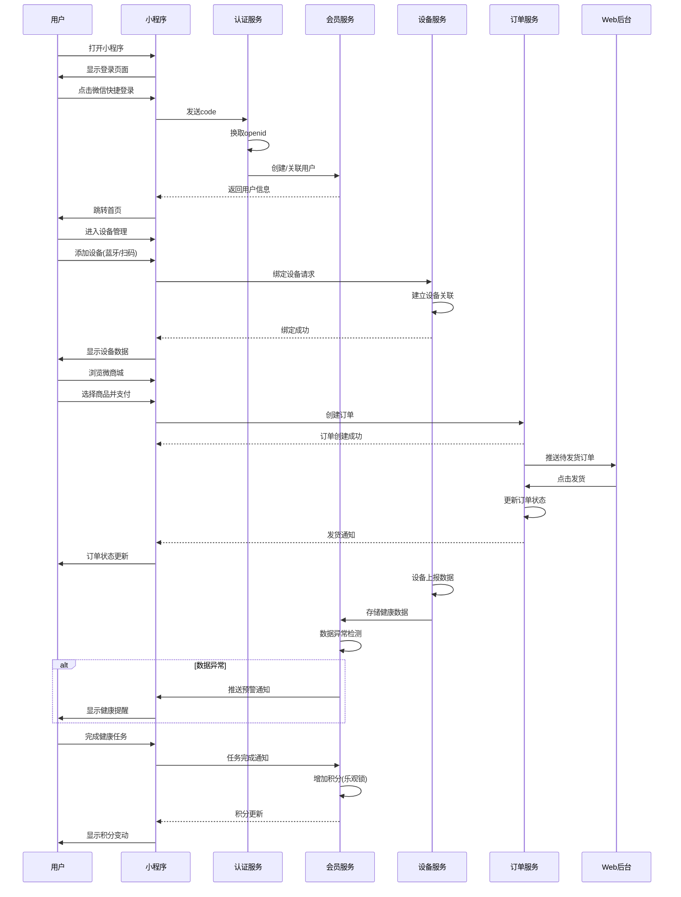
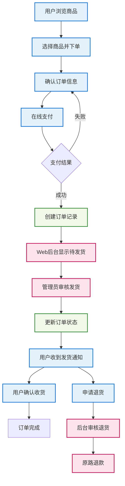

# 项目表述


## 1、自我介绍

面试官你好，我叫张三，来自广西，从事3年的Java后端工作经验，上一家公司在佛山（**佛山市众星北宸科技有限公司**），最近做的一个项目是“和睦家医疗UnitedFamily”（医疗设备健康平台），主要分为两个部分：小程序端和后台管理端，涉及的技术栈有Spring Boot、Redis、Mysql、Mybatis、Mybatis-Plus、Spring Clound Alibaba、微服务组件Nacos、网关Gateway、远程调用OpenFegin、RabbitMQ、ES、xxl-job，我在这里面主要负责的模块是用户端小程序登陆，后台订单管理，还有医疗设备的管理，在里面的不仅负责编码，也做过一些时序图，流程图来解决复杂的业务。<font style="color:green">**我的自我介绍就到这里，面试官你有什么想要了解的吗？**</font>

> [!tip]
>
> [人事题合集](../面试题-专题整理版/人事篇.md) 
>
> ### 你们的团队有多少人？
>
> 我当时的项目组有10个人左右，4~5个后端，2个前端，1个测试，1个运维，1个产品经理，1个技术主管。
>
> ### 你们公司在哪？
>
> 佛山（**佛山市众星北宸科技有限公司**）
>
> ### 技术栈
>
> Spring Boot + Spring Cloud Alibaba + MyBatis-plus + MySQL + Redis + OpenFeign + Gateway + RabbitMQ + Docker + Nginx +  + Nacos + ES + ~~xxl-job~~
>
> ### 你们项目是一个什么类型的？
>
> B2C
>
> > 用户（C）通过小程序直接购买设备/耗材（B）。包含微商城、下单支付、订单追踪等电商流程。
>
> ### 你的这个小程序上线了吗？盈利了吗？为什么打开的小程序和你说的流程不一样？
>
> 上线了，可以搜到；
>
> 盈利了；
>
> 项目组前端应该是进行了一些更改，但是大致流程是没变的
>
> ### 离职原因
>
> - 家人在广州/深圳/武汉(自己面试公司所在地)，也希望在这边长期发展，现在时间也比较合适，所以就跳槽了
> - 上一家公司核心项目我都参与开发了2年多（先不说这个，问到核心业务的话，讲得简单不太好？），没太多的技术挑战性和业务成长，长期待在舒适圈也不是个事儿，所以希望能进入更高的舞台、接触不同的业务，来提高自己的综合能力
> - 家在外地可以说是 因为家里有事，必须请假几个月，公司又不可能准假，所以辞职
> - 一直在广西上班，薪资比较低，然后呢，父母也在广州这边来打工的，所以我想的是在广州这边来扎根。
>
> ### 到岗时间
>
> 一周内，如果公司确定下发offer，我需要1-2天做体检+搬家


## 2、项目背景

面试官您好，我来简要介绍一下我们这个项目。

随着远程医疗和智能硬件的兴起，我们的项目旨在构建一个“软硬件一体化”的数字健康生态平台。我们通过一个小程序，连接用户的智能医疗设备（比如血糖仪、心率监测仪），为用户提供**实时的健康数据追踪和个性化的健康建议**。

同时，平台还整合了**在线问诊、健康社区和电商服务**，满足用户多样化的需求。为了支撑整个体系的稳定运行，我们搭建了强大的**BOSS管理后台**，实现了对设备、订单、社区、积分等模块的精细化运营。我们的最终目标，是打造一个**以用户为中心，融合IoT技术、医疗服务和社交电商的闭环健康管理生态系统**。


## 3、用户，日活，QPS,  TPS

> [!tip]
>
> 我们项目的总用户数约**2万**，日活大概在**3000**左右，日订单在**500**左右。在实际运营中，我们的峰值QPS在**300**左右，**TPS在高峰期**大概在0.8-1.2左右，**压测QPS**可以支撑700左右。主要集中在用户预约、订单流转等高频链路。为了应对这些高峰请求，我们通过**Redis**对热点数据进行了缓存，确保了系统的稳定性和响应速度。

> [!note]
>
> 数据量：五百万或者2GB以下，规避分库分表，~~也可以学一下~~


## 4、技术选型

我们的项目采用前后端分离的微服务架构。前端方面，小程序使用原生微信小程序开发框架，Web管理后台采用Vue3 + ElementPlus构建用户界面，通过Ajax/Axios与后端进行异步数据交互。

后端以Spring Boot为核心框架，结合Spring Cloud Alibaba构建完整的微服务体系。使用Nacos作为注册中心和配置中心实现服务治理，Gateway作为统一网关处理请求路由和权限鉴权，OpenFeign负责服务间的远程调用。数据存储方面选择MySQL作为主数据库存储用户信息、订单数据和设备信息等核心业务数据，Redis用于缓存热点数据和实现分布式锁以提升系统性能。

数据访问层使用MyBatis-Plus简化数据库操作并提供便捷的代码生成和分页查询功能。由于项目涉及智能医疗设备连接，我们对接阿里云OSS实现与血糖仪、心率监测仪等设备的实时数据传输。运维部署方面使用Docker进行容器化部署，Nginx作为反向代理和负载均衡保证系统高可用。同时通过AOP + Logback实现统一的日志记录和异常监控，并集成Spring AI框架为用户提供健康数据分析等智能化服务。这套技术栈既保证了系统的稳定性和可扩展性，也满足了医疗健康领域对数据安全和实时性的严格要求。

> [!note]
>
> 在技术选型上，我们的项目采用了前后端分离的**微服务架构**。
>
> 后端以**Spring Boot**为基础，结合**Spring Cloud Alibaba**搭建了一套完整的微服务体系。 
>
> - **为什么用微服务？** 因为它能让我们的服务独立部署、灵活扩展，特别适合这种功能模块多、业务复杂的平台。
> -  **为什么用Nacos和Gateway？** 我们用**Nacos**做服务治理，实现服务的注册和配置管理；用**Gateway**作为统一网关，来处理请求路由和权限鉴权，这是微服务架构的最佳实践。
> - **数据层？** 我们使用**MySQL**存储核心业务数据，而像热点数据、用户信息、缓存等，则交由**Redis**来处理，以提升性能。
> - **数据访问层？** 使用**MyBatis-Plus**，它简化了我们的数据库操作，提升了开发效率。
> - **运维？** 我们用**Docker**进行容器化部署，**Nginx**做反向代理和负载均衡，确保系统的高可用。
> - **其他亮点？** 我们也集成了**RabbitMQ**处理异步业务，用**AOP + Logback**做日志和异常监控，甚至还尝试了用**Spring AI**来做智能健康分析，这些都为项目带来了不少优势。


## 5、流程

> [!important]
>
> 可以参考米家

**面试官您好，我来简要介绍一下和睦家医疗小程序**

**首先是用户登录。** 用户通过微信打开小程序后，进入登录页面。我们对接了微信小程序登录体系，点击"微信快捷登录"按钮即可完成授权。后端认证服务判断是否是新用户，如果是新用户会自动创建会员账号并初始化积分，老用户则直接关联历史数据。登录成功后自动跳转至小程序首页。

**接下来到首页**。首先是设备管理模块，用户可以在这里连接我们的（或者第三方的）智能医疗设备，底下有一个“购买设备”的按钮，点击即可跳转至我们的微商城进行一个设备的购买（这里前端带指定参数跳转，避免了用户需要输入的繁琐），连接绑定设备后，后端对接阿里云的SDK接收保存设备的数据，这里使用了线程池来加快数据的落库，并且缓存一份设备最新上报的数据，这样用户就可以实时查看设备的数据，对于实时数据我们也做了一个异常报警提醒；也可以查看一个采集项历史设备数据，我们做了一个图表来进行可视化展示。对于设备，我们也考虑了耗材，也做了一个设备耗材检测，提醒更新，在设备详情添加了一个可以跳转微商城的耗材页面进行购买。

**刚刚提到了我们的一个微商城**。用户在跳转或者主动打开微商城之后，可以进行浏览下单，这里用户可以进行搜索，或者选择类型，比如发货地，设备类型，我们在用户支付后才创建订单，这里我们使用了RabbitMQ来对支付后续操作解耦（比如物流，短信通知等等），降低了用户等待支付成功的时间。

生成订单之后可以在**管理后台**进行查看。在管理后台可以审核，追踪订单、物流；用户也可以在个人中心查看对应的订单，追踪物流。个人中心也可以查看浏览记录，收藏，积分等等。大致的一个使用流程就是这样的。

> [!important]
>
> #### 第三方兼容？
>
> 我们会列出一个第三方的支持列表，也会有一个“添加支持”的功能，用户可以反馈想要添加的设备，~~可以跟踪反馈。~~后续有嵌入式的同事来进行兼容。
>
> #### 你们设备数据是怎么接收的？
>
> 我们对接阿里云SDK，使用线程池来加快数据的落库
>
> #### 设备异常提醒是怎么实现的？
>
> 先是获取设备的报警规则，查询设备最新上报的数据
>
> #### 你们的这个历史图表是怎么生成的？
>
> 因为我们这个图表涉及计算平均值，所以我们写了一个定时任务，在每天凌晨去进行一个处理，把处理好的结果存到另外一张表中，到时候用户查询直接查询那一张表就好了，不用实时计算。





## 6、详细设计

### 用户登录

我们采用了双token三认证的一个方式来让用户无感登陆，减少了频繁登陆的操作。

我先说一下小程序登陆的大概步骤，首先，前端调用wx.login()获取临时登录凭证code和phoneCode，然后传给后端。后端拿到code后，结合配置的appid和appsecret，调用微信的接口获取用户的openid和session_key（如果用户已授权给同主体其他应用时才返回UnionID）。接着，根据openid查询数据库**判断用户是否已存在**，如果不存在就**创建新用户**并且绑定手机号；如果用户已存在，跳过注册，检查用户是否绑定手机或者更新手机号，后端就会**更新手机号**；获取手机号的步骤大概是这样的：

后端先根据接口（需要grant_type、appid、secret）获取access_token，再根据前端传入的code（phoneCode）和access_token（URL参数）向微信接口发起请求获取手机号。

最后，将用户信息封装到**`Access Token`**和**`Refresh Token`**中，返回给小程序，后续的业务请求都携带这个Access Token（短token）。

对于双token三认证，在刚刚的基础上，我们加了一个单次使用的Refresh Token（长token）来刷新token，用户就可以无感登陆；我们把这个长token存入Redis，并且设置一个24小时的过期时间，当用户的短token过期时，去Redis查询是否存在，如果存在的话，说明已经过期或者被使用，后端就会拒绝刷新令牌操作，强制用户登录。如果还存在的话，我们就刷新短token，并且刷新对应的长token。


四端统一网关

> [!note]
>
> 还有其他登陆校验方式：
>
> ​	~~单点登录SSO（微服务），多因素机制验证MFA，无密码身份验证~~

---

### Redis和JVM缓存

针对首页展示信息、用户疗程列表、商城商品列表等这些读多写少的场景，我们设计了一个二级缓存架构来优化查询性能。

具体的查询流程是这样的：

首先检查JVM本地缓存（我们使用Caffeine实现），如果命中直接返回数据。

如果JVM缓存没有，再查询Redis分布式缓存，命中的话返回数据并同时写入JVM缓存。

如果Redis也没有，最后查询MySQL数据库，查到数据后同时写入Redis和JVM缓存。

在缓存管理方面，JVM缓存设置了5分钟过期时间，Redis缓存设置30分钟过期。当后台数据发生更新时，会主动清除对应的Redis缓存，JVM缓存则通过TTL自然过期。

---

### 图片上传功能

对接阿里云OSS实现社交圈图片上传功能，前端创建form表单，设置enctype="multipart/form-data"属性，通过input标签选择文件，使用POST方式提交到后端。

后端使用MultipartFile接收文件数据，我会先做一些校验，比如文件大小限制、格式检查（只允许jpg、png等），然后通过配置好的OSS SDK将文件上传到阿里云对象存储。上传成功后，会将文件信息（文件名、大小、URL等）保存到数据库，最后返回文件的访问URL给前端。

这种方案可以更好地做安全控制和业务处理，比如图片压缩、添加水印等。我还配置了上传失败的重试机制，以及文件重复性校验（通过MD5避免重复上传相同文件），保证了系统的稳定性和资源的合理利用。

---

### 阿里云、华为云IoT物联网设备接入

在我们项目中，我负责对接IoT设备管理模块，接入血糖仪、血压计等医疗设备，为用户提供远程健康监测。 技术实现方面，我对接OSS处理设备的注册认证和状态监控。 当设备上报数据时，通过规则引擎进行数据校验和异常告警，比如血糖值异常会自动通知用户。处理后的数据实时推送到小程序，用户可以立即查看监测结果。 我通过Spring Boot集成阿里云IoT SDK，封装了统一的设备管理服务，成功接入了主流家用医疗设备，提升了陪诊服务的专业性。

---

### 定时任务+线程池处理过期未支付订单

每天日新增订单约为1000，大概会有10-15%的用户因为种种原因未及时支付导致订单超时，在这里我用到了一个定时任务来处理每日未支付的订单，在这里我还运用到了线程池的技术，将查询到未支付的订单数据交给线程池去异步执行修改，设置核心线程数为8，最大线程数16，工作队列设置为200

----

### RabiitMQ

**医疗设备离线告警+线程池设备数据采集与处理模块**

死信交换机

用户设备数据上传到RabbitMQ，我们使用Topic消息模型来进行投递到设备数据队列（使用Topic便于后续业务的拓展），后端使用线程池创建多个线程来消费队列里面的消息，后端收到消息后会进行判断设备是否离线，具体做法是：检查该设备在过期时间队列中是否存在旧的TTL消息，如果存在则先删除旧消息（通过basicGet + basicAck），然后投递一条新的TTL消息（TTL=5分钟）到过期时间队列，该队列配置了死信交换机（DLX），如果5分钟内设备没有新的数据上报，TTL消息过期后会自动路由到死信队列，触发设备离线告警。



---

### ES

**微商城**

**功能点：** 商品的全文搜索、模糊扫描、多条件复合筛选。

- **全文搜索 (`match`)：** 当用户在搜索框输入“血糖仪 智能”时，可以使用`match`查询来搜索商品标题、描述、标签等字段，ES会根据分词和相关性算法（如BM25）进行打分，将最相关的商品排在前面。

- **多条件筛选 (`filter`)：** 用户在搜索结果页，通常会看到品牌、价格区间、功能特性等筛选项。这可以用`bool`查询中的`filter`子句来实现。例如，筛选“品牌A”且“价格在500-1000元”的商品。使用`filter`性能会更高，因为它不计算相关性得分，并且可以有效利用缓存。


**健康圈子**

功能点：发现附近的人/帖子。

- **地理位置搜索**：可以在用户发帖时记录其经纬度（需授权）。当其他用户想“查看附近的动态”时，就可以使用`geo_distance`查询，找出以当前用户为中心、一定半径（如5公里）内的所有帖子。

- **深分页问题：** 社区信息流是典型的“无限滚动”加载场景，非常容易触发**深分页**问题。当用户滚动到几百页之后，使用传统的`from` + `size`方式会变得极慢且消耗大量内存。这时就需要使用`search_after`或者`scroll` API来高效地进行分页。这是面试中考察ES掌握深度的经典问题。

> [!note]
>
> - **搜索引擎**: ES（Elasticsearch）
> - **部署情况**: 由组长搭建，具体节点数未知
> - **当前数据量**: 约20万条
> - **设计考虑**: 为应对数据增长提前部署
>
>
> 
>~~登陆完之后，获取用户经纬度，~~
> 
>
> 
>~~管道查询（类似Mysql联表查询）~~

### 评论的表设计

#### comment(评论表)

| 字段名      | 类型              | 说明                                                         |
| ----------- | ----------------- | ------------------------------------------------------------ |
| id          | bigint            | 主键，自增ID                                                 |
| target_id   | bigint            | 评论目标ID<br />（帖子ID 或 评论ID~~，用不同开头的数字前缀区分，不使用字符串）~~ |
| target_type | tinyint           | 评论目标类型：0=帖子，1=评论                                 |
| content     | text              | 评论内容                                                     |
| user_id     | bigint            | 评论用户ID                                                   |
| path        | varchar(255)      | 评论路径，如 `1/`、`1/5/`、`1/5/8/`                          |
| depth       | tinyint           | 当前评论层级，根评论为1                                      |
| like_count  | int DEFAULT 0     | 点赞数量                                                     |
| reply_count | int DEFAULT 0     | 回复数量                                                     |
| hidden      | tinyint DEFAULT 0 | 是否隐藏：0否，1是                                           |
| status      | tinyint DEFAULT 0 | 审核状态：0未审核，1审核通过，2封禁，3其他（保留）           |
| is_deleted  | tinyint DEFAULT 0 | 是否逻辑删除：0否，1是                                       |
| create_time | datetime          | 创建时间                                                     |
| update_time | datetime          | 更新时间                                                     |

主要运用的是路径枚举的方式，它通过一个额外的字段记录从根评论到当前评论的完整路径。通过一次 `order by path` 查询就能得到完美的盖楼顺序，性能极高。

先机审（关键词匹配审核）后人审，旨在高效。正常内容直接放行，违规内容进行拦截，如果有疑似的内容再进行人工审核。

（如果需要更复杂，可以用这个：[评论表设计](./评论表设计.md)）

> [!tip]
> **为什么要有path和depth两个冗余字段？**
>
> 反三范式优化
>
> - 只加载两层回复；
> - 统计某层评论数量；
> - 限制最大回复层数（如不超过3层）。
>
> **你们评论是怎么进行排序的？**
>
> 根据点赞量和创建时间，有一个权重的计算，最后得出一个排序，我们就是根据这个排序进行排序的（定时任务/刷新进行排序）
>
> **用户看过的话你们还会重复推荐吗？**
>
> 两种解决方案：
>
> - 单独设计一张表
>
>   - 优点：实现简单；不改变原表；动态降权。
>   - 缺点：join 成本较高；需要分页缓存优化。
>
> - Redis
>
>   ```makefile
>   key: user:viewed:comments:{userId}
>   value: set of commentIds
>   ttl: 24h 或 7d
>   ```
>
>   优点：查询轻量化；用户维度隔离；权重动态衰减容易调整。
>
> - ~~算法层面~~

>  [!note]
>
> 面试题：
>
> 1. 深分页
> 2. 倒排索引
> 3. match term

---

### 分布式事务



#### 为什么要用？

在我的项目中，分布式事务主要用在**订单支付场景**。
我们系统是典型的微服务架构，涉及 `订单服务（Order Service）`、`会员服务（Member Service）`、`消息通知服务（Message Service）`。
 当用户下单支付后，整个流程是：
 ① 订单服务先生成订单并更新状态为“已支付”；
 ② 会员服务扣减用户积分；
 ③ 通知服务发送短信或站内消息提醒。
 这几个服务之间通过 **OpenFeign** 调用，如果中间任何一个失败都可能造成数据不一致。

我们引入了 **Seata** 作为分布式事务协调框架，在业务入口（订单支付方法）上使用 `@GlobalTransactional` 注解，保证整个链路的事务一致。

#### 为什么选择AT模式

我们选择了 Seata 的 AT（Automatic Transaction）模式，因为它几乎是零侵入的，只需要加一个 `@GlobalTransactional` 注解就可以自动实现全局事务控制。
 我们的场景主要是电商类订单业务，**对强一致性要求不高，最终一致性即可**，而 AT 模式是 Seata 默认模式，兼顾了开发效率和可靠性。

#### 为什么不选择其他的模式？

TCC（Try-Confirm-Cancel）需要手动写补偿逻辑，侵入性强；SAGA适合长事务，但我们的事务链短；XA太重，性能差。我们订单不是金融级强一致，AT的自动回滚和低侵入性正好（只需加@GlobalTransactional注解）。

#### Seata AT模式原理

基于两阶段提交（2PC）。事务管理器（TM）启动全局事务，并向事务协调器（TC）注册。第一阶段（Prepare）：TC通知资源管理器（RM）执行本地事务，RM用Undo Log记录回滚镜像（before/after image），但不提交；第二阶段（Commit/Rollback）：TM根据业务逻辑决定提交或回滚，如果所有RM成功，TM通知TC Commit；任意失败，TM通知TC Rollback，TC通知RM用Undo Log自动回滚。~~分支事务用Branch Table记录，全局用Global Table管理。Seata Server（TC）用DB/Redis/File存储事务状态。~~


#### 有什么手段可以实现？

通过数据库锁机制或中间件实现。数据库锁（行锁、表锁、乐观锁、悲观锁）优点是实现简单，直接依赖数据库事务；缺点是性能较差，不适合分布式场景。Redis 可以用作分布式锁实现，性能高，但存在锁丢失的风险，可以通过 Redisson 或红锁算法来提升可靠性。

> [!tip]
>
> 数据库：行锁，表锁，乐观锁，悲观锁，优点：简单，不需要引入中间件；缺点：性能差
>
> Redis：快，但是可能会丢锁，红锁，Redisson
>
> ~~阿帕奇的zookeeper~~


#### 怎么做分布式锁

分布式锁通常通过 Redis 实现，最常用的是 Redisson，它底层基于 Lua 脚本实现加锁和解锁的原子性，并通过看门狗机制自动续期，防止锁过期导致的死锁或误释放。

红锁算法通过多 Redis 节点投票提高锁的可靠性，但无法保证百分之百一致，只是降低了锁丢失概率。

实际项目中推荐使用 **Redisson 的 RLock**，它封装了 Lua、SETNX、看门狗续期等细节，既稳定又方便。

> 看门狗续期那不是会导致死锁吗？
>
> 对的，就是要保证持有锁，正常程序一般没有


> SETNX + Lua脚本 + 看门狗
>
> 加锁和解锁都会用到Lua脚本
>
> Redisson底层大部分都是Lua
>
> 
>
> **看门狗**解决死锁和续锁


#### 如何避免分布式事务？

我们在设计系统时，会尽量通过合理的微服务拆分来避免分布式事务，让一个业务操作尽量落在同一服务内完成。如果确实跨服务，就通过 **消息队列的可靠消息机制** 来实现最终一致性。

MQ 方案相比 TCC 或 AT 模式更轻量、性能更高，不追求强一致性，而是通过“本地事务 + 消息投递 + 补偿机制”确保数据最终一致。


> 可靠性消息机制，哪些场景能用呢？
>
> 常见的应用场景包括订单、库存、支付、积分等异步链路。


> MQ也可以解决一部分场景的分布式事务问题，最终一致性，比TCC，AT都高
>


---

### 你们项目哪里使用了死信交换机？

下单超时、日志处理

#### 医疗设备耗材库存预警与自动补货

血糖仪、心率监测仪等设备需要定期更换耗材（如试纸、电极片）。当耗材库存低于安全阈值时，需要及时预警并触发补货流程。


#### 健康数据异常复查机制

我设计了基于死信交换机的复查机制来减少误报


#### 预约挂号超时未支付自动取消

问题背景：用户预约挂号后需要在15分钟内支付，否则自动释放号源。

解决方案：使用死信交换机实现延迟消息，15分钟后检查订单状态，若未支付则取消订单并释放号源。


#### 健康计划任务失败重试

问题背景：用户的健康计划（如每日服药提醒）由于网络等原因推送失败，需要重试。

解决方案：将失败的消息发送到死信队列，然后由重试消费者按照重试策略（如间隔时间逐渐延长）进行重试。


#### **异步任务失败重试**

例如发送短信、推送消息等异步任务，如果第一次失败，可以进入死信队列，然后由死信队列消费者进行重试或记录。

---

### 微商城浏览商品

在我负责的商品模块中，微商城的商品浏览是一个用户频繁访问的页面，这种情况是读多写少的场景，我将商品信息(如商品详情、分类列表)热点数据缓存到redis中，当用户浏览商品的时，系统优先从redis中读取数据，而不是直接查询数据库，减少了数据查询的压力

分页查询redis中key是`product:pagination:20`

详情查询时`product:detail:1001`  商品id

---

### 项目有多少个微服务，有哪些微服务

项目有11个微服务，有用户服务、会员服务、设备服务、健康数据服务、预警服务、订单服务、商品服务、网关服务、支付服务、健康社区服务、消息推送服务


## 7、项目中的问题

### 在设计开发过程中，有遇到过什么难点和挑战吗？

- [ ] 双token三认证


### 项目的亮点是什么？

**1. 双token三认证安全机制**

- 解决了医疗数据安全性要求高的痛点
- 通过设备指纹和行为分析，有效防止账号被盗用
- 在保证安全的前提下，优化了用户登录体验

**2. IoT设备数据处理优化**

- 面对大量设备并发上报数据的场景，设计了线程池 + 消息队列的异步处理架构
- 通过自定义线程池参数调优，将数据处理延迟从秒级优化到毫秒级
- 实现了设备数据的实时监控和异常预警

~~**3. AI大模型智能健康分析**~~

- ~~接入了AI大模型，对用户的健康数据进行智能分析~~
- ~~根据血糖、心率等指标变化趋势，提供个性化的健康建议~~
- ~~将传统的阈值告警升级为智能化的健康风险评估~~


### 用过什么设计模式

重构，模版方法设计模式（少于3个分支/端）考虑到可维护性，有很多个端，组长让我用模版方法设计模式，哪里用过

~~设计模式有什么缺点？~~学习成本高，可读性差








> [!caution] 
>
> 把面试官当成第一次使用的人
>
> 2~3min，以服务这个为准
>
> 按流程概括性讲，项目背景（市场，解决社会问题 -> 市场调研）-> 负责功能，流程 （微信小程序、登录完之后 -> 医院服务列表）->  详细设计 -> 
>
> 要完整的说完整个流程，避免太散，说得太乱，不用太强调模块。
>
> 不熟悉的不要写
>
> 技术点、细节、数据库设计、为什么要有、接口文档、详细描述、业务流程图、系统时序图、这个点为什么要用线程池（用哪些）、Redis（哪些数据结构）


> [!warning]

> [!tip]

>  [!note]

> [!caution]

> [!important]


### 线程池

...

### 分片下载

线程池


> ## 5、项目整体划分
>
> 小程序端包含有微商城、~~在线咨询~~、~~社交圈~~、IoT设备管理、数据监控、用户疗程、个人中心等这些模块
>
> Web端：订单管理、文档管理，圈子管理，疗程管理以及基础设计等


> - [ ] 在设计开发过程中，有遇到过什么难点和挑战吗？
>
>
> - [ ] 介绍一个解决过的线上问题，是怎么定位问题？怎么解决？采取什么措施避免以后再发生？
>
> - [x] 核心接口的高峰和平均QPS是多少、用户表和订单表有多少数据等指标参数
>
>
> - [ ] 项目的亮点是什么？
>
>
> - [x] 项目组人员组成
>
>
> - [ ] 整个系统总共多少张表？有哪些表？
> - [ ] 宇哥提到最好要说公司名称
> - [ ] 目前对数据量的掌控并不清晰，看不出是做过项目的(项目职责和亮点描述不够立体，缺乏量化)
> - [ ] 加强非技术题


> [!important]
>
> 1.自我介绍：流畅？团队成员？你在你们团队的定位？工作职责？
> 2.业务考察
> （1）登录校验：说一下双token的机制？怎么保证两个token写操作的原子性？@Transaction原理？可以去了解一下lua脚本；
> （2）IOT海量数据接收：历史数据的报表处理？数据量多少？1kw用什么存储？一张表存储？分库分表了解过吗？海量数据怎么接受？线程池的开销也会占用内存，如何避免OOM？
> 3.过去遇到过OOM？有这样几个场景会遇到：大文件导入导出、MQ积压、Redis缓存三兄弟、慢SQL都要去研究一下；最近有学习什么新技术？Seata你的理解？离职原因？你怎么看待加班？10-15K报价多少？
